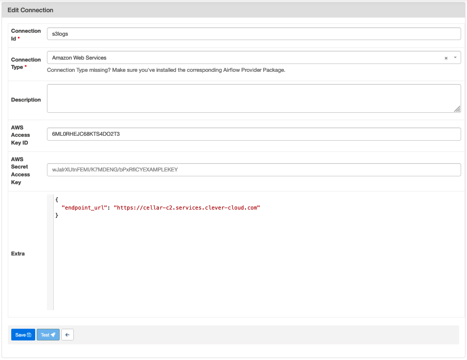

# Que faire de mes objets - Data Platform

Ce projet contient l'environnement d'execution d'Airflow

## Mise à jour du scheduler et du webserver sur CleverCloud

Airflow tourne sur CleverCloud et utilise les services suivant:

- qfdmo-airflow-webserver (instance docker): interface d'airflow
- qfdmo-airflow-scheduler (instance docker): scheduler d'airflow, fait tourner les dags car on est configuré en LocalExecutor
- qfdmo-storage : S3 pour stocker les logs des dags
- qfdmo-airflow-postgres : base de données nécessaire au fonctionnelment d'airflow

## Pour déployer airflow

- configururer sa clé ssh dans l'interface de clevercloud (cf.doc clevercloud)
- configurer un "remote repository" pour `qfdmo-airflow-webserver` (qu'on nommera clevercloud-webserver) pour ce repository
- configurer un "remote repository" pour `qfdmo-airflow-scheduler` (qu'on nommera clevercloud-scheduler) pour ce repository
- pousser le code souhaité sur la branch master des 2 repository ci-dessus

```sh
git remote add clevercloud-webserver git+ssh://git@push-n3-par-clevercloud-customers.services.clever-cloud.com/app_efd2802a-1773-48e0-987e-7a6dffb929d1.git
git remote add clevercloud-scheduler git+ssh://git@push-n3-par-clevercloud-customers.services.clever-cloud.com/app_fda5d606-44d9-485f-a1b4-1f7007bc3bec.git
git push clevercloud-webserver mabranch:master
git push clevercloud-scheduler mabranch:master
```

Pour que les logs du scheduler soit stocké sur S3, les instances CleverCloud sont lancés avec les variables d'environnement:

```txt
AIRFLOW__LOGGING__REMOTE_LOGGING=true
AIRFLOW__LOGGING__REMOTE_BASE_LOG_FOLDER=s3://qfdmo-airflow-logs
AIRFLOW__LOGGING__REMOTE_LOG_CONN_ID=s3logs
AIRFLOW__LOGGING__ENCRYPT_S3_LOGS=false
```

`s3logs` est une connection configuré dans l'interface d'Airflow



Attention à ajouter le paramètre enfpoint_url pour le stockage Cellar de CleverCloud

## déploiement des dags en preprod et en prod

les dags sont déployés sur un bucket s3, dans un dossier au nom de l'environnement sur clevercloud :

- s3://qfdmo-dags/preprod
- s3://qfdmo-dags/production

Cette copie est faite via la CI/CD github action

Airflow est déployé avecun seul DAG `doswnload_dags_from_s3` qui télécharge les dags de preprod et de production à partir des repo s3.

### Déploiement des DAGs en environnement de développement

En environnement de développement, on précisera l'emplacement des DAGs avec la variable d'environnement AIRFLOW_DAGS_LOCAL_FOLDER avant le lancement des container docker. Par exemple :

```sh
export AIRFLOW_DAGS_LOCAL_FOLDER=$HOME/workspace/beta.gouv.fr/quefairedemesobjets/dags
```

Ce dossier est monté dans les containers docker à l'emplacement `/opt/airflow/development`

Puis copier les variable d'environnement airflow-dags/.env.template vers airflow-dags/.env

```sh
cp .env.template .env
```

Enfin, lancer les containers docker avec docker compose:

```sh
docker compose -f docker-compose.airflow.yaml up
```

docker compose lancera :

- une base de données postgres nécessaire à Airflow
- un webserver airflow
- un scheduler airflow en mode LocalExecutor

accéder à l'interface d'Airflow en local [http://localhost:8080](http://localhost:8080) ; identifiant/mot de passe : airflow / airflow

## Reste à faire

- [ ] Aujourd'hui, on a 1 seule bucket de log pour tout les environnements
