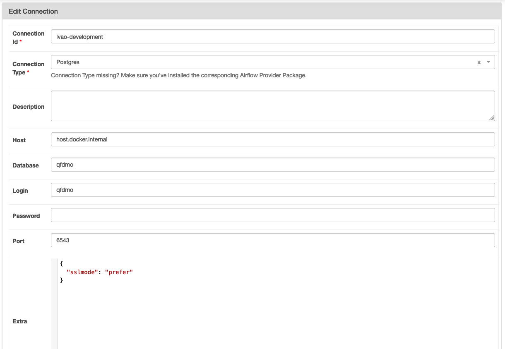

# Que faire de mes objets - Data Platform

Ce projet contient l'environnement d'execution d'Airflow

Les fichiers qui concerne la plateforme data :

- `airflow-requirements.txt` (compilé par pip-tools à partir de airfow-requirements.in) est la définition des packages `python` installés avec pip dans les instances `webserver` et `scheduler` de Airflow
- `./dags` répertoire dans lequels sont stockés tous les dags executés sur le cluster Airflow
- `airflow-scheduler.Dockerfile` et `airflow-webserver.Dockerfile`, fichier de configuration docker executer dans tous les environnements
- `docker-compose.yml` orchestre les dockers en envronnemnt de développement
- `./dags_unit_tests` répertoire qui contient les tests des dags

## Environnements

On distingue 3 environements:

- `development` : airflow tourne localement en utilisant l'orchestrateur `docker compose`
- `preprod` et `prod` : airflow tourne sur CleverCloud

## Mise à jour du scheduler et du webserver sur CleverCloud

Airflow tourne sur CleverCloud sur un ensemble de serveur par environnement et utilise les services suivant:

- <ENVIRONMENT>-airflow-webserver (instance docker): interface d'airflow
- <ENVIRONMENT>-airflow-scheduler (instance docker): scheduler d'airflow, fait tourner les dags car on est configuré en LocalExecutor
- <ENVIRONMENT>-airflow-s3 : S3 pour stocker les logs et les dags
- <ENVIRONMENT>-airflow-postgres : base de données nécessaire au fonctionnelment d'airflow

## Déploiement et configuration

### Déploiement de la plateforme Airflow (hors dag)

- configururer sa clé ssh dans l'interface de clevercloud (cf.doc clevercloud)
- configurer un "remote repository" pour `airflow-webserver` pour ce repository et pour chaque environnemnt
- configurer un "remote repository" pour `airflow-scheduler` pour ce repository et pour chaque environnemnt
- pousser le code souhaité sur la branch master des 2 repository

en PREPROD

```sh
git remote add preprod-airflow-scheduler git+ssh://git@push-n3-par-clevercloud-customers.services.clever-cloud.com/app_3d1f7d89-d7f0-433a-ac01-c663d4729143.git
git remote add preprod-airflow-webserver git+ssh://git@push-n3-par-clevercloud-customers.services.clever-cloud.com/app_d3c229bf-be85-4dbd-aca2-c8df1c6166de.git
git push preprod-airflow-scheduler mabranch:master
git push preprod-airflow-webserver mabranch:master
```

en PROD

```sh
git remote add prod-airflow-scheduler git+ssh://git@push-n3-par-clevercloud-customers.services.clever-cloud.com/app_fda5d606-44d9-485f-a1b4-1f7007bc3bec.git
git remote add prod-airflow-webserver git+ssh://git@push-n3-par-clevercloud-customers.services.clever-cloud.com/app_efd2802a-1773-48e0-987e-7a6dffb929d1.git
git push prod-airflow-scheduler mabranch:master
git push prod-airflow-webserver mabranch:master
```

### Configuration du cluster Airflow

#### Variable d'environnement du cluster Airflow

En plus des variables d'environnement nécessaire pour configurer Airflow, les variables d'environnemnt suivantes doivent-être configurées sur le docker `scheduler` de chaque environnement dans CleverCloud:

- `ENVIRONMENT` nécessaire pour lancer la synchronisation des dags
- `AIRFLOW__CORE__DAGS_FOLDER` nécessaire pour la synchronisation des dags
- `CELLAR_ADDON_HOST` host du s3 stockant les dags de l'environnement
- `CELLAR_ADDON_KEY_ID` id du s3 stockant les dags de l'environnement
- `CELLAR_ADDON_KEY_SECRET` secret du s3 stockant les dags de l'environnement
- `CELLAR_ADDON_BUCKET` bucket stockant les dags de l'environnement

#### Gestion des logs

Pour que les logs du scheduler soient stockés sur S3, les instances CleverCloud sont lancés avec les variables d'environnement:

```txt
AIRFLOW__LOGGING__REMOTE_LOGGING=true
AIRFLOW__LOGGING__REMOTE_BASE_LOG_FOLDER=s3://qfdmo-airflow-logs
AIRFLOW__LOGGING__REMOTE_LOG_CONN_ID=s3logs
AIRFLOW__LOGGING__ENCRYPT_S3_LOGS=false
```

`s3logs` est une connection configuré dans l'interface d'Airflow


Attention à ajouter le paramètre endpoint_url pour le stockage Cellar de CleverCloud

#### Gestion de la base de données

La connexion postgres `qfdmo_django_db` doit aussi être configurée dans l'interface d'Airflow

##### Spécificité de l'environnement de développement

Lorsque la base de données est dockerisée, la connexion doit être configurée comme suit:



### Déploiement en preprod et en prod

le déploiement est assuré en CI par le `job` 47ng/actions-clever-cloud

#### Forcer un déploiement

Pour forcer le déploiement, il suffit de pousser la branche à déployer sur :

- les 2 repo git des projets `webserver`et `scheduler`
- en choisissant le bon environnement
- sur la branche master

1. Configuration

le repository git est disponible sur l'interface de clevercloud

```sh
git remote add <ENV>-airflow-webserver <REPO_GIT_ENV_WEBSERVER>
git remote add <ENV>-airflow-scheduler <REPO_GIT_ENV_SCHEDULER>
```

2. Déployement

```sh
git push preprod-airflow-webserver <BRANCH/TAG>:master
git push preprod-airflow-scheduler <BRANCH/TAG>:master
```

### Configurer l'environnement de développement

Copier les variable d'environnement dags/.env.template vers dags/.env

```sh
cp dags/.env.template dags/.env
```

Enfin, lancer les containers docker avec docker compose:

```sh
docker compose --profile airflow up
```

docker compose lancera :

- la base de données postgres nécessaire à la webapp de la carte
- la base de données postgres nécessaire à Airflow
- un webserver airflow
- un scheduler airflow en mode LocalExecutor

accéder à l'interface d'Airflow en local [http://localhost:8080](http://localhost:8080) ; identifiant/mot de passe : airflow / airflow
