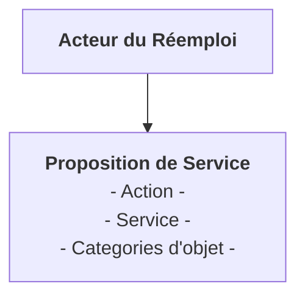

# Que faire de mes objets

Que faire de mes objets propose des solutions pour promouvoir les gestes de consomation responsable:

- Mise à disposition d'un annuaire d'Acteur du ré-emploi et du re-cyclage en France (disponible aussi via une iframe)
- Mise à disposition de l'annuaire via une API
- Promotion des gestes de consomation responsable tel que le don et le partage local

## Modèle de donnée

Chaque acteur du ré-emploi et recyclage explose des propositions de service associée à un geste et une liste de catégorie d'objet



## Environnement de développement

### Prérequis

- docker-compose
- python 3.11

### Technologies

- Python
- Django
- github
- Licence MIT
- Node
- Parcel
- DSFR
- honcho
- Scalingo
- Sentry
- Pytest
- Whitnoise
- Tailwind
- Dependabot
- Django-debug-toolbar

### installation & execution

Les bases de données source `MySQL` et cible `Postgres + Postgis` sont executées et mises à disposition par le gestionnaire de conteneur Docker

```sh
docker compose up
```

Création de l'environnement virtuel de votre choix (préférence pour asdf)

```sh
python -m venv .venv --prompt $(basename $(pwd))
source  .venv/bin/activate
```

Installation

```sh
pip install -r requirements.txt -r dev-requirements.txt
npm install
```

Configuration des variables d'environnement

```sh
cp .env.template .env
```

// Modifier les variables dans le fichier .env si nécessaire

Migration

```sh
python manage.py migrate
```

### Create superuser

```sh
python manage.py createsuperuser
```

### Lancement

```sh
honcho start -f Procfile.dev
```

Honcho démarrera les containers Docker s'ils ne sont pas déjà démarrés

### Ajout et modification de package pip-tools

Ajouter les dépendances aux fichiers `requirements.in` et `dev-requirements.in`

Compiler les dépendances:

```sh
pip-compile dev-requirements.in --generate-hashes
pip-compile requirements.in --generate-hashes
```

### Installer les hooks de pre-commit

Pour installer les git hook de pre-commit, installer le package precommit et installer les hooks en executant pre-commit

```sh
pre-commit install
```

### populate Acteur Réemploi from LVAO Base file

Create a one-off contanier and download LVAO base file from your local using --file option.

```sh
scalingo --region osc-fr1 --app quefairedemesobjets run --file backup_db.bak/Base_20221218_Depart.csv bash
```

following message should be display in prompt:

```txt
-----> Starting container one-off-1576  Done in 0.224 seconds
 Upload /Users/nicolasoudard/workspace/beta.gouv.fr/quefairedemesobjets/backup_db.bak/Base_20221218_Depart.csv to container.
…
```

uploaded file is stored in `/tmp/uploads` folder

Launch import :

```sh
python manage.py populate_lvao_base /tmp/uploads/Base_20221218_Depart.csv
```

## Deploy in Scalingo

we need to install GDAL as explain in doc : [https://techilearned.com/configure-geodjango-in-scalingo/](https://techilearned.com/configure-geodjango-in-scalingo/) form [https://doc.scalingo.com/platform/app/app-with-gdal](https://doc.scalingo.com/platform/app/app-with-gdal) and mattermost discussion in beta.gouv.fr community
