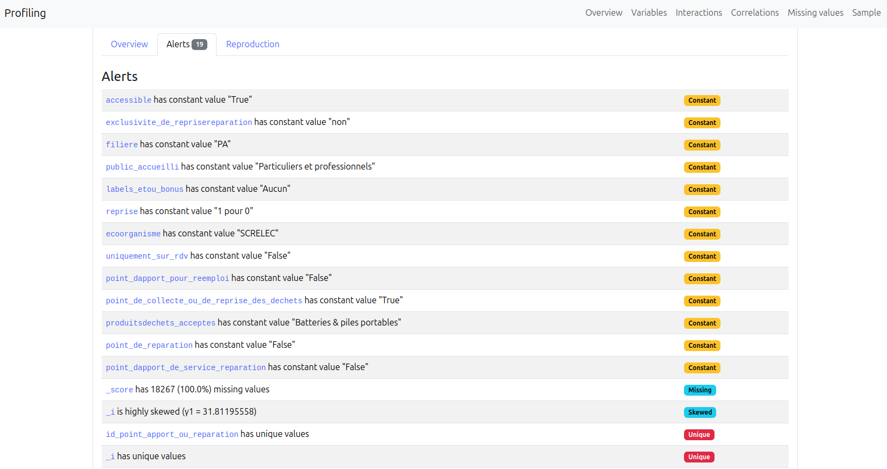
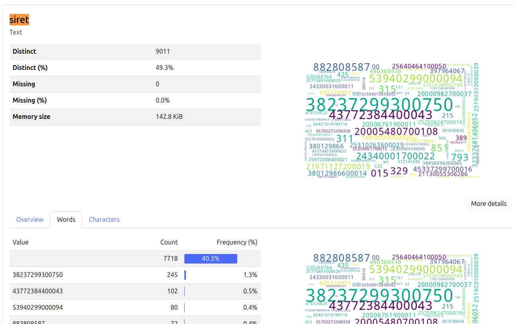

# Script d'audit d'une source de données

`scripts/source_data_audit.py` permet de gagner du temps dans la création du `DAG` en explorant la donnée au préalable pour anticiper/prévenir des potentiels problèmes.

## Execution du script

_To be continued_

## Exemple: un résumé des champs pour le mapping

## Exemple: problèmes de données

On peut voir qu'on a des problèmes sur le `siret`

