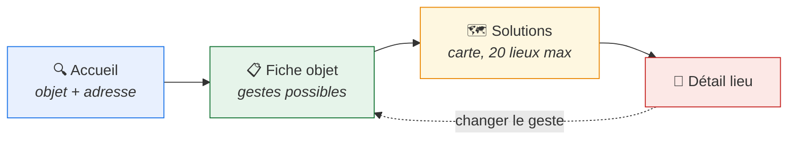
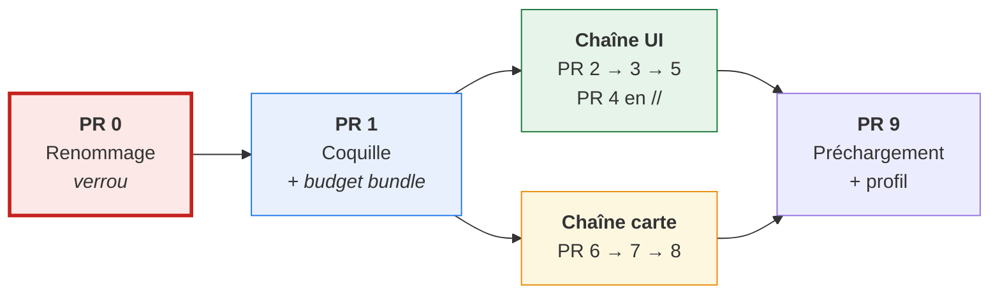

# 0. Synthèse — une page

> **À lire en premier.** Tout le plan en 5 minutes. Chaque section renvoie au
> détail. Conçu pour être présenté à l'équipe.

## Ce qu'on construit

Un assistant au tri en **4 écrans**, embarqué en iframe chez des réutilisateurs.

Périmètre MVP **volontairement petit** : pas de filtres, pas de bascule
liste/carte, pas de géolocalisation, pas de partage.
→ [01-vue d'ensemble](01-vue-ensemble.md)

## Les 5 choix structurants

| #   | Choix                               | Pourquoi                                                                |
| --- | ----------------------------------- | ----------------------------------------------------------------------- |
| 1   | App `assistant` **sans modèle**     | le contenu vit dans `quefaire.ProduitPage` et `acteur.DisplayedActeur`  |
| 2   | **Zéro reprise** de la plomberie V1 | on reprend l'accès aux données, pas les formulaires préfixés ni le DSFR |
| 3   | L'état vit **dans l'URL**           | chaque écran partageable, rechargeable, cacheable en HTTP               |
| 4   | Carte en **GeoJSON**, pas en HTML   | le client doit posséder l'état des marqueurs (spec #3356)               |
| 5   | **Renommage préalable** des apps    | `qfdmd`→`quefaire`, `qfdmo`→`acteur`, tables gelées                     |

Les 3 décisions contestables sont argumentées en [ADR](adr/README.md).

## L'ordre de travail

**Deux chaînes parallèles** après PR 1 : deux personnes peuvent avancer sans se
marcher dessus. → [06-découpage PR](06-decoupage-pr.md)

## Les 3 risques à connaître avant de commencer

### 🔴 PR 0 touche des données de production

Renommer une app Django écrit à **trois** endroits en base :

| Écriture                        | Volume         | Si oublié                                    |
| ------------------------------- | -------------- | -------------------------------------------- |
| `django_migrations.app`         | **314 lignes** | Django recrée 44 tables → `ProgrammingError` |
| `django_content_type.app_label` | 70 lignes      | 123 pages Wagtail ne se résolvent plus       |
| `db_table` sur 44 modèles       | —              | ~95 tables renommées → dbt et Airflow cassés |

→ **répétition obligatoire sur copie de prod**, critère de réussite
`No migrations to apply`. [06-découpage PR](06-decoupage-pr.md)

### 🟠 La requête carte est 3× trop lente en zone dense

| Zone          | Mesuré        |
| ------------- | ------------- |
| Paris         | **450 ms** ❌ |
| Savoie rurale | 27 ms ✅      |

Cause : 4 141 candidats chargés pour renvoyer 20 lieux. Solution : **rayon
croissant** (2 km → 21 ms pour le même résultat).
→ [05-données et cache](05-donnees-et-cache.md)

### 🟠 Le bundle JS pèse 1 381 kb gzip

MapLibre (21 Mo sur disque) est importé **statiquement** et embarqué dans
toutes les pages. L'import dynamique est **le levier le plus rentable du
plan**, et il se décide en **PR 1**, pas en PR 7.
→ [04-stimulus](04-stimulus.md)

## Ce que la vérification en base a changé

Ce plan a été confronté au code et à la base réelle. Les corrections
importantes :

| Ce qu'on croyait                     | La réalité                                                                             |
| ------------------------------------ | -------------------------------------------------------------------------------------- |
| Les gestes sont des `Action`         | Ce sont des **`GroupeAction`** (5), et un geste `deposer` n'existe pas : c'est `trier` |
| Les couleurs sont des tokens CSS     | Elles sont **déjà en base** dans `GroupeAction.couleur`                                |
| `[:20]` renvoie 20 lieux             | Le JOIN duplique : **9 363 acteurs** ont >1 proposition dans un groupe                 |
| `DisplayedActeur.objects.physical()` | `AttributeError` — le manager ne proxifie pas le QuerySet                              |
| stimulus-use est disponible          | **Déclaré mais pas installé**, et jamais importé                                       |
| Il faut créer un dispositif a11y     | `@axe-core/playwright` et ses tests **existent déjà**                                  |

La liste complète des 17 pièges est dans le [README](README.md), section « Pièges vérifiés dans le code existant ».

## Les 3 questions ouvertes

1. **URL de partage d'un lieu** — `/assistant/lieu/<uuid>/` ? (#3434, à voir avec Lucas)
2. **Noms d'apps** — `quefaire` et `acteur` confirmés ? (`acteur` est techniquement viable, vérifié ; `acteurs` au pluriel éviterait `acteur.models.acteur.Acteur`)
3. **Config Tailwind** — garder celle du projet (dérivée DSFR) ou en faire une dédiée ?

## En résumé

> On repart d'une base neuve côté présentation, on réutilise l'accès aux
> données existant, et on commence par un renommage risqué mais réversible.
> Le premier vrai gain utilisateur n'est pas dans le code de l'assistant :
> c'est de sortir MapLibre du bundle initial.
