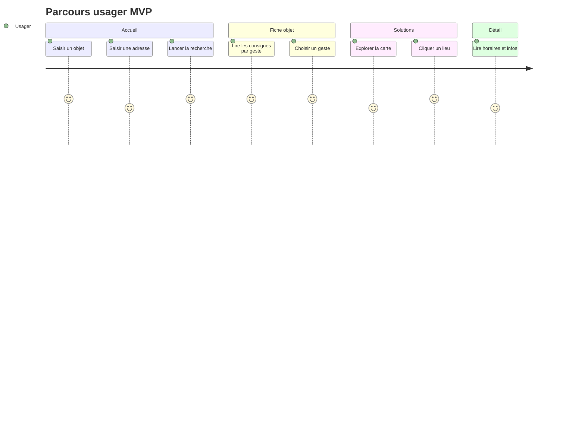
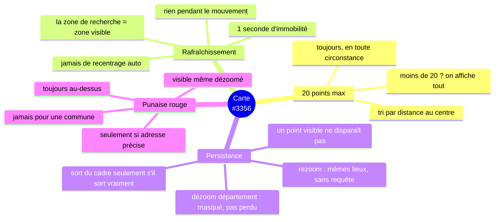

# 1. Vue d'ensemble

## Le produit en trois écrans

La spec fonctionnelle ([#3295](https://app.notion.com/p/38e6523d57d780049d61e54dc439c1f3))
décrit quatre écrans avec, pour chaque fonctionnalité, un ✅ ou un ❌ MVP.
**Le périmètre est petit ; la tentation d'en faire plus est le principal risque.**

## Ce qui est dans le MVP, ce qui n'y est pas

| Écran           | ✅ Dans le MVP                                                                                                                             | ❌ Hors MVP                                                                                                            |
| --------------- | ------------------------------------------------------------------------------------------------------------------------------------------ | ---------------------------------------------------------------------------------------------------------------------- |
| **Accueil**     | recherche objet (autocomplete, insensible accents/casse), champ adresse **obligatoire**, bouton « Lancer la recherche », bandeau de marque | liste au focus, « les plus populaires », 4 catégories, géolocalisation                                                 |
| **Fiche objet** | rappel objet/adresse modifiable, cartes « gestes », badges d'état, hiérarchie des gestes, CTA par geste, ancre au clic                     | compteur total, comptage par geste _(à évaluer)_, avertissements, liens vers fiches, liens Bonus Réparation            |
| **Solutions**   | bouton « changer le geste », champ adresse modifiable, carte, recalcul auto au déplacement, pastilles Bonus                                | compteur de résultats, bascule liste/carte, filtres (Bonus/ESS/Répar'Acteurs), chips, mode liste, « proposer un lieu » |
| **Détail lieu** | nom + type de service, tag **Bonus Réparation seul**, infos pratiques, horaires, « en savoir plus » (sources + fraîcheur)                  | itinéraire, appeler, voir le site, partager, mini-carte, accordéon gestes acceptés                                     |

> **Nuance importante** : le _filtre exclusivité de marque_ est ❌ côté UI, mais
> la spec précise qu'il doit **rester appliqué par défaut** comme sur la carte
> actuelle, sinon on affiche des réparateurs non pertinents.

## Les règles de la carte en un coup d'œil

Extraites de [#3356](https://app.notion.com/p/3a06523d57d780589476d537f8776008),
la spec la plus dense du lot.

## Contraintes non fonctionnelles

| Contrainte                        | Origine                                                                                                                     | Conséquence sur le plan                                          |
| --------------------------------- | --------------------------------------------------------------------------------------------------------------------------- | ---------------------------------------------------------------- |
| Pas de SEO                        | [#3434](https://app.notion.com/p/3d86523d57d780cda740c44ed0226417) « se cantonner à ce qui est utile pour l'accessibilité » | `noindex`, pas de bloc meta/OG, mais **accessibilité maintenue** |
| Affichage en iframe               | prototypes de démo, réutilisateurs                                                                                          | pas de Turbo Drive global, ancre au clic, bundle léger           |
| Design system propre              | Figma « Composants spécifiques à Que faire »                                                                                | pas de DSFR → [ADR 0001](adr/0001-pas-de-dsfr.md)                |
| Données lues par la data-platform | 38 fichiers dbt, 106 fichiers Airflow                                                                                       | noms de tables gelés → [ADR 0002](adr/0002-geler-noms-tables.md) |

## Glossaire

| Terme        | Sens ici                                                                                                                                                                           |
| ------------ | ---------------------------------------------------------------------------------------------------------------------------------------------------------------------------------- |
| **Geste**    | Ce que l'usager choisit de faire de son objet. Correspond à un **`acteur.GroupeAction`** (5 en base), pas à une `Action` (11 en base). Voir [02-architecture](02-architecture.md). |
| **Action**   | Le verbe précis porté par un acteur (`donner`, `echanger`, `rapporter`…). Plusieurs actions composent un geste.                                                                    |
| **Consigne** | Le contenu rédactionnel décrivant un geste pour une fiche donnée. Vient du CMS (à terme).                                                                                          |
| **Lieu**     | Un acteur physique affiché sur la carte. Correspond à `acteur.DisplayedActeur`.                                                                                                    |
| **Fiche**    | Une page produit. Correspond à `quefaire.ProduitPage` (Wagtail).                                                                                                                   |
| **Frame**    | Un `<turbo-frame>`, zone de la page rechargeable indépendamment.                                                                                                                   |
