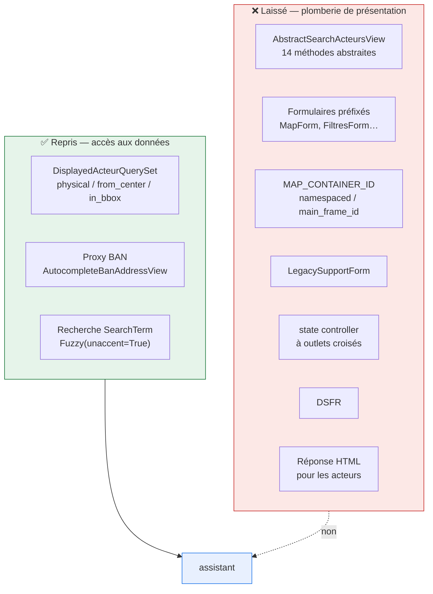
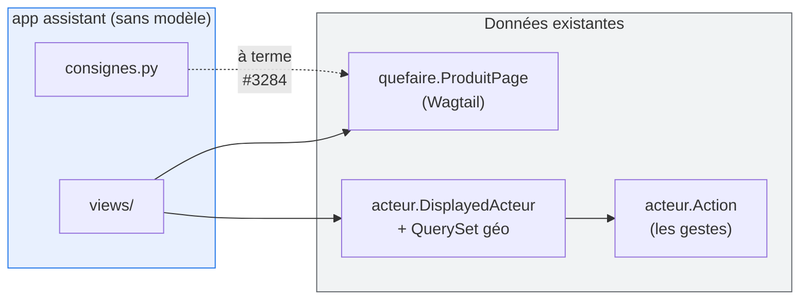
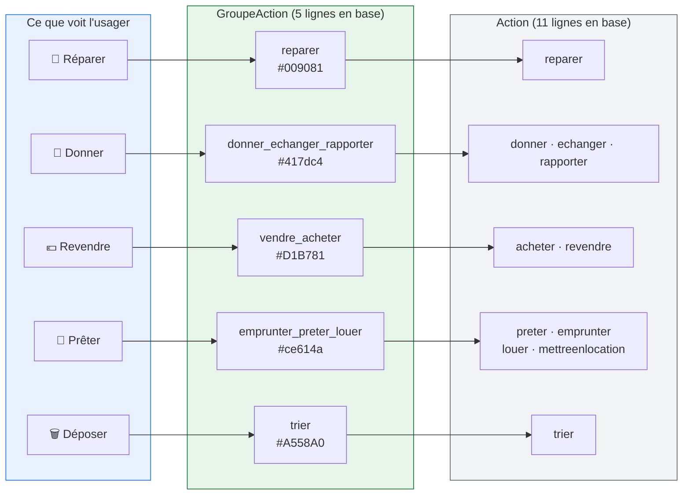

# 2. Architecture Django

## Principe : on reprend les données, pas la plomberie

L'assistant V2 n'hérite **d'aucun** comportement de la carte V1.



**La règle** : est repris ce qui touche à la donnée et à son accès ; est laissé
ce qui touche à la présentation. Le tableau détaillé du pourquoi :

| Laissé                                  | Pourquoi précisément                                                                                                  |
| --------------------------------------- | --------------------------------------------------------------------------------------------------------------------- |
| `AbstractSearchActeursView`             | 14 méthodes abstraites dédiées à des filtres que le MVP n'a pas (`_get_ess`, `_get_bonus`, `_get_label_reparacteur`…) |
| Formulaires préfixés                    | existent pour faire cohabiter plusieurs cartes dans une page ; l'assistant est une iframe unique                      |
| `MAP_CONTAINER_ID` / `` | corollaire du point précédent : plus de namespacing dynamique à gérer                                                 |
| `LegacySupportForm`                     | aucune URL assistant V2 n'est déployée chez des réutilisateurs, donc aucun querystring legacy à honorer               |
| `state` controller global               | l'état vit dans l'URL, pas dans un contrôleur pivot à outlets croisés                                                 |
| DSFR                                    | voir [ADR 0001](adr/0001-pas-de-dsfr.md)                                                                              |
| HTML pour les acteurs                   | voir [ADR 0003](adr/0003-geojson-plutot-que-html.md)                                                                  |

## Arborescence de l'app

Packages plutôt que fichiers uniques, comme dans
[seves](https://github.com/betagouv/seves). Un `views.py` monolithique est
exactement ce qui a produit les ~900 lignes de `quefaire/views.py` actuel.

```text
webapp/assistant/
├── __init__.py
├── apps.py
├── README.md                 # objectif, dépendances, diagramme (façon aides-agri)
├── urls.py
├── consignes.py              # contenu statique en attendant #3284
├── views/
│   ├── __init__.py           # ré-exporte les vues publiques
│   ├── mixins.py             # TurboFrameMixin
│   ├── pages.py              # Home, Produit, Solutions, Lieu
│   ├── autocomplete.py       # objet + adresse
│   └── geojson.py            # LieuxGeoJSONView
└── tests/
    ├── test_urls.py
    ├── test_geojson.py
    ├── test_consignes.py
    └── test_accessibilite.py
```

**Aucun `models.py`** : l'app ne possède pas de donnée. Elle orchestre
`quefaire.ProduitPage` (contenu) et `acteur.DisplayedActeur` (lieux).



## Routes

```python
# assistant/urls.py
from django.urls import path

from assistant import views

app_name = "assistant"

urlpatterns = [
    path("", views.HomeView.as_view(), name="home"),
    path("objet/<slug:slug>/", views.ProduitView.as_view(), name="produit"),
    path("solutions/", views.SolutionsView.as_view(), name="solutions"),
    path("lieu/<uuid:uuid>/", views.LieuView.as_view(), name="lieu"),
    path("lieux.geojson", views.LieuxGeoJSONView.as_view(), name="lieux-geojson"),
    path("recherche/objet", views.RechercheObjetView.as_view(), name="recherche-objet"),
    path("recherche/adresse", views.AutocompleteAdresseView.as_view(), name="autocomplete-adresse"),
]
```

Montée sous `/assistant/` dans `core/urls.py`, **avant** le bloc Wagtail :

```python
path("assistant/", include(("assistant.urls", "assistant"), namespace="assistant")),
```

> ⚠️ Le catch-all Wagtail (`sites_conformes_urls`) est monté sur `""` en fin de
> `core/urls.py`. Toute route racine non déclarée avant lui est avalée.

Nommage : URLs en français, cohérent avec l'existant (`adresse_details`,
`carte`, `formulaire`). `lieu` plutôt que `acteur` car c'est le vocabulaire
usager ; `solutions` plutôt que `carte` car l'écran accueillera la bascule
liste/carte plus tard.

## Vues : minces par construction

Règle : **la vue traduit HTTP ↔ manager**. Toute logique de sélection vit sur
le QuerySet (voir [05-données et cache](05-donnees-et-cache.md)).

```python
# views/mixins.py
class TurboFrameMixin:
    """Sert un layout réduit quand la requête vient d'un Turbo Frame.

    Turbo n'extrait que le frame correspondant de la réponse : rendre le
    layout complet serait du travail jeté. On bascule donc sur un gabarit
    minimal, ce qui réduit aussi le HTML transféré à chaque interaction.
    """

    def get_context_data(self, **kwargs):
        context = super().get_context_data(**kwargs)
        context["base_template"] = (
            "ui/layout/turbo.html"
            if self.request.headers.get("Turbo-Frame")
            else "ui/layout/assistant.html"
        )
        return context
```

```python
# views/pages.py
class ProduitView(TurboFrameMixin, DetailView):
    model = ProduitPage
    template_name = "ui/pages/assistant/produit.html"
    context_object_name = "produit"

    def get_queryset(self):
        return ProduitPage.objects.live()

    def get_context_data(self, **kwargs):
        context = super().get_context_data(**kwargs)
        context["consignes"] = consignes_pour(self.object)
        return context
```

## Layout

Pas de DSFR, pas de bloc SEO.

```django

<!DOCTYPE html>
<html lang="fr" class="qf-scroll-smooth">
  <head>
    <meta charset="utf-8">
    <meta name="viewport" content="width=device-width, initial-scale=1, shrink-to-fit=no">
    <meta name="robots" content="noindex, nofollow">
    <title>Assistant au tri, au réemploi et à la réparation</title>
    <link rel="stylesheet" href="">
    <script type="module" src=""></script>
  </head>
  <body>
    <a class="qfa-skiplink" href="#contenu">Aller au contenu</a>
    
    <main id="contenu"></main>
    
  </body>
</html>
```

Le skiplink est écrit à la main puisqu'on n'a plus ``.
C'est ~6 lignes de CSS et c'est **non négociable** (RGAA 12.7).

### Conventions de nommage CSS

| Préfixe | Usage                               |
| ------- | ----------------------------------- |
| `qfa-`  | composants assistant V2 (ce projet) |
| `qf-`   | utilitaires Tailwind du projet      |
| `fr-`   | DSFR — **absent** de l'assistant    |

## Templates

```text
templates/ui/
├── layout/assistant.html
├── pages/assistant/{home,produit,solutions,lieu}.html
└── components/assistant/
    ├── alerte.html            + .md     ┐
    ├── badge.html             + .md     │ élémentaires
    ├── barre_recherche.html   + .md     │ (#3433)
    ├── bloc_geste.html        + .md     │
    ├── etiquette_geste.html   + .md     │
    ├── icone.html             + .md     │
    ├── pinpoint.html          + .md     ┘
    ├── accordeon.html         + .md     ┐
    ├── bloc_gestes.html       + .md     │ complexes
    ├── bouton_changer_geste.html + .md  │ (#3433)
    ├── carte.html             + .md     │
    ├── footer.html            + .md     │
    ├── header.html            + .md     ┘
    └── _partials/                       # fragments rechargés par Turbo
        ├── resultats_objet.html
        └── resultats_adresse.html
```

Les noms reprennent ceux du Figma, comme demandé dans #3433. Le `.md` par
composant suit la convention déjà en place dans `templates/ui/components/`.
La convention `_partials/` vient d'[aides-agri](https://github.com/betagouv/aides-agri).

## Les gestes : la taxonomie existe déjà en base

⚠️ **Point vérifié en base, contre-intuitif** : les « gestes » de la spec ne
sont pas à inventer. Ils correspondent aux `GroupeAction` existants, et les
5 couleurs de pinpoint demandées par #3295 **sont déjà des colonnes en base**.

```text
$ Action.objects.values_list("code", flat=True)
['preter', 'emprunter', 'louer', 'mettreenlocation', 'reparer', 'donner',
 'echanger', 'acheter', 'revendre', 'rapporter', 'trier']          → 11 actions

$ GroupeAction.objects.values_list("code", flat=True)
['reparer', 'donner_echanger_rapporter', 'emprunter_preter_louer',
 'vendre_acheter', 'trier']                                        → 5 groupes
```

| `GroupeAction.code`         | Couleur en base | Spec #3295           | Actions membres                                    |
| --------------------------- | --------------- | -------------------- | -------------------------------------------------- |
| `reparer`                   | `#009081`       | vert — P. Réparation | `reparer`                                          |
| `donner_echanger_rapporter` | `#417dc4`       | bleu — P. Don        | `donner`, `echanger`, `rapporter`                  |
| `emprunter_preter_louer`    | `#ce614a`       | orange — P. Loc      | `preter`, `emprunter`, `louer`, `mettreenlocation` |
| `vendre_acheter`            | `#D1B781`       | brun — P. Vente      | `acheter`, `revendre`                              |
| `trier`                     | `#A558A0`       | violet — P. Tri      | `trier`                                            |

**La correspondance est exacte : 5 groupes, 5 couleurs.** Il n'y a donc ni
table de correspondance à écrire, ni code de geste à inventer.



On filtre donc sur `proposition_services__action__groupe_action__code`. Filtrer
sur l'action seule serait une **erreur fonctionnelle** : choisir « donner »
exclurait les acteurs qui ne déclarent que `echanger` ou `rapporter`.

> 🚫 **Piège évité** : un geste nommé `deposer` n'existe pas. Le « déposer » de
> la spec correspond au groupe `trier` (et à l'action `rapporter` pour les
> reprises). Écrire `deposer` en dur donnerait un filtre qui ne matche rien.

### Conséquence sur les tokens CSS

Les couleurs de geste **ne sont pas des tokens CSS en dur** : elles viennent de
`GroupeAction.couleur`. Le template les expose en variable CSS locale, ce qui
garde une source unique de vérité (l'admin Django) :

```django
{# etiquette_geste.html #}
<span class="qfa-etiquette-geste"
      style="--qfa-geste-couleur: {{ groupe.couleur }}">
  {{ groupe.libelle }}
</span>
```

C'est le seul usage de `style` inline du projet, et il est justifié : la
couleur est une **donnée**, pas une décision de design figée. Une CSP avec
`style-src 'unsafe-inline'` reste évitable via un `nonce` ou des classes
générées, à trancher en PR 2.

Les tokens CSS restent utilisés pour ce qui est réellement statique :

```css
:root {
  --qfa-adresse-usager: ...; /* rouge — punaise « vous êtes ici » (Figma) */

  /* États (#3284) — à relever dans le Figma */
  --qfa-etat-reparable: ...;
  --qfa-etat-bon-etat: ...;
  --qfa-etat-hors-usage: ...;

  --qfa-espace-bloc: clamp(1rem, 0.8rem + 1vw, 1.5rem);
  --qfa-rayon: 8px;
  --qfa-duree-rapide: 150ms;
}
```

## Accordéon : pas de contrôleur

```django
<details class="qfa-accordeon" open>
  <summary class="qfa-accordeon__entete">{{ titre }}</summary>
  <div class="qfa-accordeon__contenu">{{ contenu }}</div>
</details>
```

`<details>`/`<summary>` couvre le besoin (horaires, « en savoir plus ») avec le
clavier et l'ARIA natifs. Un contrôleur Stimulus ici serait de la
réimplémentation.

## Version de Django

Le projet est en **Django 6.1.1**. Conséquences vérifiées :

| Fonctionnalité             | Disponible ?      | Usage dans le plan             |
| -------------------------- | ----------------- | ------------------------------ |
| ``        | ✅ (depuis 5.1)   | construction des URLs de frame |
| `QuerySet.as_manager()`    | ✅                | tous les managers              |
| `django.template.partials` | ❌ (pas en 6.1.1) | on reste sur ``   |
