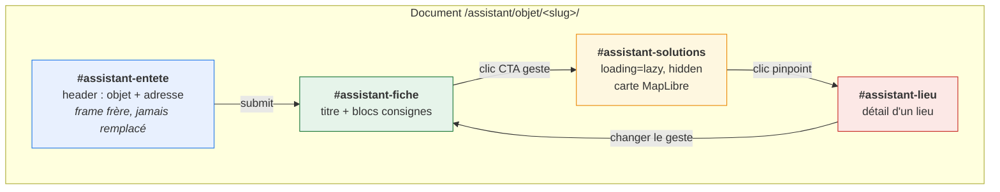
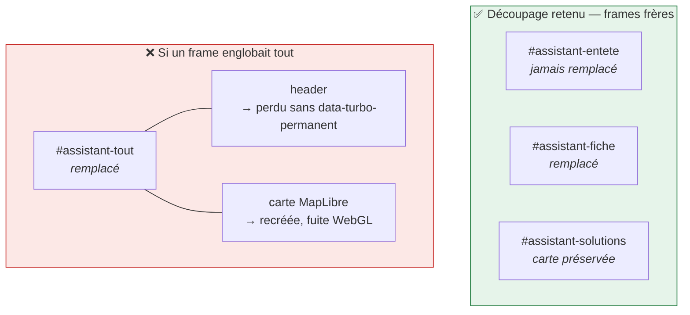
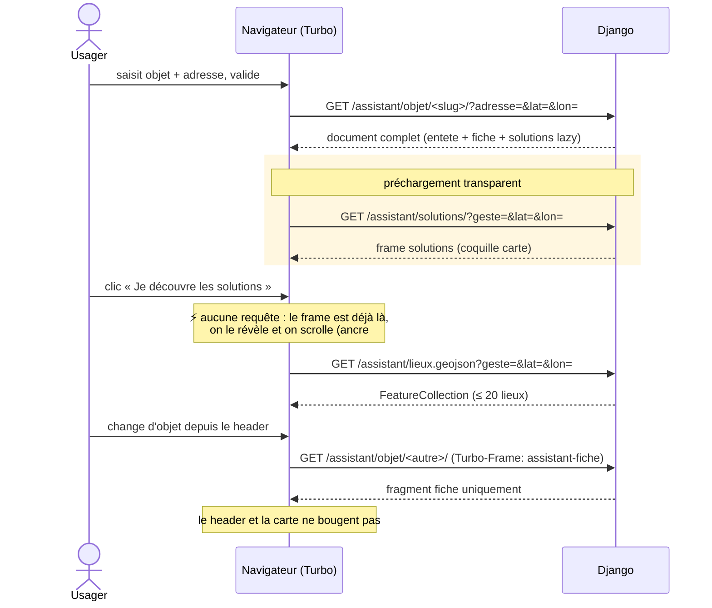
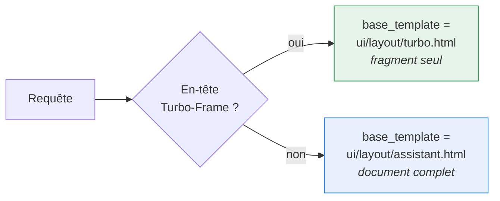
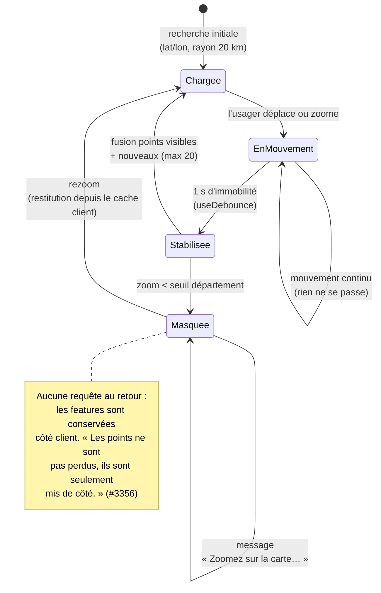

# 3. Architecture Turbo Frames

> ⚠️ **Mise à jour (2026-09-14) : `#assistant-solutions` n'existe pas.** Les
> maquettes d'écran, arrivées après l'écriture de ce document, font de la carte
> un **écran voisin** de la fiche (nœud 30141:8703) et non un frame qu'elle
> contiendrait : la carte a son propre bandeau « Revenir aux solutions » et son
> propre pied de page. L'imbriquer en empilerait deux.
>
> Le `loading="lazy"` prévu ici est donc remplacé par un préchargement à
> l'intention — `<link rel="prefetch">` posé au survol du bouton « Je découvre
> les solutions ». Même objectif, mécanisme adapté à une navigation de page :
> **53 ms** gagnées sur le clic, mesuré sur le document solutions.
>
> Les frames `#assistant-fiche` et `#assistant-lieu` décrits plus bas restent
> valables.

## Les quatre frames



| Frame                  | Rôle                         | Déclencheur                                   | Attribut côté HTML                                          |
| ---------------------- | ---------------------------- | --------------------------------------------- | ----------------------------------------------------------- |
| `#assistant-entete`    | les deux champs de recherche | jamais rechargé                               | _(aucun — frame frère)_                                     |
| `#assistant-fiche`     | titre + blocs consignes      | soumission du header, retour depuis le détail | `data-turbo-frame="assistant-fiche"` sur le formulaire      |
| `#assistant-solutions` | coquille de la carte         | approche du viewport                          | `loading="lazy"` sur le frame                               |
| `#assistant-lieu`      | fiche détaillée d'un lieu    | clic sur un pinpoint                          | `data-turbo-frame="assistant-lieu"` sur le lien du marqueur |

### `data-turbo-permanent` : quand il sert vraiment

Vérifié dans Turbo 8.0.23 : `FrameRenderer` appelle bien
`preservingPermanentElements()`, donc l'attribut **fonctionne aussi pour les
rendus de frame**, pas seulement pour les visites complètes. Deux contraintes
lues dans le code :

```javascript
// turbo 8.0.23
function getPermanentElementById(node, id) {
  return node.querySelector(`#${id}[data-turbo-permanent]`);
}
```

1. l'élément **doit avoir un `id`** (le sélecteur l'exige) ;
2. l'`id` doit être **identique** dans l'ancien et le nouveau DOM, sinon
   l'élément n'est pas apparié et il est remplacé.

> ⚠️ **Nuance importante pour notre découpage** : un élément n'est préservé que
> s'il se trouve **à l'intérieur du fragment remplacé**. Or `#assistant-entete`
> est un frame **frère** de `#assistant-fiche` : quand Turbo remplace la fiche,
> il ne touche jamais au header. `data-turbo-permanent` y est donc **inutile**
> dans l'architecture décrite ici — le header est préservé par construction.

**L'attribut devient nécessaire seulement si** on décide un jour de recharger
un fragment **englobant** header et fiche (par exemple pour changer les deux
d'un coup). Le mentionner maintenant évite de croire qu'il protège la carte :
c'est le **découpage en frames frères** qui la protège.



C'est la raison de fond du découpage en quatre frames frères : **la carte ne
doit jamais se trouver dans un fragment que l'on remplace.**

## Parcours nominal



## Le préchargement, concrètement

```django
<turbo-frame id="assistant-solutions"
             src=""
             loading="lazy" hidden></turbo-frame>
```

Turbo charge le frame dès qu'il approche du viewport ; le clic ne fait que le
révéler. **Aucun contrôleur de préchargement maison.**

> `` est natif depuis Django 5.1 (le projet est en 6.1.1). Il
> préserve les paramètres existants et encode correctement, là où une
> concaténation manuelle casse au premier accent dans l'adresse.

Si un déclenchement plus fin que `loading="lazy"` s'avère nécessaire,
`useIntersection` (stimulus-use) fournit le seuil sans écrire d'observer.

## Contrat de réponse

Chaque vue sert soit le document complet, soit le fragment, selon l'en-tête
`Turbo-Frame` (voir `TurboFrameMixin` dans [02-architecture](02-architecture.md)).



C'est ce qui rend chaque URL directement partageable : ouvrir
`/assistant/solutions/?geste=reparer&lat=…` dans un onglet neuf sert une page
entière, pas un fragment orphelin.

## Rafraîchissement de la carte (#3356)

La machine à états que doit implémenter le contrôleur carte.



## Pourquoi Turbo ici, et pas htmx

[aides-agri](https://github.com/betagouv/aides-agri) a choisi htmx
([leur ADR 0001](https://github.com/betagouv/aides-agri/blob/main/documentation/adr/decision-0001-django-templating.md)),
et leur raisonnement est bon pour un projet neuf. Ici, Turbo est déjà en
dépendance et utilisé par la carte et l'assistant V1. Changer de bibliothèque
serait une migration plus large que l'assistant lui-même, pour un bénéfice nul.

**On garde Turbo**, en n'utilisant que les frames (pas Turbo Drive) :

```typescript
Turbo.session.drive = false;
```

L'assistant vit en iframe chez des réutilisateurs : prendre le contrôle de la
navigation du document hôte n'aurait pas de sens. C'est la même politique que
`js/carte.ts` en V1.
