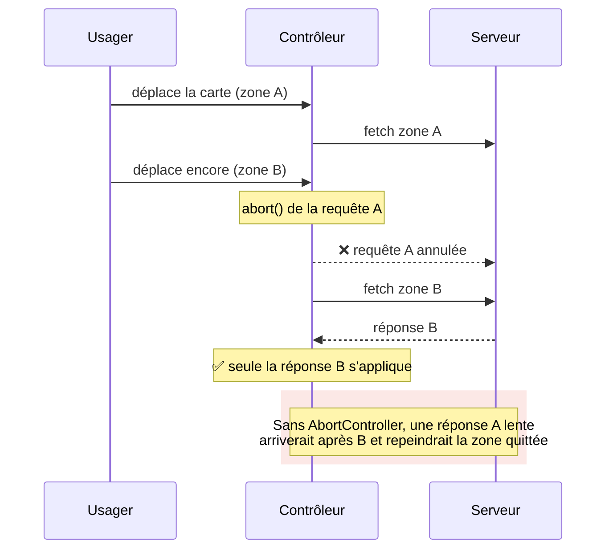
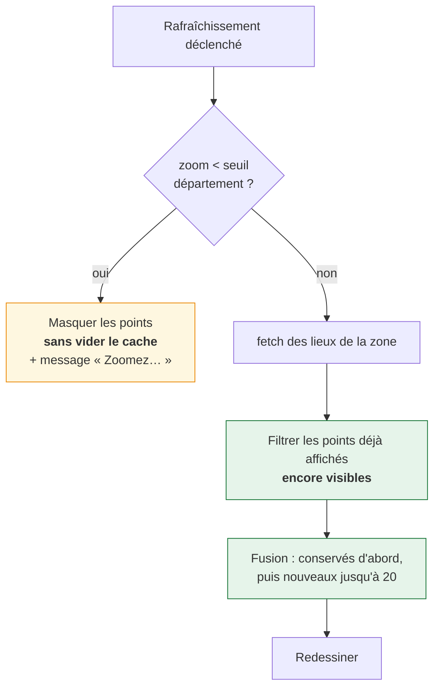
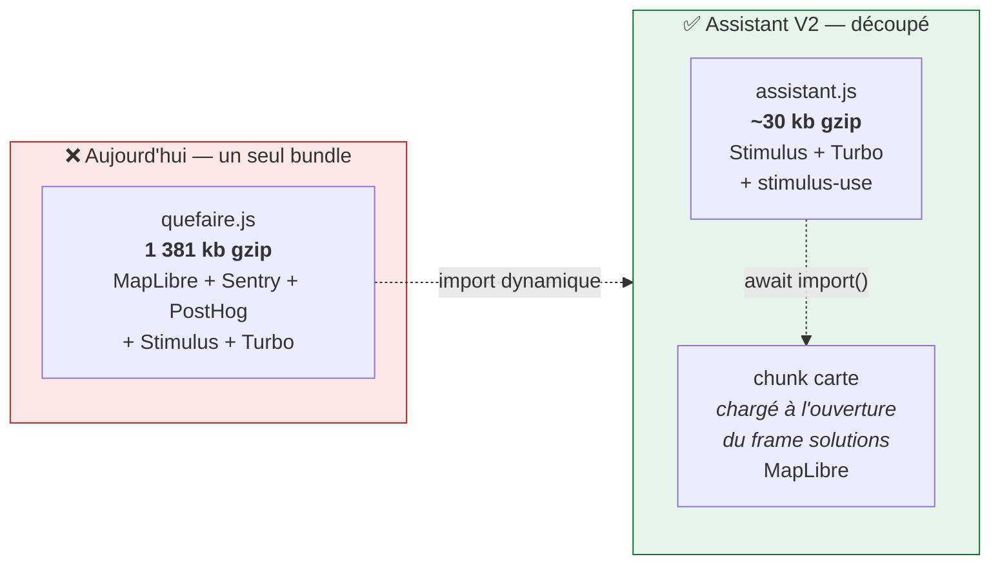

# 4. Stimulus et frontend

## Principe : le moins de JS possible, et du JS déclaratif

Trois règles, dans cet ordre :

1. **Le navigateur d'abord** — `<details>` plutôt qu'un contrôleur accordéon,
   `loading="lazy"` plutôt qu'un observer maison, `<a>` plutôt qu'un `click`.
2. **stimulus-use ensuite** — la bibliothèque est déjà en dépendance
   (`^0.53.0`) et couvre l'essentiel de l'observation DOM.
3. **Du code maison en dernier** — et seulement s'il porte une règle métier.

## Application centralisée

Un module unique démarre l'application, façon
[seves](https://github.com/betagouv/seves), plutôt qu'un fichier
d'enregistrement géant (`js/carte.ts` en V1 fait 45 lignes de `register`).

```typescript
// static/to_compile/js/assistant.ts
import { Application } from "@hotwired/stimulus";
import * as Turbo from "@hotwired/turbo";

const application = Application.start();
application.debug = Boolean(document.documentElement.dataset.stimulusDebug);

// Navigation par frames uniquement : l'assistant vit en iframe, prendre le
// contrôle du document hôte via Turbo Drive n'aurait pas de sens.
Turbo.session.drive = false;

export default application;
```

```text
static/to_compile/
├── assistant.ts                      # entrée Parcel (déjà déclarée)
├── js/assistant.ts                   # application Stimulus
├── styles/assistant.css              # tokens + reset
└── controllers/assistant/
    ├── carte_controller.ts
    ├── recherche_controller.ts
    └── autocomplete_controller.ts
```

## ⚠️ Avant tout : stimulus-use n'est pas installé

Vérifié sur ce dépôt :

```bash
$ grep stimulus-use webapp/package.json
    "stimulus-use": "^0.53.0",          # déclaré…

$ ls webapp/node_modules/stimulus-use
ls: No such file or directory           # …mais absent

$ grep -rn "stimulus-use" webapp/static/to_compile/
                                        # et jamais importé
```

La dépendance est **déclarée mais jamais installée ni utilisée**. Première
tâche de PR 1 :

```bash
cd webapp && npm install        # installe réellement la dépendance
```

Version courante du registre : **0.53.1**. L'API décrite ci-dessous a été
vérifiée contre cette version (et non contre la documentation en ligne).

## Usage de stimulus-use

| Besoin                                                          | Composable        | Remplace                            |
| --------------------------------------------------------------- | ----------------- | ----------------------------------- |
| 1 s d'immobilité avant rafraîchissement carte (#3356)           | `useDebounce`     | `setTimeout`/`clearTimeout` manuels |
| Précharger le frame solutions (si `loading="lazy"` insuffisant) | `useIntersection` | `IntersectionObserver` manuel       |
| Recalculer la taille de la carte quand son conteneur change     | `useResize`       | `ResizeObserver` manuel             |
| Fermer la liste d'autocomplete au clic extérieur                | `useClickOutside` | listener `document` + `contains()`  |
| Apparition/disparition du panneau détail lieu                   | `useTransition`   | classes CSS pilotées à la main      |
| Débounce de la frappe dans les champs                           | `useDebounce`     | idem                                |

## Contrôleur carte

```typescript
import { Controller } from "@hotwired/stimulus";
import { useDebounce, useResize } from "stimulus-use";

const DELAI_STABILISATION_MS = 1000; // #3356 : 1 s d'immobilité avant refresh
const NOMBRE_MAX_LIEUX = 20; // #3356 : plafond absolu
const ZOOM_MINIMUM = 9; // #3356 : ≈ département, en dessous on masque

export default class extends Controller {
  static values = { geste: String, urlLieux: String };
  // Vérifié dans stimulus-use 0.53.1 : la forme objet {name, wait} est bien
  // supportée, et les défauts sont leading=false / trailing=true — exactement
  // le « 1 s d'immobilité » de #3356.
  static debounces = [{ name: "rafraichir", wait: DELAI_STABILISATION_MS }];

  async connect() {
    // L'ordre compte : useDebounce remplace this.rafraichir, useResize
    // enveloppe this.disconnect. Les deux AVANT tout usage.
    useDebounce(this);
    useResize(this);

    this.lieux = new Map(); // uuid -> feature, mémoire client
    this.abortController = null;

    // Import dynamique : MapLibre reste hors du bundle initial.
    const { Map } = await import("maplibre-gl");
    this.carte = new Map({/* … */});
    this.carte.on("moveend", () => this.rafraichir());
  }

  resize() {
    this.carte?.resize(); // appelé par useResize (nom imposé)
  }

  disconnect() {
    // useResize a déjà enveloppé disconnect() : notre corps s'exécute, puis
    // le sien fait unobserve(). Sans ce remove(), le contexte WebGL fuit à
    // chaque navigation de frame (problème rencontré sur map_controller.ts V1).
    this.abortController?.abort();
    this.carte?.remove();
  }
}
```

`static debounces` rend la temporisation imposée par la spec **lisible en tête
de classe**, au lieu de la cacher dans un `setTimeout` au fond d'une méthode.

### Trois pièges de stimulus-use, vérifiés dans le code de la bibliothèque

#### 1. Une méthode débouncée ne peut pas être `await`ée

```javascript
// stimulus-use 0.53.1, fonction debounce() — extrait
timeoutId = setTimeout(() => {
  timeoutId = null;
  if (trailing && trailingPending) {
    trailingPending = false;
    callback();
  }
}, wait);
// ...aucun return : le wrapper renvoie toujours undefined
```

La valeur de retour est **perdue**. Conséquences concrètes :

```typescript
// ❌ à NE PAS écrire — illustre le piège
await this.rafraichir()        // ❌ résout immédiatement sur undefined
this.rafraichir().catch(...)   // ❌ TypeError: undefined has no .catch
```

**Une méthode débouncée `async` doit donc gérer ses propres erreurs**, sinon
un rejet devient une _unhandled promise rejection_ silencieuse :

```typescript
// dans la classe du contrôleur carte
async rafraichir() {
  try {
    // …
  } catch (erreur) {
    if (erreur.name === "AbortError") return
    console.error("rafraîchissement carte", erreur)   // jamais propagé
  }
}
```

#### 2. `useResize` enveloppe `disconnect()`

```javascript
const controllerDisconnect = controller.disconnect.bind(controller);
Object.assign(controller, {
  disconnect() {
    unobserve();
    controllerDisconnect();
  },
});
```

Le `disconnect()` de la classe **reste appelé**, donc notre `carte.remove()`
s'exécute bien. Mais l'enveloppe est posée au moment de l'appel `useResize(this)` :
appeler les composables **au début** de `connect()` n'est pas cosmétique.

#### 3. Le nom du callback est imposé

`useResize` appelle `method(controller, "resize")` : la méthode **doit**
s'appeler `resize()`. Même logique pour `clickOutside()` (`useClickOutside`),
`appear()`/`disappear()` (`useIntersection`). Un nom différent échoue en
silence, sans erreur.

## Requêtes annulables

Emprunt à [seves](https://github.com/betagouv/seves), qui annule
systématiquement la requête d'autocomplete en vol avant d'en lancer une
nouvelle. Le problème est **pire sur la carte** : un usager qui balaie
enchaîne les rafraîchissements, et sans annulation une réponse lente peut
arriver après une réponse récente et réafficher les points d'une zone déjà
quittée.



```typescript
// dans la classe du contrôleur carte
async rafraichir() {
  // Annule la requête en vol : sinon une réponse lente arrivant après une
  // réponse récente réafficherait des points d'une zone déjà quittée.
  this.abortController?.abort()
  this.abortController = new AbortController()

  try {
    const reponse = await fetch(url, { signal: this.abortController.signal })
    this.#fusionner(await reponse.json())
  } catch (erreur) {
    if (erreur.name === "AbortError") return   // annulation volontaire
    throw erreur
  }
}
```

## La règle de persistance des points

Le cœur de #3356, et la raison d'être du GeoJSON
([ADR 0003](adr/0003-geojson-plutot-que-html.md)).



```typescript
// dans la classe du contrôleur carte
#fusionner(nouveaux) {
  const conserves = [...this.lieux.values()].filter((l) => this.#estVisible(l))

  // Les points conservés passent en premier : c'est ce qui garantit qu'un
  // lieu sous les yeux de l'usager ne saute pas (retour de test explicite
  // cité dans #3356).
  const fusion = new Map(conserves.map((l) => [l.uuid, l]))
  for (const lieu of nouveaux) {
    if (fusion.size >= NOMBRE_MAX_LIEUX) break
    fusion.set(lieu.uuid, lieu)
  }
  this.lieux = fusion
  this.#dessiner()
}
```

## Punaise rouge : adresse ≠ commune

#3356 §4 : la punaise n'apparaît **que** pour une adresse précise, jamais pour
une commune. La distinction se fait sur le `type` renvoyé par la BAN, qui doit
être propagé **dès l'autocomplete** :

```django
{# _partials/resultats_adresse.html #}
data-type="{{ option.type }}"   {# housenumber | street | municipality #}
```

| Type BAN       | Punaise rouge ?                     |
| -------------- | ----------------------------------- |
| `housenumber`  | ✅                                  |
| `street`       | ✅                                  |
| `municipality` | ❌ (« Lyon » n'est pas une adresse) |

Sans cette propagation, l'écran carte n'a **aucun moyen** de savoir si l'usager
a saisi « Lyon » ou « 12 rue de la Paix, Lyon ».

Autres règles de la punaise : toujours au-dessus des autres points (z-index),
jamais déplacée par une recherche dans la zone, et reste visible même sous le
seuil de dézoom.

## Pinpoints

| Règle (#3295, #3356)                                                         | Implémentation                                                                 |
| ---------------------------------------------------------------------------- | ------------------------------------------------------------------------------ |
| Couleur = **geste choisi par l'usager**, pas l'action principale de l'acteur | le `geste` vient de l'URL (`?geste=<code groupe>`), pas de `properties.groupe` |
| Bonus Réparation prioritaire sur le vert si geste = `reparer`                | test sur `properties.bonus` **avant** la couleur de geste                      |
| La pointe de la goutte tombe sur le lieu                                     | `anchor: "bottom"`                                                             |
| Punaise usager toujours au-dessus                                            | z-index dédié                                                                  |

Les 5 couleurs viennent de `GroupeAction.couleur` **en base** (voir
[02-architecture](02-architecture.md), section « Les gestes ») : elles ne sont
ni en dur dans le JS, ni dans le CSS.

```typescript
// La couleur du pinpoint suit le geste CHOISI, pas celui de l'acteur :
// un acteur qui fait donner + revendre s'affiche en bleu si l'usager a
// choisi « donner », en brun s'il a choisi « revendre ».
const couleur =
  feature.properties.bonus && this.gesteValue === "reparer"
    ? COULEUR_BONUS
    : this.couleurGesteValue; // passée par le template depuis la base
```

Fond de carte : `carte-facile` (déjà en dépendance), style désaturé, fallback
OpenFreeMap positron. Contrôles +/− en haut à gauche, **sans boussole** :
`new maplibregl.NavigationControl({ showCompass: false })`.

## Accessibilité de la carte

Une carte MapLibre seule n'est pas navigable au clavier ni au lecteur d'écran.
La bascule liste/carte est hors MVP, donc **sans ajout il n'existe aucun chemin
accessible vers les résultats**.

```django
<ul class="qfa-lieux-accessibles qfa-sr-only">
  
    <li><a href="">{{ lieu.nom }}</a></li>
  
</ul>
```

Quelques lignes, et ça évite de livrer un écran inutilisable. **Non négociable
même en MVP** — c'est exactement ce que #3434 vise en disant « se cantonner à
ce qui est utile pour l'accessibilité ».

## Budget frontend

### Point de départ mesuré

Chiffres relevés sur `static/compiled/` (build actuel, gzip) :

| Bundle              | Brut     | **Gzip**     |
| ------------------- | -------- | ------------ |
| `quefaire.js`       | 7 688 kb | **1 381 kb** |
| `quefaire.css`      | 297 kb   | **38 kb**    |
| `qfdmo.js` (carte)  | 7 830 kb | 1 405 kb     |
| `qfdmo.css` (carte) | 1 567 kb | 188 kb       |

**Le JS est le problème, pas le CSS.** 1 381 kb gzippés sur chaque page, alors
qu'une landing page devrait tenir sous 150 kb.

### D'où vient le poids

`maplibre-gl` pèse **21 Mo sur disque** et est importé **statiquement** par
`js/solution_map.ts` (`import { … } from "maplibre-gl"`). Il est donc embarqué
dans le bundle de **toutes** les pages, y compris celles qui n'affichent aucune
carte. Sentry et PostHog sont dans le même cas (présents dans `quefaire.js`).



> Les tailles de `assistant.js` sont des **cibles**, pas des mesures : le
> bundle n'existe pas encore. Seuls les chiffres de `quefaire.js` /
> `quefaire.css` ci-dessus sont mesurés.

### Cibles pour l'assistant

| Poste                        | Cible        | Levier                                              |
| ---------------------------- | ------------ | --------------------------------------------------- |
| JS initial (gzip)            | **< 150 kb** | MapLibre, Sentry et PostHog en **import dynamique** |
| JS écran solutions (gzip)    | < 400 kb     | MapLibre chargé à l'activation du frame             |
| CSS (gzip)                   | **< 30 kb**  | pas de DSFR (référence actuelle : 38 kb)            |
| Requêtes au chargement fiche | 2            | document + frame solutions (parallèles)             |

### Le levier principal : import dynamique

```typescript
// extraits — `connect()` est un membre de la classe du contrôleur

// ❌ Ce que fait la V1 (js/solution_map.ts) : MapLibre dans tous les bundles
import { Map, Marker } from "maplibre-gl"

// ✅ Assistant V2 : chargé seulement quand le contrôleur carte se connecte,
//    c'est-à-dire quand le frame solutions s'active.
async connect() {
  const { Map, Marker } = await import("maplibre-gl")
  this.carte = new Map({ /* … */ })
}
```

Parcel produit alors un _chunk_ séparé, téléchargé uniquement sur l'écran
solutions. L'accueil et la fiche objet — les deux écrans les plus vus — n'en
paient rien.

> 💡 **Gain attendu** : l'accueil et la fiche passent de ~1 381 kb à quelques
> dizaines de kb (Stimulus + Turbo + stimulus-use ≈ 30 kb gzip). C'est la
> mesure la plus rentable de tout le plan, et elle ne coûte que deux `await
import()`.

### Vérifier le budget en CI

Sans garde-fou automatique, un `import` statique ajouté distraitement ramène
MapLibre dans le bundle initial sans que personne ne le voie.

`webapp/bin/check_bundle.sh` :

```bash
#!/usr/bin/env bash
# Vérifie le budget du bundle initial de l'assistant.
set -euo pipefail

BUNDLE="${1:-static/compiled/assistant.js}"
MAX_GZIP_KB="${2:-150}"

# 1. Le fichier doit exister : sans ça le contrôle passerait à vide.
if [[ ! -f "$BUNDLE" ]]; then
  echo "❌ $BUNDLE introuvable — le build a-t-il échoué ?" >&2
  exit 1
fi

# 2. MapLibre ne doit pas être dans le bundle initial.
#    `grep -q` renvoie 1 quand il ne trouve rien : on inverse explicitement.
if grep -q maplibre "$BUNDLE"; then
  echo "❌ MapLibre est dans le bundle initial — utiliser await import()" >&2
  exit 1
fi

# 3. Budget en gzip.
gzip_bytes=$(gzip -c "$BUNDLE" | wc -c)
max_bytes=$((MAX_GZIP_KB * 1024))
if (( gzip_bytes > max_bytes )); then
  printf '❌ bundle %.0f kb gzip > %d kb\n' "$((gzip_bytes / 1024))" "$MAX_GZIP_KB" >&2
  exit 1
fi

printf '✅ %s : %.0f kb gzip (budget %d kb), sans MapLibre\n' \
  "$BUNDLE" "$((gzip_bytes / 1024))" "$MAX_GZIP_KB"
```

Branchement : `make check-bundle` et une étape CI après `npm run build`.

#### ⚠️ Deux pièges de ce type de garde-fou

Les versions naïves de ce contrôle **passent silencieusement** au lieu
d'échouer. Vérifié en exécutant chaque cas :

| Version naïve                                         | Problème constaté                                                                                                                             |
| ----------------------------------------------------- | --------------------------------------------------------------------------------------------------------------------------------------------- |
| `gzip -c bundle.js \| wc -c \| awk '$1 > N {exit 1}'` | fichier **absent** → `exit 0`. Si le build échoue, le contrôle passe.                                                                         |
| `grep -c maplibre bundle.js`                          | renvoie **`exit 1` quand le bundle est propre** (aucune occurrence) et **`exit 0` quand MapLibre est présent** : le contrôle est **inversé**. |

D'où les trois étapes explicites du script : existence du fichier, puis
`grep -q` avec inversion assumée, puis budget.

#### Matrice de test du garde-fou

Un garde-fou non testé ne protège rien. Les cinq cas ont été exécutés :

| Cas                                        | Attendu | Constaté    |
| ------------------------------------------ | ------- | ----------- |
| fichier absent                             | échec   | ✅ `exit 1` |
| bundle contenant MapLibre                  | échec   | ✅ `exit 1` |
| bundle propre et petit                     | succès  | ✅ `exit 0` |
| bundle propre mais 1 369 kb, budget 150 kb | échec   | ✅ `exit 1` |
| même bundle, budget très large             | succès  | ✅ `exit 0` |

> 💡 **Règle générale** : un contrôle qui n'a jamais échoué volontairement
> n'est pas un contrôle. Le faire échouer une fois exprès fait partie de son
> écriture.
