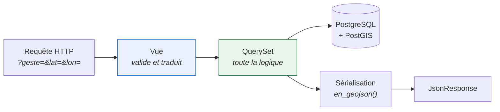
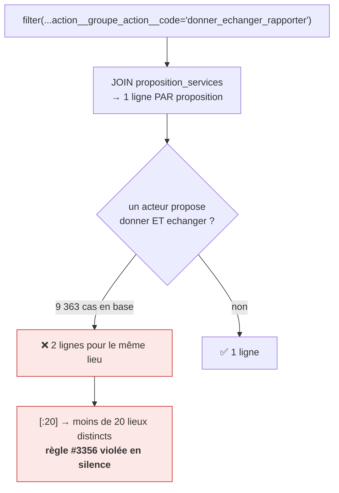
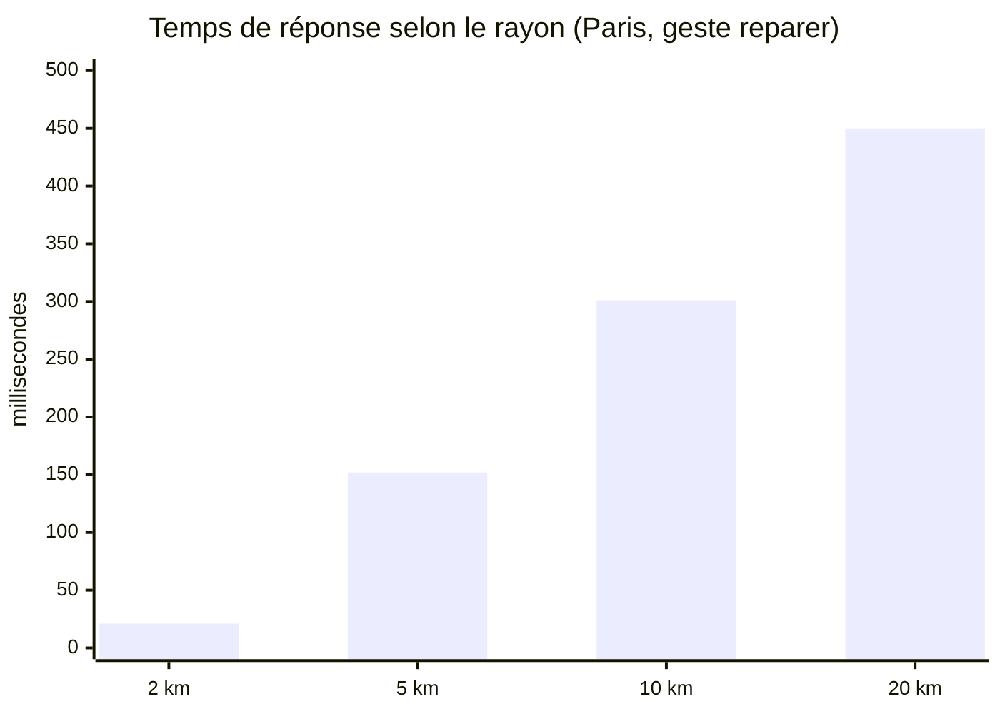
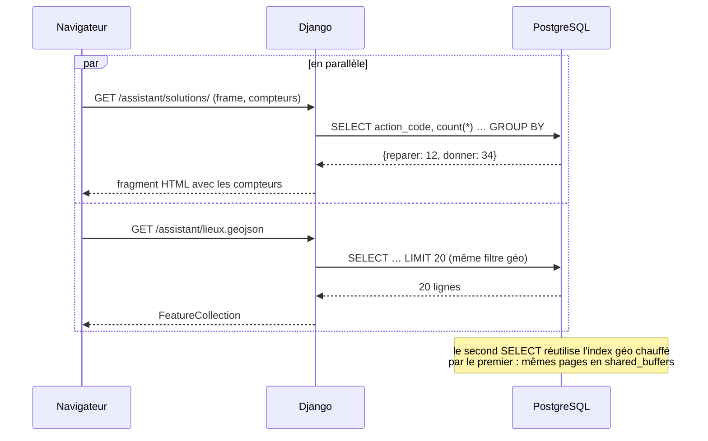
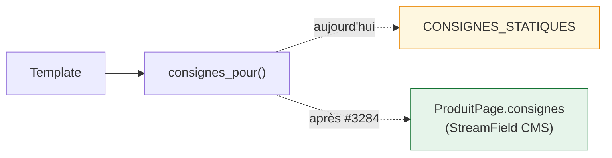

# 5. Données, managers et cache

## Règle : la logique sur le QuerySet, pas dans la vue

Un QuerySet chaînable par prédicat, façon
[aides-agri](https://github.com/betagouv/aides-agri) (`AideQuerySet.published()`,
`.validated()`, `.by_departements()`…). La vue ne fait que traduire HTTP ↔ manager.



Bénéfice concret : les règles de #3356 sont testables **sans HTTP**, en
appelant directement le QuerySet.

## Le QuerySet des lieux

```python
# acteur/models/acteur.py

NOMBRE_MAX_LIEUX = 20       # plafond imposé par #3356
RAYON_RECHERCHE_M = 20_000  # 20 km sur recherche d'adresse (#3356)


class DisplayedActeurQuerySet(models.QuerySet):
    # … méthodes existantes : physical(), from_center(), in_bbox(),
    #   with_bonus(), with_displayable_labels() …

    def pour_le_geste(self, code_groupe: str):
        """Lieux proposant ce geste.

        Le « geste » de la spec correspond à un GroupeAction (5 en base :
        reparer, donner_echanger_rapporter, emprunter_preter_louer,
        vendre_acheter, trier), pas à une Action (11 en base). Filtrer sur
        l'action donnerait un résultat trop étroit : choisir « donner »
        exclurait les acteurs qui ne déclarent que `echanger`.
        """
        return self.filter(
            proposition_services__action__groupe_action__code=code_groupe
        )

    def autour_de(self, longitude: float, latitude: float):
        """Recherche initiale : les plus proches d'un point, rayon 20 km."""
        return self.physical().from_center(longitude, latitude, RAYON_RECHERCHE_M)

    def dans_la_zone(self, bbox):
        """Exploration : lieux de la zone visible, triés depuis son centre.

        `in_bbox()` termine par `.order_by("?")` ; le tri par distance
        ci-dessous l'écrase délibérément, comme l'exige #3356.
        """
        centre = Point((bbox[0] + bbox[2]) / 2, (bbox[1] + bbox[3]) / 2, srid=4326)
        return (
            self.in_bbox(bbox)
            .annotate(distance=Distance("location", centre))
            .order_by("distance")
        )

    def pour_la_carte(self):
        """Les lieux prêts pour le rendu GeoJSON, dédoublonnés.

        Le dédoublonnage est OBLIGATOIRE : le filtre sur le geste joint
        proposition_services, et un acteur ayant plusieurs propositions dans
        le même groupe apparaît une fois par proposition. Mesuré en base :
        9 363 acteurs ont >1 proposition dans le groupe
        « donner_echanger_rapporter » (qui réunit donner/echanger/rapporter).
        Sans dédoublonnage, [:20] renvoie moins de 20 lieux distincts et la
        règle des 20 points de #3356 est violée silencieusement.
        """
        return (
            self.with_bonus()
            .select_related("action_principale__groupe_action")
            .distinct()[:NOMBRE_MAX_LIEUX]
        )

    def en_geojson(self) -> dict:
        """FeatureCollection GeoJSON des lieux du queryset."""
        return {
            "type": "FeatureCollection",
            "features": [
                {
                    "type": "Feature",
                    "geometry": {"type": "Point",
                                 "coordinates": [a.location.x, a.location.y]},
                    "properties": {
                        "uuid": str(a.uuid),
                        "nom": a.nom_commercial or a.nom,
                        # Le groupe porte la couleur du pinpoint (en base).
                        "groupe": a.action_principale.groupe_action.code,
                        "couleur": a.action_principale.groupe_action.couleur,
                        "bonus": a.bonus,
                    },
                }
                for a in self
            ],
        }
```

> ⚠️ **Piège repéré** : `in_bbox()` se termine par `.order_by("?")` (ordre
> aléatoire), incompatible avec le tri par distance qu'exige #3356. Le
> `.order_by("distance")` l'écrase — c'est correct mais implicite, d'où le
> commentaire dans la méthode.

> ⚠️ **Piège vérifié** : `DisplayedActeur.objects` est un `DisplayedActeurManager`
> qui surcharge `get_queryset()` **sans** proxifier les méthodes du QuerySet.
> `DisplayedActeur.objects.physical()` lève donc `AttributeError`. Il faut
> passer par `.all()` :
>
> ```python
> DisplayedActeur.objects.all().pour_le_geste("reparer")   # ✅
> DisplayedActeur.objects.pour_le_geste("reparer")         # ❌ AttributeError
> ```
>
> **Alternative propre, à faire en PR 6** : ajouter
> `DisplayedActeurManager = DisplayedActeurQuerySet.as_manager()`-like en
> déclarant les méthodes voulues sur le manager via
> `Manager.from_queryset(DisplayedActeurQuerySet)`, ce qui supprime le `.all()`
> partout. C'est la forme utilisée par
> [aides-agri](https://github.com/betagouv/aides-agri) et la plus idiomatique.

## La vue GeoJSON

```python
# views/geojson.py
class LieuxGeoJSONView(View):
    """Traduit les paramètres de requête en appel manager. Aucune logique ici."""

    def get(self, request, *args, **kwargs):
        try:
            params = self._params(request.GET)
        except (KeyError, ValueError, TypeError):
            return HttpResponseBadRequest("paramètres invalides")

        lieux = DisplayedActeur.objects.all().pour_le_geste(params["geste"])
        lieux = (
            lieux.dans_la_zone(params["bbox"])
            if params["bbox"]
            else lieux.autour_de(params["lon"], params["lat"])
        )
        return JsonResponse(lieux.pour_la_carte().en_geojson())
```

### ⚠️ Le piège du dédoublonnage (vérifié en base)

C'est le piège le plus subtil de tout le plan, parce que le code **fonctionne
par accident** et cesserait de fonctionner à la première modification.



**Mesure** : sur 60 lignes renvoyées autour de Paris pour ce geste, **13
étaient des doublons** (47 acteurs distincts).

#### Pourquoi `.distinct()` suffit — et pourquoi c'est fragile

`.distinct()` produit un `SELECT DISTINCT` sur **toutes** les colonnes
sélectionnées : les champs de l'acteur **plus** l'annotation `distance`. Comme
`distance` est calculée depuis la position de l'acteur lui-même, les lignes
dupliquées d'un même acteur sont **strictement identiques**, donc PostgreSQL
les fusionne. Vérifié : `pour_la_carte()` renvoie bien 20 lieux uniques.

> 🚨 **Ce qui casserait ce comportement** : ajouter au `SELECT` une colonne
> issue de la table jointe (par ex. `.annotate(action=F("proposition_services__action__code"))`).
> Les lignes cesseraient d'être identiques et les doublons réapparaîtraient —
> sans erreur, juste moins de 20 points.

#### Ce qu'il ne faut PAS faire

```python
# ❌ ProgrammingError: SELECT DISTINCT ON expressions must match
#    initial ORDER BY expressions
#    (le queryset est déjà ordonné par `distance`)
self.distinct("identifiant_unique")[:20]
```

#### Alternative robuste, si le SELECT doit évoluer

Deux requêtes, insensibles aux colonnes sélectionnées :

```python
def pour_la_carte_robuste(self, point):
    """Variante explicite : dédoublonne sur les pk avant de trier."""
    pks = self.values_list("pk", flat=True).distinct()
    return (
        DisplayedActeur.objects.filter(pk__in=list(pks))
        .annotate(distance=Distance("location", point))
        .order_by("distance")[:NOMBRE_MAX_LIEUX]
    )
```

Vérifiée : renvoie elle aussi 20 lieux uniques. À adopter **si** un jour on
annote le queryset avec une colonne de la table jointe.

#### Test de non-régression

```python
def test_deduplicates_acteur_with_several_propositions(acteur_factory):
    """#3356 : 20 points signifie 20 LIEUX distincts, pas 20 lignes SQL."""
    acteur = acteur_factory(location=PARIS)
    proposition_factory(acteur=acteur, action__code="donner")
    proposition_factory(acteur=acteur, action__code="echanger")   # même groupe

    lieux = (DisplayedActeur.objects.all()
             .pour_le_geste("donner_echanger_rapporter")
             .autour_de(*PARIS_LONLAT)
             .pour_la_carte())

    uuids = [lieu.uuid for lieu in lieux]
    assert len(uuids) == len(set(uuids))
```

### Validation aux frontières

`lat`, `lon` et `bbox` viennent du client : ce sont des **entrées non fiables**.

> ⚠️ **Piège vérifié dans le code existant** : `sanitize_frontend_bbox()`
> (`qfdmo/map_utils.py`) **ne lève pas d'exception** sur une entrée invalide —
> elle logge et retourne `[]`. Un `try/except ValueError` autour d'elle ne se
> déclencherait donc jamais, et le `[]` filerait jusqu'à `Polygon.from_bbox()`.
> Elle attend par ailleurs un JSON de forme Leaflet
> (`{"southWest": {...}, "northEast": {...}}`), pas une liste de 4 nombres.

```python
def _params(self, get):
    """Valide les paramètres client.

    Lève KeyError/ValueError si invalides. Le retour [] de
    sanitize_frontend_bbox (entrée illisible) est traité explicitement :
    cette fonction logge et retourne [] au lieu de lever.
    """
    if not (geste := get.get("geste")):
        raise KeyError("geste")

    if brut := get.get("bbox"):
        bbox = sanitize_frontend_bbox(brut)
        if not bbox:                       # [] = bbox illisible
            raise ValueError("bbox illisible")
        return {"geste": geste, "bbox": bbox, "lat": None, "lon": None}

    # float() lève ValueError sur une saisie non numérique, TypeError sur None
    return {
        "geste": geste,
        "bbox": None,
        "lat": float(get["lat"]),
        "lon": float(get["lon"]),
    }
```

Jamais de chaîne brute passée à `from_center()`.

## Performance : mesures et stratégie du rayon

Chiffres relevés sur la base locale (~387 700 acteurs), médiane de 7 exécutions.

| Zone          | Geste                       | Lieux | Temps         |
| ------------- | --------------------------- | ----- | ------------- |
| Paris         | `reparer`                   | 20    | **450 ms** ❌ |
| Paris         | `donner_echanger_rapporter` | 20    | 461 ms ❌     |
| Savoie rurale | `reparer`                   | 20    | **27 ms** ✅  |
| Savoie rurale | `donner_echanger_rapporter` | 20    | 10 ms ✅      |

La cible de 150 ms est donc **dépassée d'un facteur 3 en zone dense**, sur
l'interaction la plus fréquente (rafraîchie à chaque pause d'exploration).

### Pourquoi : le coût suit le nombre de candidats, pas de résultats

`EXPLAIN ANALYZE` sur la requête parisienne :

```text
Limit (actual time=1030..1060 rows=20)
  -> Unique (actual time=870..900 rows=20)
    -> Sort (actual time=870..900 rows=20)   Sort Method: quicksort  Memory: 1847kB
      -> Nested Loop Left Join (actual time=185..891 rows=4141)
```

**4 141 lignes sont chargées et triées pour en renvoyer 20.** Le `DISTINCT`
porte sur des lignes de ~6 000 octets (tous les champs de l'acteur), d'où les
1,8 Mo de tri.

### Le levier : réduire le rayon, pas la requête



| Rayon    | Lieux trouvés | Temps        |
| -------- | ------------- | ------------ |
| 20 km    | 20            | 450 ms       |
| 10 km    | 20            | 301 ms       |
| 5 km     | 20            | 152 ms       |
| **2 km** | **20**        | **21 ms** ✅ |

En zone dense, **les 20 lieux tiennent dans 2 km** : chercher à 20 km charge
4 000 candidats pour en garder 20. En zone rurale au contraire, 20 km est
nécessaire — et peu coûteux, car il y a peu de candidats.

### Stratégie retenue : rayon croissant

```python
# Paliers : on s'arrête dès qu'on a NOMBRE_MAX_LIEUX résultats.
# En ville le premier palier suffit (~20 ms) ; en zone rurale on
# descend jusqu'à 20 km, qui reste rapide faute de candidats.
PALIERS_RAYON_M = (2_000, 5_000, 20_000)


def autour_de(self, longitude: float, latitude: float):
    """Recherche initiale : les plus proches d'un point.

    Essaie des rayons croissants pour éviter de charger des milliers de
    candidats en zone dense. Mesuré : 450 ms à 20 km contre 21 ms à 2 km
    à Paris, pour le même résultat final.
    """
    for rayon in PALIERS_RAYON_M:
        lieux = self.physical().from_center(longitude, latitude, rayon)
        if lieux.count() >= NOMBRE_MAX_LIEUX:
            return lieux
    return lieux          # dernier palier : tout ce qu'on a trouvé
```

> ⚠️ Le `count()` ajoute une requête par palier. À mesurer : si le `count()`
> coûte autant que la requête complète, préférer un `[:NOMBRE_MAX_LIEUX]`
> matérialisé et tester `len()`. **À trancher en PR 6, chiffres à l'appui.**

Le plafond de 20 km reste celui de la spec #3356 (« la recherche se fait sur un
rayon de 20 km maximum ») : les paliers sont une optimisation interne, ils ne
changent pas le résultat visible.

### En exploration (bbox), le problème ne se pose pas

La bbox est bornée par ce que l'usager voit à l'écran : au niveau de zoom où
les points s'affichent (≥ seuil département), la zone visible est petite et le
nombre de candidats reste faible. Les mesures rurales ci-dessus en sont
représentatives.

## Stratégie de cache

**Pas de `cache.get_or_set` manuel, pas de clé fabriquée à la main.**

### Deux requêtes parallèles qui partagent le travail



Les deux partent **en parallèle** depuis le navigateur (frame lazy + fetch du
contrôleur), donc la latence perçue est celle de la plus lente, pas la somme.

### Cache HTTP plutôt qu'applicatif

Comme le proxy BAN existant dans le projet :

```python
@method_decorator(
    cache_control(public=True, max_age=300, stale_while_revalidate=60),
    name="dispatch",
)
class LieuxGeoJSONView(View):
    ...
```

Géré par le navigateur et le proxy nginx en amont, **sans clé à fabriquer ni
invalidation à gérer**. `stale_while_revalidate` rend instantané le retour sur
une zone déjà visitée : le navigateur sert le cache et rafraîchit en fond.

### Ce qu'on ne fait pas, et pourquoi

| Anti-pattern                                                | Pourquoi on l'évite                                                             |
| ----------------------------------------------------------- | ------------------------------------------------------------------------------- |
| Clé de cache construite à la main (arrondi de coordonnées…) | complexité et invalidation manuelle, pour un gain non mesuré                    |
| `DatabaseCache` sur des comptages                           | le cache applicatif n'a de sens qu'après avoir mesuré que la requête coûte cher |
| Cache sur chaque bbox de la carte                           | la bbox varie en continu, le taux de hit serait proche de zéro                  |

**Mesurer d'abord.** `django-silk` est déjà dans les dépendances du projet :
s'en servir pour profiler plutôt que d'ajouter un outil.

## Comptage par geste

Marqué ❌ dans #3295, mais explicitement « possible dans le MVP si ça passe, à
évaluer techniquement côté dev ». C'est faisable en **une** requête agrégée :

```python
def comptes_par_geste(self):
    """Nombre de lieux par geste, en une seule requête.

    Groupe sur le GROUPE d'action, pas sur l'action : un « geste » au sens
    de la spec est un GroupeAction (5 en base), pas une Action (11).
    Le `distinct=True` est indispensable — sans lui, un acteur proposant
    `donner` ET `echanger` serait compté deux fois dans le même geste
    (9 363 acteurs sont dans ce cas).
    """
    return dict(
        self.values_list("proposition_services__action__groupe_action__code")
            .annotate(n=Count("pk", distinct=True))
    )
```

> ⚠️ **Piège de cohérence** : grouper sur `action__code` renverrait 11 lignes
> (une par action) au lieu des 5 gestes attendus, et les compteurs affichés
> ne correspondraient pas aux lieux réellement listés par
> `pour_le_geste()`.

**Critère de décision** : si la requête dépasse ~150 ms sur une fiche large
(vêtements, emballages), on livre le MVP sans. À mesurer en PR 9, pas à décider
à l'avance.

## Consignes : contenu statique en attendant #3284

Le champ CMS dédié n'existe pas encore. **Pas de dérivation transitoire** :
du contenu statique, branché sur le champ plus tard.

```python
# assistant/consignes.py
"""Consignes de tri par geste.

Contenu statique en attendant le champ dédié sur ProduitPage (#3284).
Quand le champ existera, `consignes_pour()` le lira et ce module disparaîtra
sans qu'aucun appelant ne change.
"""

# Hiérarchie d'affichage imposée par #3295 : Réparable → Bon état → Hors d'usage.
# Les codes sont ceux des GroupeAction en base (vérifiés), pas des libellés :
# « déposer » dans la spec correspond au groupe `trier`.
ORDRE_GESTES = [
    "reparer",                    # Réparable
    "donner_echanger_rapporter",  # Bon état
    "vendre_acheter",             # Bon état
    "emprunter_preter_louer",     # Bon état
    "trier",                      # Hors d'usage
]

CONSIGNES_STATIQUES = [
    {"geste": "reparer", "titre": "Réparer", "etat": "reparable",
     "contenu": "…", "bonus_reparation": True},
    # …
]


def consignes_pour(produit_page) -> list[dict]:
    """Consignes de la fiche, dans l'ordre d'affichage de la spec."""
    return CONSIGNES_STATIQUES
```

La vue et le template **ignorent** que le contenu est temporaire : c'est tout
l'intérêt de la fonction pivot.


