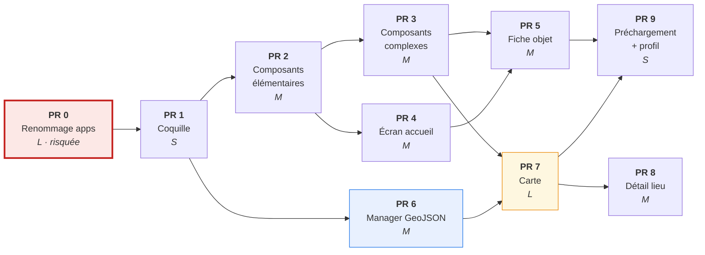
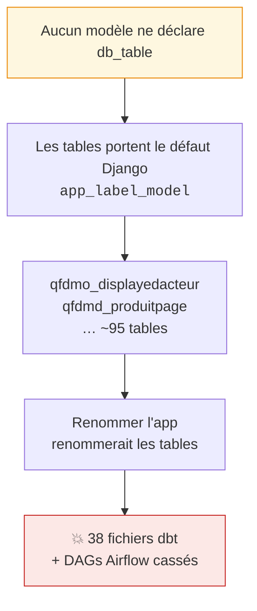
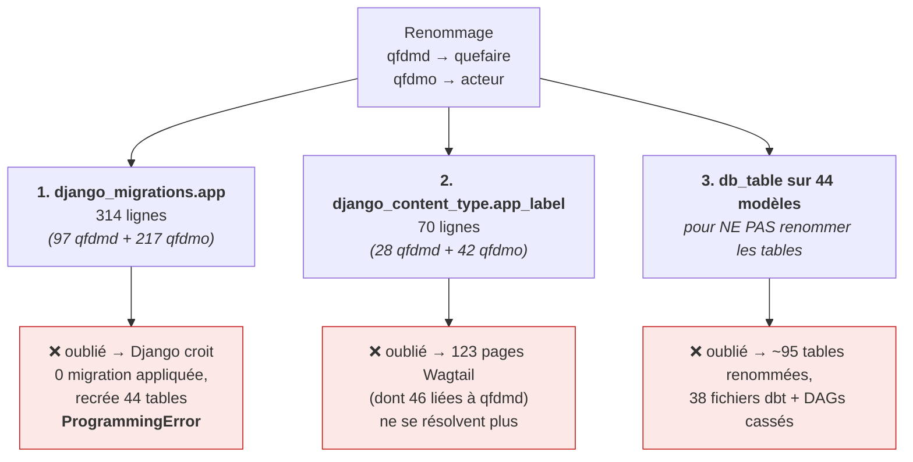
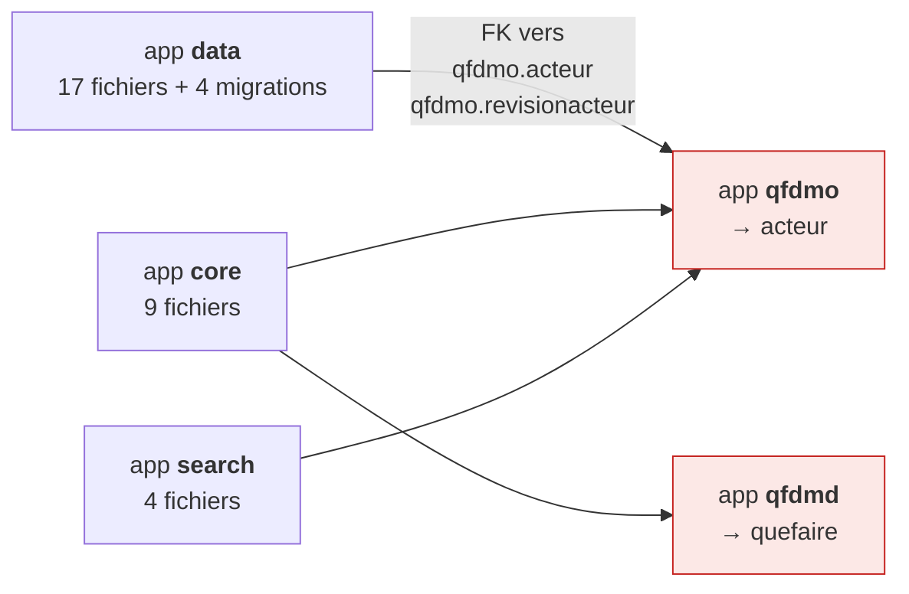
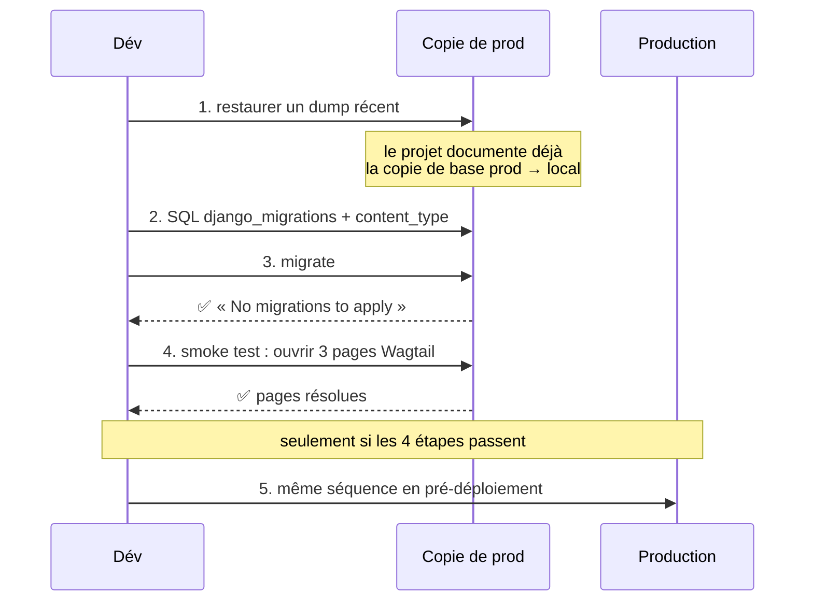
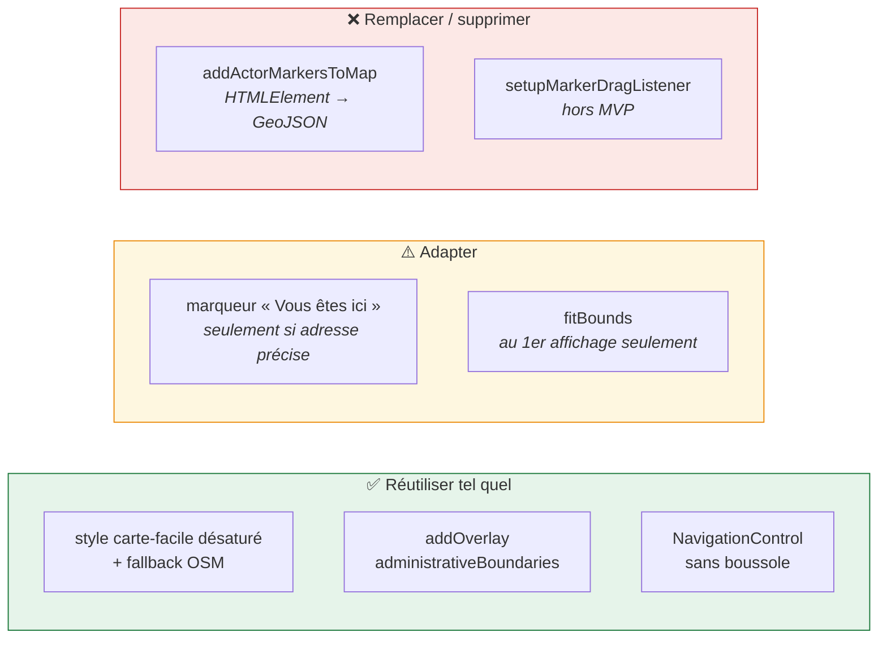

# 6. Découpage en Pull Requests

## Vue d'ensemble



**PR 6 est le chemin parallèle** : indépendante des PR 2-5, elle peut avancer
dès que PR 1 est mergée. C'est utile car PR 7 en dépend et c'est la plus grosse.

### Deux points de séquencement à connaître

> ⚠️ **Mise à jour (2026-09-13) : PR 0 est reportée.** Le renommage attend la
> validation de l'équipe, car il touche la data-platform. Les PR 1, 2-3, 6 et 7
> ont donc été construites sur `qfdmd`/`qfdmo`.
>
> Conséquence assumée : le verrou n'a pas joué, et PR 0 devra balayer ces PR en
> plus du reste. Le travail reste mécanique (`git mv` + `sed`, tables gelées par
> [ADR 0002](adr/0002-geler-noms-tables.md)), mais il n'est plus gratuit. Plus
> on avance, plus la surface grandit : à rouvrir dès que l'équipe tranche.

**1. PR 0 est un verrou, pas une étape.** Tant qu'elle n'est pas mergée, toute
autre PR importera `qfdmd`/`qfdmo` et devra être retouchée. Elle est aussi la
seule à toucher des données de production. → la faire seule, vite, et la merger
avant d'ouvrir les autres.

**2. Le découpage du bundle se décide en PR 1, pas en PR 7.** C'est
contre-intuitif : l'import dynamique de MapLibre _semble_ relever de l'écran
carte. Mais si `assistant.ts` importe MapLibre statiquement dès PR 1, chaque PR
suivante construit sur un bundle de ~1 400 kb, et le corriger en PR 7 devient
une refonte. La cible « bundle initial sans MapLibre » fait donc partie de la
**Definition of done de PR 1**, avec sa vérification automatisée.

| Phase               | PR                                               | Peut démarrer quand…                   |
| ------------------- | ------------------------------------------------ | -------------------------------------- |
| 🔒 **Verrou**       | PR 0 renommage                                   | immédiatement — **seule, mergée vite** |
| 🧱 **Socle**        | PR 1 coquille + budget bundle                    | PR 0 mergée                            |
| 🅰️ **Chaîne UI**    | PR 2 → PR 3 → PR 5, et PR 4 en parallèle de PR 3 | PR 1 mergée                            |
| 🅱️ **Chaîne carte** | PR 6 → PR 7 → PR 8                               | PR 1 mergée                            |
| 🏁 **Final**        | PR 9 préchargement + profil                      | PR 5 **et** PR 7 mergées               |

Les deux chaînes parallèles (UI et carte) ne se rejoignent qu'en PR 9 : deux
personnes peuvent avancer sans se marcher dessus après PR 1.

| PR  | Titre                                          | Dépend de | Taille | Livrable vérifiable                             |
| --- | ---------------------------------------------- | --------- | ------ | ----------------------------------------------- |
| 0   | Renommage `qfdmd`→`quefaire`, `qfdmo`→`acteur` | —         | L ⚠️   | tests verts, aucune migration en attente        |
| 1   | Coquille : app, routes, layout, bundle, ADR    | 0         | S      | `/assistant/` répond 200                        |
| 2   | Lookbook + composants élémentaires             | 1         | M      | 7 composants dans `/lookbook/`                  |
| 3   | Composants complexes                           | 2         | M      | 5 composants de plus                            |
| 4   | Écran accueil + autocompletes                  | 2         | M      | objet + adresse mènent à la fiche               |
| 5   | Fiche objet (consignes statiques)              | 3, 4      | M      | gestes ordonnés, changement d'objet sans reload |
| 6   | Manager GeoJSON + endpoint (#3432)             | 1         | M      | endpoint testé sur les 4 règles                 |
| 7   | Carte MapLibre                                 | 6, 3      | L      | les 4 sections de #3356 vérifiables             |
| 8   | Détail d'un lieu                               | 7         | M      | fiche lieu conforme au périmètre MVP            |
| 9   | Préchargement + profil                         | 5, 7      | S      | profil silk, décision comptage                  |

---

## PR 0 — Renommage des apps ⚠️

À faire **avant tout le reste** : l'assistant importera `quefaire.ProduitPage`
et `acteur.DisplayedActeur`. Renommer après coup imposerait de retoucher
chaque PR.

### Impact mesuré sur la base actuelle

```text
webapp        : ~3050 occurrences « qfdmd », ~3040 « qfdmo »
                118 .py · 15 .html · 16 .md · 2 .ts · 2 .toml · 2 .sql
migrations    : 57 (qfdmd) + 38 (qfdmo) = 95
data-platform : 106 fichiers (DAGs Airflow, tests, Dockerfiles)
dbt           : 38 fichiers référençant les tables physiques
```

### Le piège



### La solution : renommer le code, geler les tables

```python
class DisplayedActeur(...):
    class Meta:
        db_table = "qfdmo_displayedacteur"   # nom historique, figé
```

Voir [ADR 0002](adr/0002-geler-noms-tables.md) pour le raisonnement complet.

| Conséquence                  | Détail                                             |
| ---------------------------- | -------------------------------------------------- |
| ✅ Zéro migration de données | les tables ne bougent pas                          |
| ✅ Zéro downtime             | rien à coordonner avec la data-platform            |
| ✅ dbt et Airflow intacts    | ils lisent les tables, pas les apps                |
| ⚠️ Noms divergents           | `acteur.DisplayedActeur` ↔ `qfdmo_displayedacteur` |

La divergence est le coût assumé. Elle est documentée en commentaire d'en-tête
de chaque `models.py` :

```python
# Les tables conservent leur préfixe historique (qfdmo_/qfdmd_) : la
# data-platform (Airflow, dbt) les lit directement. Renommer les tables
# imposerait une migration coordonnée sans bénéfice fonctionnel.
```

### Déroulé

```bash
git mv webapp/qfdmd webapp/quefaire
git mv webapp/qfdmo webapp/acteur

grep -rl '\bqfdmd\b' webapp --include='*.py' --include='*.html' --include='*.ts' \
  | grep -v migrations | xargs sed -i '' 's/\bqfdmd\b/quefaire/g'
grep -rl '\bqfdmo\b' webapp --include='*.py' --include='*.html' --include='*.ts' \
  | grep -v migrations | xargs sed -i '' 's/\bqfdmo\b/acteur/g'
```

### Le nom `acteur` entre-t-il en collision ?

Question légitime : `qfdmo` contient déjà un modèle `Acteur`, un module
`qfdmo/models/acteur.py`, et **32 champs nommés `"acteur"`** dans les
migrations. Renommer l'app en `acteur` produit donc `acteur.models.acteur.Acteur`
et un label d'app homonyme de champs existants.

**Vérifié en montant une app Django minimale reproduisant exactement ce cas :**

```text
OK label app 'acteur'        -> acteur.Acteur | table: qfdmo_acteur
OK champ nommé 'acteur'      -> acteur.Acteur
OK module acteur.models.acteur -> acteur.models.acteur
django checks                -> aucune erreur
```

Django distingue sans ambiguïté le **label d'app**, le **nom de modèle**, le
**chemin de module** et le **nom de champ** : ce sont des espaces de noms
séparés. `to="acteur.Acteur"` se résout correctement même quand le champ
porteur s'appelle `acteur`.

> ✅ **Conclusion** : le nom `acteur` est techniquement viable. La redondance
> `acteur.models.acteur.Acteur` est inélégante mais sans conséquence
> fonctionnelle. Si elle gêne, l'alternative est de renommer l'app `acteurs`
> (au pluriel) — **à trancher avec l'équipe**, ce n'est pas une contrainte
> technique.

### Les trois écritures en base, dans l'ordre

Le renommage d'une app Django touche **trois** endroits en base. En oublier un
casse le déploiement. Chiffres relevés sur la base actuelle :



> ⚠️ **Le piège le plus dangereux est le n°1**, et il est invisible en local si
> la base n'est pas recréée. `django_migrations.app` stocke le label **en
> chaîne de caractères**, pas en clé étrangère. Après `git mv`, Django ne
> trouve aucune migration appliquée pour `quefaire`/`acteur` et tente de créer
> des tables qui existent déjà.

Puis, dans l'ordre :

1. **`db_table` sur chaque modèle** des deux apps (44 modèles concrets ; le seul proxy, `RevisionActeurParent`, partage la table de son modèle concret et n'en a pas besoin).

2. **Renommer les labels dans `django_migrations`** — à faire **avant** tout
   `migrate`. Deux options :

```python
# Option A — migration SQL dans une app tierce (core), exécutée en premier
operations = [
    migrations.RunSQL(
        "UPDATE django_migrations SET app='quefaire' WHERE app='qfdmd';",
        reverse_sql="UPDATE django_migrations SET app='qfdmd' WHERE app='quefaire';",
    ),
    migrations.RunSQL(
        "UPDATE django_migrations SET app='acteur' WHERE app='qfdmo';",
        reverse_sql="UPDATE django_migrations SET app='qfdmo' WHERE app='acteur';",
    ),
]
```

```bash
# Option B — commande de déploiement, jouée une fois avant migrate
psql "$DATABASE_URL" -c "UPDATE django_migrations SET app='quefaire' WHERE app='qfdmd';"
psql "$DATABASE_URL" -c "UPDATE django_migrations SET app='acteur'  WHERE app='qfdmo';"
```

**Option B est préférable** : une migration qui doit s'exécuter avant que le
graphe ne soit chargé est fragile (problème d'œuf et de poule sur les
`dependencies`). Le SQL en pré-déploiement est explicite et rejouable.

3. **Data migration `ContentType`** :

```python
def renommer_content_types(apps, schema_editor):
    ContentType = apps.get_model("contenttypes", "ContentType")
    ContentType.objects.filter(app_label="qfdmd").update(app_label="quefaire")
    ContentType.objects.filter(app_label="qfdmo").update(app_label="acteur")
```

`UPDATE` en place, et **surtout pas** delete/recreate : les 20+ tables qui
pointent vers `django_content_type` le font par **clé étrangère**
(`wagtailcore_page.content_type_id`, `taggit_taggeditem.content_type_id`,
`wagtailcore_revision`, `modelsearch_indexentry`…). Mettre à jour la ligne
préserve toutes ces références ; la recréer les casserait toutes.

> 📋 Vérifié : `qfdmd` a **28 content types pour 19 modèles**. L'écart
> correspond à des modèles supprimés dont la ligne subsiste. Le `filter(...)
.update(...)` les renomme aussi, ce qui est sans effet — inutile de les
> nettoyer dans cette PR.

4. **Migrations historiques** : ne pas toucher leur contenu, seulement les
   `dependencies = [("qfdmo", "0038_…")]` inter-apps, sinon le graphe casse.

5. **Références restantes** : `INSTALLED_APPS`, `core/urls.py`,
   `pyproject.toml`, `previews/template_preview.py`.

### ⚠️ Les autres apps référencent aussi `qfdmd`/`qfdmo`

Le renommage ne se limite pas aux deux répertoires déplacés. Relevé sur la base
de code actuelle :

| App      | Fichiers Python (hors migrations) | Migrations référençant qfdmd/qfdmo |
| -------- | --------------------------------- | ---------------------------------- |
| `data`   | 17                                | **4**                              |
| `core`   | 9                                 | 0                                  |
| `search` | 4                                 | 0                                  |



Le `sed` de l'étape 1 balaie tout `webapp/`, donc le **code** de `data`, `core`
et `search` est bien traité. **Mais il exclut les migrations** (`grep -v
migrations`), et c'est justement là qu'il reste un problème :

```text
# data/migrations/0015_alter_suggestion_management.py  (extraits)

dependencies = [
    ("qfdmo", "0176_merge_20250924_1802"),   ← label d'app
]
        ...
        to="qfdmo.acteur",                   ← cible de ForeignKey
        to="qfdmo.revisionacteur",
```

Django résout **dépendances et cibles `to=` par label d'app**. Laissées telles
quelles après le renommage, ces références pointent vers une app qui n'existe
plus → graphe de migrations cassé.

#### Ce qu'il faut faire, précisément

| Fichier                               | Action                                                              |
| ------------------------------------- | ------------------------------------------------------------------- |
| Migrations **de** `qfdmd`/`qfdmo`     | ne pas toucher leur contenu, **sauf** les `dependencies` inter-apps |
| Migrations **de `data`** (4 fichiers) | réécrire `dependencies` **et** les `to="qfdmo.xxx"`                 |
| Code de `data`, `core`, `search`      | couvert par le `sed` global                                         |

```bash
# Les migrations de data doivent être traitées, contrairement aux autres
sed -i '' 's/"qfdmo"/"acteur"/g; s/to="qfdmo\./to="acteur./g' \
  webapp/data/migrations/*.py
```

> ⚠️ Réécrire une migration déjà appliquée est sans risque **ici** parce qu'on
> ne change que des **labels**, pas des opérations : la table et les colonnes
> visées restent identiques. C'est la même logique que le gel des `db_table`
> ([ADR 0002](adr/0002-geler-noms-tables.md)).

#### Vérification

```bash
# Aucune référence résiduelle dans TOUTES les migrations
grep -rn '"qfdmo"\|"qfdmd"\|to="qfdm[do]\.' webapp/*/migrations/*.py && echo "KO" || echo "OK"

# Le graphe se charge et rien n'est en attente
cd webapp && uv run python manage.py migrate --plan
```

### Vérifié : ce qui n'est PAS concerné

| Vérification                                                 | Résultat    |
| ------------------------------------------------------------ | ----------- |
| `ProduitPage.body` (StreamField) contenant `qfdmd.`/`qfdmo.` | **0 ligne** |
| `wagtailcore_revision.content` contenant des refs app        | **0 ligne** |

Les StreamField ne stockent donc aucune référence d'app en dur : rien à migrer
de ce côté.

### Garde-fous

```python
import pytest
from django.apps import apps

TABLES_HISTORIQUES = {
    ("acteur", "DisplayedActeur"): "qfdmo_displayedacteur",
    ("quefaire", "ProduitPage"): "qfdmd_produitpage",
    # … un par modèle
}


@pytest.mark.parametrize("cle,table", TABLES_HISTORIQUES.items())
def test_tables_keep_historical_names(cle, table):
    """La data-platform lit ces tables : leur nom ne doit jamais changer."""
    assert apps.get_model(*cle)._meta.db_table == table


def test_every_model_declares_db_table():
    """Un db_table oublié renommerait silencieusement une table en prod."""
    for app_label in ("acteur", "quefaire"):
        for modele in apps.get_app_config(app_label).get_models():
            assert "db_table" in modele.Meta.__dict__ or modele._meta.proxy, modele
```

Le second test est **le vrai filet** : il attrape le modèle qu'on aurait oublié,
là où le premier ne couvre que ceux qu'on a pensé à lister.

#### Contrôle négatif du garde-fou

Ce test a été **exécuté sur la base actuelle, avant toute modification** : il
doit échouer aujourd'hui, sinon il ne protège rien.

```text
$ python manage.py shell -c "<le test ci-dessus>"
modèles : 45, sans db_table explicite : 44
→ le test échoue bien aujourd'hui ✅
```

Le 45ᵉ modèle est `qfdmo.RevisionActeurParent`, un **proxy** qui partage la
table `qfdmo_revisionacteur` de son modèle concret : il n'a pas de `db_table`
à déclarer, d'où l'exemption `or modele._meta.proxy` dans le test.

> 💡 Même règle que pour le garde-fou du bundle : **un contrôle qui n'a jamais
> échoué volontairement n'est pas un contrôle.**

### Matrice de risques

| Risque                                                        | Gravité         | Détection                                       | Mitigation                                            |
| ------------------------------------------------------------- | --------------- | ----------------------------------------------- | ----------------------------------------------------- |
| `django_migrations.app` non renommé → Django recrée 44 tables | 🔴 **critique** | invisible en local si la base n'est pas recréée | SQL de pré-déploiement + répétition sur copie de prod |
| `ContentType` non migrés → 123 pages Wagtail cassées          | 🔴 critique     | visible au premier chargement de page           | data migration `UPDATE` en place                      |
| `db_table` oublié → table renommée en prod                    | 🔴 critique     | CI                                              | `test_every_model_declares_db_table`                  |
| Graphe de migrations cassé                                    | 🟠 bloquant     | CI                                              | `migrate --plan`                                      |
| Conflit avec des PR en cours                                  | 🟡 gênant       | au merge                                        | branche courte, prévenir l'équipe                     |

### Répétition obligatoire avant la prod

Cette PR modifie des données de production. **Elle se répète sur une copie
avant d'être déployée**, ce n'est pas optionnel.



Critère de réussite de la répétition : après le SQL et le `migrate`, la sortie
doit être **`No migrations to apply`**. Si Django propose la moindre opération,
c'est que le renommage des labels est incomplet — **ne pas déployer**.

```bash
# Sur la copie de prod
psql "$COPIE_URL" -c "UPDATE django_migrations SET app='quefaire' WHERE app='qfdmd';"
psql "$COPIE_URL" -c "UPDATE django_migrations SET app='acteur'  WHERE app='qfdmo';"
uv run python manage.py migrate --plan     # doit être vide
uv run python manage.py migrate            # « No migrations to apply »
uv run python manage.py shell -c "
from wagtail.models import Page
print([p.specific.__class__.__name__ for p in Page.objects.live()[:3]])
"                                          # doit lister les classes, pas lever
```

### Rollback

Le renommage est réversible tant que les tables ne bougent pas (c'est
précisément l'intérêt de [l'ADR 0002](adr/0002-geler-noms-tables.md)) :

```bash
git revert <commit>
psql "$DATABASE_URL" -c "UPDATE django_migrations SET app='qfdmd' WHERE app='quefaire';"
psql "$DATABASE_URL" -c "UPDATE django_migrations SET app='qfdmo' WHERE app='acteur';"
psql "$DATABASE_URL" -c "UPDATE django_content_type SET app_label='qfdmd' WHERE app_label='quefaire';"
psql "$DATABASE_URL" -c "UPDATE django_content_type SET app_label='qfdmo' WHERE app_label='acteur';"
```

Aucune donnée métier n'est touchée : seuls des libellés d'app le sont.

---

## PR 1 — Coquille

Voir [02-architecture](02-architecture.md) pour l'arborescence, les routes et
le layout.

**Livrables** :

- app `assistant` dans `INSTALLED_APPS`, montée sur `/assistant/`
- 4 routes répondant 200 (vues stub)
- `ui/layout/assistant.html` sans DSFR
- `assistant.ts` / `assistant.css` compilés par Parcel
- `assistant/README.md` + les 3 ADR

**Definition of done** : `/assistant/` répond 200, `npm run build` produit
`assistant.js` et `assistant.css`, tests verts, **et le bundle initial ne
contient pas MapLibre** :

```bash
# La bibliothèque ne doit pas être dans le bundle initial. Chercher
# « maplibre » ne suffit pas : le nom du chunk chargé dynamiquement y
# apparaît légitimement. On cherche donc un symbole interne.
grep -c "maplibregl\|MercatorCoordinate" static/compiled/assistant.js   # 0
gzip -c static/compiled/assistant.js | wc -c                            # < 150 kb
```

Voir [08-démarrage](08-demarrage.md) pour la check-list complète.

---

## PR 2 & 3 — Composants et lookbook (#3433)

Noms repris du Figma, comme demandé dans le ticket.

**Élémentaires (PR 2)** : `alerte`, `badge`, `barre_recherche`, `bloc_geste`,
`etiquette_geste`, `icone`, `pinpoint`.

**Complexes (PR 3)** : `accordeon`, `bloc_gestes`, `bouton_changer_geste`,
`carte`, `footer`, `header`.

Chaque composant expose une preview lookbook :

```python
class AssistantComposantsPreview(ContextAwareLookbookPreview):
    """Composants élémentaires de l'assistant V2 (#3433)."""

    def etiquette_geste(self, **kwargs):
        """Les 5 gestes dans une seule preview : comparaison directe au Figma."""
        gestes = [("reparer", "Réparer"), ("donner", "Donner"),
                  ("revendre", "Revendre"), ("preter", "Prêter"),
                  ("deposer", "Déposer")]
        return "".join(
            render_to_string(
                "ui/components/assistant/etiquette_geste.html",
                {"code": code, "libelle": libelle},
            )
            for code, libelle in gestes
        )
```

Rendre les 5 variantes dans une seule preview plutôt qu'une preview par
couleur : on compare d'un coup d'œil avec la maquette.

**Definition of done** : les 12 composants visibles dans `/lookbook/`, chacun
avec son `.md`, tokens en place.

---

## PR 4 — Écran accueil

Périmètre MVP strict. Les deux autocompletes héritent des vues existantes :

> 🚫 **Le sous-classement décrit ci-dessous a été écarté à la mesure** : le
> rendu du gabarit coûtait ~25 ms contre 15 ms pour la requête, soit un p95 de
> 69 ms pour un budget de 50 ms. L'assistant sert désormais du JSON depuis
> `RechercheObjetView` — voir
> [ADR 0007](adr/0007-endpoint-json-pour-la-recherche.md).
>
> L'autocomplete d'adresse, lui, suit bien le patron ci-dessous.

```python
# views/autocomplete.py
class AutocompleteObjetView(AutocompleteHomeSearchView):  # ← écarté, cf. ADR 0007
    """Recherche d'objet — hérite du Fuzzy(unaccent=True) existant,
    seul le gabarit de résultats change."""

    template_name = "ui/components/assistant/_partials/resultats_objet.html"


class AutocompleteAdresseView(AutocompleteBanAddressView):
    """Recherche d'adresse — proxy BAN existant.

    L'option synthétique « Autour de moi » de la vue parente est retirée :
    la géolocalisation est hors périmètre MVP (#3295).
    """

    template_name = "ui/components/assistant/_partials/resultats_adresse.html"

    def get_queryset(self):
        return [option for option in super().get_queryset() if not option["geolocate"]]
```

⚠️ **Ne pas oublier** la propagation du `type` BAN
(`housenumber`/`street`/`municipality`), nécessaire à la punaise rouge en PR 7.
Voir [04-stimulus](04-stimulus.md), section « Punaise rouge ».

**Definition of done** : saisir un objet + une adresse mène à la fiche objet ;
les deux champs sont obligatoires.

---

## PR 5 — Fiche objet

Consignes statiques (voir [05-données](05-donnees-et-cache.md), section « Consignes »).

**Definition of done** : la fiche affiche les gestes ordonnés selon la
hiérarchie #3295 ; changer d'objet depuis le header recharge le frame fiche
sans recharger la page.

---

## PR 6 — Manager GeoJSON (#3432)

Voir [05-données et cache](05-donnees-et-cache.md) pour le QuerySet, le
formulaire de validation et la vue.

Livre **trois** objets, pas deux : le QuerySet, la vue, et `LieuxForm`
(`assistant/forms.py`) qui porte tout le contrat d'URL. Le formulaire est
partagé avec `/assistant/solutions/` (PR 5) : c'est lui qui empêche les deux
vues de diverger.

**Tests — un par règle de #3356** :

```python
def test_caps_results_at_twenty_places(): ...
def test_orders_by_distance_from_bbox_center(): ...
def test_filters_on_selected_geste(): ...
def test_excludes_digital_acteurs(): ...          # « uniquement lieux physiques »
```

**Tests du formulaire** — sans client HTTP, voir
[10-contrat d'URL](10-contrat-url.md) :

```python
def test_bbox_takes_precedence_over_latlon(): ...
def test_returns_400_when_no_position_given(): ...
def test_unreadable_bbox_does_not_fall_back_to_latlon(): ...
def test_rejects_every_unreadable_bbox_shape(): ...   # null, 5, [] → 400, pas 500
def test_rejects_non_numeric_bbox_coordinates(): ...
def test_rejects_unknown_geste(): ...                 # ?geste=nimportequoi
```

**Definition of done** : endpoint testé, contrat GeoJSON documenté dans
`assistant/README.md`, validation portée par un formulaire et non par du
parsing manuel.

---

## PR 7 — Carte

### Ce qui existe déjà en V1, et ce qu'on en fait

`static/to_compile/js/solution_map.ts` (239 lignes) et
`controllers/carte/map_controller.ts` (86 lignes) implémentent déjà une carte
MapLibre. **Tout n'est pas à jeter.**



| Élément V1                                          | Décision      | Raison                                                                                        |
| --------------------------------------------------- | ------------- | --------------------------------------------------------------------------------------------- |
| `mapStyles.desaturated` (carte-facile)              | ✅ réutiliser | c'est exactement le fond demandé par #3295                                                    |
| Fallback OSM si carte-facile indisponible           | ✅ réutiliser | déjà spécifié et déjà codé                                                                    |
| `addOverlay(Overlay.administrativeBoundaries)`      | ✅ réutiliser | limites administratives demandées                                                             |
| `NavigationControl` sans boussole, en haut à gauche | ✅ réutiliser | conforme à la spec                                                                            |
| Marqueur « Vous êtes ici »                          | ⚠️ adapter    | V1 l'affiche dès qu'il y a lat/lon ; #3356 §4 exige **adresse précise uniquement**            |
| `fitBounds`                                         | ⚠️ adapter    | uniquement au **premier** affichage ; #3356 interdit tout recentrage ensuite                  |
| `addActorMarkersToMap(Array<HTMLElement>)`          | ❌ remplacer  | signature HTML incompatible avec le GeoJSON ([ADR 0003](adr/0003-geojson-plutot-que-html.md)) |
| `setupMarkerDragListener`                           | ❌ supprimer  | déplacement de marqueur : hors MVP                                                            |

> 💡 **Conséquence pratique** : PR 7 n'écrit pas une carte de zéro. Elle extrait
> la partie « fond de carte et contrôles » de `SolutionMap` — qui est correcte
> et testée — et remplace uniquement la couche de marqueurs. Cela réduit
> nettement la taille réelle de la PR.

### Dépendances de la carte — état vérifié

| Paquet               | Déclaré   | Dernière publiée | État                             |
| -------------------- | --------- | ---------------- | -------------------------------- |
| `@hotwired/turbo`    | `^8.0.23` | 8.0.23           | ✅ à jour                        |
| `@hotwired/stimulus` | `^3.2.2`  | 3.2.2            | ✅ à jour                        |
| `stimulus-use`       | `^0.53.0` | 0.53.1           | ⚠️ **déclaré mais non installé** |
| `maplibre-gl`        | `^6.6.0`  | 6.9.0            | ✅ compatible                    |
| `carte-facile`       | `^0.9.0`  | 0.10.0           | ✅ compatible                    |

**API `carte-facile` vérifiée** dans les deux versions (0.9.0 et 0.10.0) : les
symboles utilisés par `solution_map.ts` existent et sont stables.

```text
export declare const mapStyles: { simple, simpleOsm, aerial, desaturated }
export declare function addOverlay(...)
```

> ✅ Le style `desaturated` demandé par #3295 et l'overlay
> `administrativeBoundaries` sont disponibles dans la version installée **et**
> dans la suivante. Une montée de version de `carte-facile` ne bloque pas PR 7.

### Découpage suggéré de PR 7

| Étape | Contenu                                          | Vérifiable par                         |
| ----- | ------------------------------------------------ | -------------------------------------- |
| 7a    | Extraire fond + contrôles dans un module partagé | la carte s'affiche, vide               |
| 7b    | Couche marqueurs depuis GeoJSON                  | 20 points apparaissent                 |
| 7c    | Règle de fusion / persistance (#3356)            | test e2e « les points ne sautent pas » |
| 7d    | Punaise rouge conditionnelle                     | test e2e commune vs adresse            |
| 7e    | Seuil de dézoom + message                        | test e2e « zoomez sur la carte »       |

Chaque étape est un commit vérifiable seul : si PR 7 devient trop grosse à
relire, elle se scinde sur ces lignes.

La plus grosse PR. Toutes les règles de #3356 sont côté client : voir
[04-stimulus](04-stimulus.md) pour le contrôleur, la persistance des points,
l'annulation des requêtes et l'accessibilité.

**Definition of done** : les 4 sections de #3356 vérifiables à la main, plus
des tests e2e Playwright sur le plafond de 20 points et la persistance.

---

## PR 8 — Détail d'un lieu

```python
class LieuView(TurboFrameMixin, DetailView):
    model = DisplayedActeur
    template_name = "ui/pages/assistant/lieu.html"
    slug_field = "uuid"
    slug_url_kwarg = "uuid"
    context_object_name = "lieu"

    def get_queryset(self):
        return DisplayedActeur.objects.all().pour_le_detail()
```

`pour_le_detail()` porte le `prefetch_related` côté QuerySet, pas dans la vue.

> ❓ **Question ouverte (#3434)** : « définir avec Lucas ce que donne le partage
> d'un acteur, quelle url ? » Ce plan pose `/assistant/lieu/<uuid>/`, cohérent
> avec `adresse_details/<uuid>` en V1. **À valider avant merge.**

---

## PR 9 — Préchargement et profil

1. Frame solutions en `loading="lazy"` (voir [03-turbo-frames](03-turbo-frames.md))
2. **Profil `django-silk`** sur une fiche large (vêtements, emballages)
3. Décision sur le comptage par geste, sur la base du profil

**Definition of done** : un profil chiffré documenté, et une décision tranchée
sur le comptage plutôt qu'un « à voir ».
