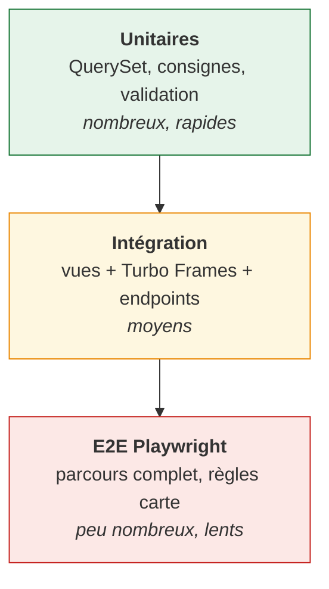
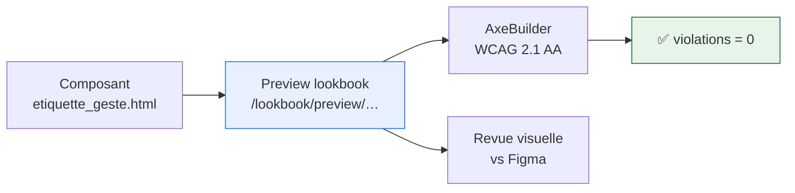

# 7. Tests et qualité

## Pyramide de tests



**Le levier principal est en bas** : les règles de #3356 sont testables sur le
QuerySet, sans HTTP ni navigateur. C'est la raison d'être du découpage
manager/vue de [05-données](05-donnees-et-cache.md).

## Ce qu'on teste, par thème

### Règles métier de la carte (#3356) — unitaire

```python
# assistant/tests/test_geojson.py

def test_caps_results_at_twenty_places(lieux_factory):
    """#3356 : toujours, et en toute circonstance, 20 points maximum."""
    lieux_factory.create_batch(50, geste="reparer")
    resultat = DisplayedActeur.objects.all().pour_le_geste("reparer").autour_de(LON, LAT)
    assert len(resultat.pour_la_carte()) == 20


def test_orders_by_distance_from_bbox_center(lieux_factory):
    """#3356 : tri par distance au centre de la zone où se trouve l'usager."""
    ...


def test_returns_all_places_when_fewer_than_twenty(lieux_factory):
    """#3356 : « si la zone en contient moins, les afficher quand même »."""
    lieux_factory.create_batch(3, geste="donner")
    assert len(...) == 3


def test_excludes_digital_acteurs(lieux_factory):
    """#3295 : « uniquement les lieux physiques »."""
    ...
```

Un test **par phrase de la spec**, avec la citation en docstring. Quand la spec
évolue, on retrouve le test correspondant par recherche textuelle.

### Validation des entrées — unitaire

```python
def test_returns_400_on_unreadable_bbox(client): ...
def test_returns_400_on_non_numeric_coordinates(client): ...
def test_returns_400_when_geste_missing(client): ...
```

Les coordonnées viennent du client : ce sont des entrées non fiables, testées
comme telles.

### Turbo Frames — intégration

```python
def test_serves_full_layout_without_turbo_header(client):
    reponse = client.get(reverse("assistant:produit", args=["chaise"]))
    assert reponse.context["base_template"] == "ui/layout/assistant.html"


def test_serves_reduced_layout_with_turbo_header(client):
    reponse = client.get(
        reverse("assistant:produit", args=["chaise"]),
        headers={"Turbo-Frame": "assistant-fiche"},
    )
    assert reponse.context["base_template"] == "ui/layout/turbo.html"


def test_solutions_url_is_shareable(client):
    """Ouvrir l'URL d'un frame dans un onglet neuf sert une page entière."""
    reponse = client.get(
        reverse("assistant:solutions"),
        {"geste": "reparer", "lat": "48.85", "lon": "2.35"},
    )
    assert b"<!DOCTYPE html>" in reponse.content
```

Le dernier test protège une propriété qu'on casse facilement : une URL de frame
doit rester ouvrable seule.

### Renommage (PR 0) — garde-fou permanent

```python
def test_every_model_declares_db_table():
    """Un db_table oublié renommerait silencieusement une table en prod."""
    for app_label in ("acteur", "quefaire"):
        for modele in apps.get_app_config(app_label).get_models():
            assert "db_table" in modele.Meta.__dict__ or modele._meta.proxy, modele
```

Ce test **reste** après la PR 0 : il empêche qu'un modèle ajouté plus tard
échappe à la règle.

### Accessibilité — le dispositif existe déjà, on l'étend

Le projet a **déjà** `@axe-core/playwright` et un fichier
`e2e_tests/accessibility.spec.ts` qui scanne les pages en WCAG 2.1 AA. On ne
crée donc rien : on ajoute nos routes et nos composants au dispositif existant.

```typescript
// e2e_tests/accessibility.spec.ts — convention du projet : titres en français
const WCAG_TAGS = ["wcag2a", "wcag2aa", "wcag21a", "wcag21aa"];

test("L'accueil de l'assistant V2 respecte les critères WCAG 2.1 AA", async ({
  page,
}) => {
  await navigateTo(page, "/assistant/");
  const resultats = await new AxeBuilder({ page })
    .exclude("[data-disable-axe]")
    .withTags(WCAG_TAGS)
    .analyze();
  expect(resultats.violations).toEqual([]);
});
```

#### L'astuce à reprendre : scanner les previews lookbook

Le fichier existant scanne `/lookbook/preview/iframe/carte/`, pas seulement les
pages réelles. C'est un pattern à généraliser : **chaque composant a une
preview, donc chaque composant est testable en isolation.**

```typescript
// Un composant cassé est détecté sans monter une page complète
for (const composant of [
  "alerte",
  "bloc_geste",
  "barre_recherche",
  "accordeon",
]) {
  test(`Le composant ${composant} respecte les critères WCAG 2.1 AA`, async ({
    page,
  }) => {
    await navigateTo(
      page,
      `/lookbook/preview/assistant_composants/${composant}/`,
    );
    const resultats = await new AxeBuilder({ page })
      .withTags(WCAG_TAGS)
      .analyze();
    expect(resultats.violations).toEqual([]);
  });
}
```



Double bénéfice : la preview sert à la fois de vitrine de design et de
harnais de test. C'est la raison pour laquelle chaque composant de PR 2 et PR 3
**doit** avoir sa preview, et pas seulement son `.md`.

#### Ce que axe ne détecte pas

axe-core couvre ~30-40 % des critères WCAG. Restent à vérifier à la main, et
ce sont précisément les points sensibles ici :

| Point                             | Pourquoi axe ne le voit pas              | Vérification                            |
| --------------------------------- | ---------------------------------------- | --------------------------------------- |
| Navigation clavier dans la carte  | axe ne simule pas le clavier             | test Playwright dédié (`page.keyboard`) |
| Liste accessible des lieux        | axe ne juge pas la pertinence du contenu | test d'intégration Django               |
| Ordre de tabulation cohérent      | axe ne connaît pas l'intention           | revue manuelle                          |
| Libellés explicites hors contexte | axe accepte « En savoir plus »           | revue manuelle                          |
| `prefers-reduced-motion`          | non testé par défaut                     | test Playwright avec `emulateMedia`     |

```python
# Tests d'intégration Django — noms en anglais (convention du dépôt)
def test_renders_accessible_list_of_places(client):
    """La carte n'est pas navigable au clavier : une liste doit exister."""
    reponse = client.get(
        reverse("assistant:solutions"),
        {"geste": "reparer", "lat": "48.85", "lon": "2.35"},
    )
    assert 'class="qfa-lieux-accessibles' in reponse.content.decode()


def test_renders_skiplink(client):
    """RGAA 12.7 — on n'a plus , donc on vérifie le nôtre."""
    reponse = client.get(reverse("assistant:home"))
    assert 'class="qfa-skiplink"' in reponse.content.decode()
```

```typescript
// Ce que axe ne peut pas voir : la carte est-elle utilisable au clavier ?
test("Les lieux de la carte sont atteignables au clavier", async ({ page }) => {
  await navigateTo(
    page,
    "/assistant/solutions/?geste=reparer&lat=48.85&lon=2.35",
  );
  await page.keyboard.press("Tab");
  const focus = await page.evaluate(() => document.activeElement?.tagName);
  expect(focus).not.toBe("BODY"); // le focus doit entrer dans la liste
});
```

#### Respect de `prefers-reduced-motion`

Les transitions (`useTransition`, apparition du panneau lieu) doivent se
désactiver quand l'usager le demande :

```css
@media (prefers-reduced-motion: reduce) {
  .qfa-panneau-lieu {
    transition: none;
  }
}
```

```typescript
test("Les transitions sont désactivées en prefers-reduced-motion", async ({
  page,
}) => {
  await page.emulateMedia({ reducedMotion: "reduce" });
  // …
});
```

### E2E Playwright — les règles difficiles

Réservé à ce qui n'est vérifiable qu'en navigateur :

| Test                                          | Règle couverte                            |
| --------------------------------------------- | ----------------------------------------- |
| `test_points_persistent_au_deplacement`       | #3356 : un point visible ne disparaît pas |
| `test_dezoom_masque_puis_rezoom_restitue`     | #3356 : points mis de côté, pas perdus    |
| `test_pas_de_refresh_pendant_le_mouvement`    | #3356 : 1 s d'immobilité requise          |
| `test_punaise_rouge_absente_pour_une_commune` | #3356 §4                                  |
| `test_clic_solutions_sans_requete_reseau`     | le préchargement fonctionne               |

Le projet a déjà une configuration Playwright (`webapp/playwright.config.ts`)
avec les flags WebGL nécessaires pour MapLibre en headless :
`--use-angle=gl --use-gl=angle --ignore-gpu-blacklist`.

## Checklist avant merge

Par PR, à cocher dans la description :

```markdown
- [ ] Tests unitaires sur les règles métier touchées (citation de spec en docstring)
- [ ] Pas de logique de sélection dans une vue (tout sur le QuerySet)
- [ ] Entrées client validées (float/bbox sous try)
- [ ] Composants nouveaux : preview lookbook + fichier .md
- [ ] Accessibilité : navigable au clavier, libellés explicites
- [ ] Pas de régression de bundle (< 150 kb JS, < 30 kb CSS)
- [ ] `makemigrations --check --dry-run` ne propose rien
```

## Qualité de code

Le projet impose déjà (CI) :

| Langage    | Outil                 | Convention                         |
| ---------- | --------------------- | ---------------------------------- |
| Python     | `ruff`                | PEP 8, ligne 88                    |
| TypeScript | `eslint` + `prettier` | ts.dev/style, pas de `;`, ligne 88 |

### Quelle langue, où ? (conventions relevées dans le dépôt)

Le dépôt applique une règle précise, à respecter pour ne pas détonner :

| Élément                        | Langue       | Exemple constaté                                              |
| ------------------------------ | ------------ | ------------------------------------------------------------- |
| Nom de fonction de test Python | **anglais**  | `test_produit_page_has_seo_meta_tags`                         |
| Docstring de test Python       | français     | citation de la spec                                           |
| Titre de test Playwright       | **français** | `test("Le surfooter est encapsulé dans un <nav aria-label>")` |
| Nom de variable / fonction     | anglais      | `get_queryset`, `couleur` (franglais toléré)                  |
| URL et contenu usager          | français     | `/assistant/objet/<slug>/`                                    |

> Les exemples de ce plan suivent cette règle : **fonctions Python en anglais,
> descriptions Playwright en français**. Voir aussi
> [docs/reference/coding](../../reference/coding/README.md).

Conventions propres à l'assistant :

- **Constantes de spec nommées et commentées** — `NOMBRE_MAX_LIEUX = 20  # #3356`
  plutôt qu'un `20` en dur. Chaque nombre magique renvoie à sa source.
- **Docstrings citant la spec** sur les méthodes qui portent une règle métier.
- **Français dans les URLs et le contenu**, anglais dans le code
  (voir [docs/reference/coding](../../reference/coding/README.md)).

## Vérifier ce plan lui-même

Les extraits de code de ce plan sont **contrôlés syntaxiquement**. Si vous en
modifiez un, relancez la vérification :

````bash
# Blocs Python : tous doivent parser
python3 - <<'PY'
import re, pathlib, ast
bad = 0
for f in pathlib.Path("docs/explanations/assistant").rglob("*.md"):
    for m in re.finditer(r"```python\n(.*?)```", f.read_text(), re.S):
        try:
            ast.parse(m.group(1))
        except SyntaxError as e:
            bad += 1
            print(f"{f.name}: {e.msg}")
print("blocs Python invalides:", bad)
PY
````

```bash
# Diagrammes Mermaid : tous doivent rendre
mmdc -i diagramme.mmd -o /tmp/out.svg
```

État au dernier passage :

| Contrôle                        | Résultat        |
| ------------------------------- | --------------- |
| Blocs Python (35)               | ✅ tous parsent |
| Blocs TypeScript autonomes (12) | ✅ tous parsent |
| Diagrammes Mermaid (28)         | ✅ tous rendent |
| Liens internes                  | ✅ aucun cassé  |
| Build Sphinx                    | ✅ 0 warning    |

> Les extraits annotés « dans la classe du contrôleur » sont des **membres de
> classe isolés** : ils ne compilent pas seuls, c'est normal. Les blocs
> destinés au copier-coller, eux, sont complets.

## Métriques de performance

Cibles, mesurées avec `django-silk` (déjà en dépendance) et Lighthouse :

| Métrique                      | Cible    | Pourquoi                                                                                                        |
| ----------------------------- | -------- | --------------------------------------------------------------------------------------------------------------- |
| Réponse fiche objet           | < 200 ms | c'est l'écran le plus visité                                                                                    |
| Réponse GeoJSON (zone rurale) | < 50 ms  | mesuré : 10-27 ms                                                                                               |
| Réponse GeoJSON (zone dense)  | < 150 ms | **mesuré à 450 ms sans optimisation** — voir [05-données](05-donnees-et-cache.md), stratégie du rayon croissant |
| JS transféré (gzip)           | < 150 kb | iframe chez des réutilisateurs                                                                                  |
| CSS transféré (gzip)          | < 30 kb  | idem                                                                                                            |
| LCP                           | < 2.5 s  | Core Web Vitals                                                                                                 |

**Mesurer avant d'optimiser** : PR 9 commence par un profil, pas par du cache.
