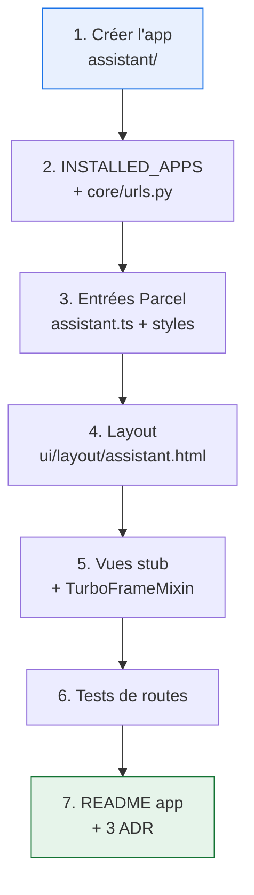

# 8. Démarrage — check-list PR 1

> Objectif : passer d'un dépôt vierge à `/assistant/` qui répond 200, sans
> chercher les informations ailleurs.

## Prérequis vérifiés

| Élément     | Valeur constatée                   | Où                                                              |
| ----------- | ---------------------------------- | --------------------------------------------------------------- |
| Django      | **6.1.1**                          | `uv run python -c "import django; print(django.get_version())"` |
| Base locale | ~387 700 acteurs, 42 `ProduitPage` | voir [installation](../../how-to/development/installation.md)   |
| Bundler     | Parcel, sortie `static/compiled/`  | `webapp/package.json` → `targets`                               |
| Tailwind    | préfixe `qf-`, thème dérivé DSFR   | `webapp/tailwind.config.js`                                     |
| Lookbook    | previews dans `webapp/previews/`   | `settings/base.py` → `LOOKBOOK`                                 |

## Étapes



### 1. Créer l'app

```bash
cd webapp
uv run python manage.py startapp assistant
rm assistant/models.py assistant/admin.py assistant/views.py assistant/tests.py
mkdir -p assistant/views assistant/tests
```

On supprime `models.py` : l'app ne possède aucune donnée
(voir [02-architecture](02-architecture.md)).

```python
# assistant/apps.py
from django.apps import AppConfig


class AssistantConfig(AppConfig):
    default_auto_field = "django.db.models.BigAutoField"
    name = "assistant"
    verbose_name = "Assistant V2"
```

### 2. Enregistrer l'app et les routes

```python
# settings/base.py
INSTALLED_APPS = [
    # …
    "quefaire",
    "acteur",
    "assistant",   # ← ajout
    "infotri",
    # …
]
```

```python
# core/urls.py — AVANT le bloc Wagtail (voir l'avertissement ci-dessous)
path("assistant/", include(("assistant.urls", "assistant"), namespace="assistant")),
```

> ⚠️ `sites_conformes_urls` est monté sur `""` **en fin** de `core/urls.py` et
> se comporte comme un catch-all Wagtail. Toute route déclarée après lui est
> inatteignable.

### 3. Entrées Parcel

`webapp/package.json` → tableau `source` : `static/to_compile/assistant.ts`
**y est déjà** (vérifié). Il ne reste qu'à écrire les fichiers.

```typescript
// static/to_compile/assistant.ts
// Parcel génère un .css du même nom à partir des CSS importés ici.
import "./styles/assistant.css";
import "./js/assistant";
```

```css
/* static/to_compile/styles/assistant.css */
@tailwind base;
@tailwind components;
@tailwind utilities;

:root {
  --qfa-rayon: 8px;
  --qfa-duree-rapide: 150ms;
  /* … voir 02-architecture, section « tokens » */
}

/* RGAA 12.7 — on ne charge pas , donc on écrit le nôtre */
.qfa-skiplink {
  position: absolute;
  left: -9999px;
}
.qfa-skiplink:focus {
  left: 0;
  top: 0;
  padding: 0.5rem 1rem;
  background: #fff;
  z-index: 100;
}
```

```bash
npm run build          # produit static/compiled/assistant.{js,css}
# ou, en développement :
npm run watch
```

> 💡 **Piège connu du projet** : après un `git pull`, le cache Parcel racine
> peut servir un ancien bundle. En cas de comportement JS incohérent,
> `rm -rf .parcel-cache` puis rebuild.

### 4. Layout

Voir [02-architecture](02-architecture.md), section « Layout ». Points à ne pas
oublier : `noindex`, skiplink, **pas** de ``.

### 5. Vues stub

```python
# assistant/views/__init__.py
from .pages import HomeView, LieuView, ProduitView, SolutionsView

__all__ = ["HomeView", "LieuView", "ProduitView", "SolutionsView"]
```

`mixins.py` et `pages.py` : voir [02-architecture](02-architecture.md).

### 6. Tests

```python
# assistant/tests/test_urls.py
import pytest
from django.urls import reverse


@pytest.mark.parametrize("nom", ["assistant:home", "assistant:solutions"])
def test_routes_respond(client, nom):
    assert client.get(reverse(nom)).status_code == 200


def test_serves_reduced_layout_on_turbo_request(client):
    reponse = client.get(reverse("assistant:home"), headers={"Turbo-Frame": "x"})
    assert reponse.context["base_template"] == "ui/layout/turbo.html"
```

```bash
cd webapp && make unit-test
```

### 7. Documentation d'app

`assistant/README.md` (façon aides-agri) : objectif, dépendances internes
(`quefaire.ProduitPage`, `acteur.DisplayedActeur`), dépendances externes (BAN,
MapLibre, carte-facile), contrat GeoJSON.

Puis les 3 ADR — voir [adr/](adr/README.md).

## Definition of done

- [ ] `/assistant/` répond 200 ; `/assistant/objet/<slug>/` aussi
- [ ] `npm run build` produit `assistant.js` et `assistant.css`
- [ ] Le bundle initial **ne contient pas MapLibre**
      (`grep -c maplibre static/compiled/assistant.js` → 0)
- [ ] `make unit-test` vert
- [ ] Aucune classe `fr-*` dans les templates de l'assistant
- [ ] `assistant/README.md` et les 3 ADR écrits

## Commandes utiles

```bash
# Environnement
cd webapp && uv sync

# Serveur local (voir how-to/development/installation.md)
uv run python manage.py runserver

# Lookbook (previews des composants)
open http://localhost:8000/lookbook/

# Vérifier le poids du bundle
gzip -c static/compiled/assistant.js | wc -c

# Qualité
uv run ruff check . && npm run lint
```
