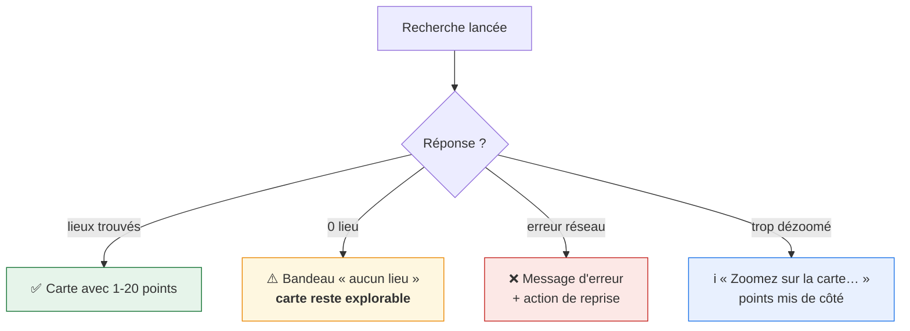
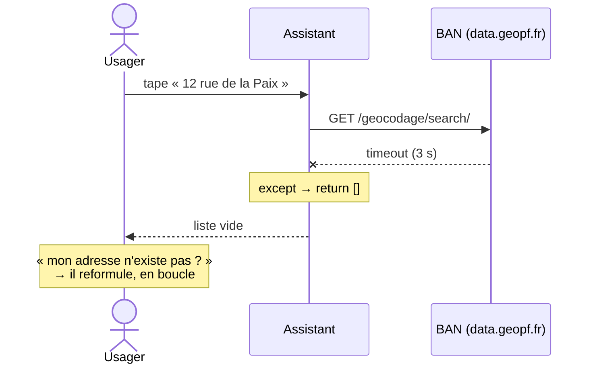

# 9. États vides, erreurs et modes dégradés

> Ce que voit l'usager quand ça ne se passe pas bien. Souvent oublié dans les
> plans, systématiquement rencontré en production.

## Vue d'ensemble



## Le tableau de référence

| Situation                                            | Spécifié ?      | Comportement attendu                                                                                                     | Où l'implémenter          |
| ---------------------------------------------------- | --------------- | ------------------------------------------------------------------------------------------------------------------------ | ------------------------- |
| **0 lieu pour ce geste + cette adresse**             | ✅ #3295        | Bandeau « aucun lieu » **non bloquant** ; la carte **reste explorable**                                                  | contrôleur carte          |
| **Dézoom au-delà du seuil département**              | ✅ #3356        | Message « Zoomez sur la carte et faites-la défiler, ou cherchez une nouvelle adresse » ; points **conservés en mémoire** | contrôleur carte          |
| **Fiche objet sans geste disponible**                | ❌ non spécifié | à trancher : masquer la fiche ou afficher « pas de solution près de chez vous »                                          | vue `ProduitView`         |
| **BAN indisponible (timeout 3 s)**                   | ❌ non spécifié | ⚠️ **piège**, voir ci-dessous                                                                                            | `AutocompleteAdresseView` |
| **Endpoint GeoJSON en erreur 500**                   | ❌ non spécifié | message + bouton « réessayer », ne pas vider la carte                                                                    | contrôleur carte          |
| **MapLibre ne charge pas** (import dynamique échoué) | ❌ non spécifié | repli sur la liste accessible des lieux                                                                                  | contrôleur carte          |
| **JavaScript désactivé**                             | ❌ non spécifié | la fiche objet doit rester lisible                                                                                       | layout                    |

## ⚠️ Le piège BAN : panne et « aucun résultat » se ressemblent

Vérifié dans `qfdmo/views/autocomplete.py` :

```python
BAN_TIMEOUT_SECONDS = 3

try:
    response = requests.get(BAN_API_URL, params={"q": query}, timeout=BAN_TIMEOUT_SECONDS)
    ...
except (requests.RequestException, ValueError) as exc:
    logger.warning("BAN proxy failed for query %r: %s", query, exc)
    return []          # ← indistinguable de « aucune adresse trouvée »
```

Du point de vue de l'usager, **une panne de la BAN ressemble exactement à une
adresse introuvable**. Il va corriger sa saisie encore et encore sans succès.



**Recommandation pour PR 4** : distinguer les deux cas dans le gabarit de
résultats.

```python
class AutocompleteAdresseView(AutocompleteBanAddressView):
    def get_context_data(self, **kwargs):
        context = super().get_context_data(**kwargs)
        # Distinguer « BAN muette » de « aucune adresse ne correspond » :
        # sans ça, l'usager reformule indéfiniment une saisie correcte.
        context["service_indisponible"] = getattr(self, "ban_failed", False)
        return context
```

```django

  <li class="qfa-alerte" role="status">
    La recherche d'adresse est momentanément indisponible. Réessayez dans un instant.
  </li>

  <li role="status">Aucune adresse ne correspond à votre saisie.</li>

```

> Cela suppose un petit ajout dans la vue parente (positionner `ban_failed`).
> À faire dans PR 4, c'est quelques lignes.

## Le bandeau « aucun lieu » (#3295)

Seul état vide **explicitement spécifié** :

> « Affiché si une adresse est saisie **et** 0 résultat ; **La carte reste
> explorable** »

Deux conséquences d'implémentation :

1. le bandeau **ne bloque pas** l'interaction : pas de modale, pas d'overlay
   opaque ; un bandeau au-dessus ou sous la carte ;
2. la carte **reste montée et manipulable** — l'usager doit pouvoir déplacer la
   vue pour chercher ailleurs, ce qui déclenchera un nouveau rafraîchissement.

```html
<div class="qfa-alerte qfa-alerte--info" role="status">
  Aucun lieu trouvé ici. Déplacez la carte pour explorer une autre zone.
</div>
```

`role="status"` plutôt que `role="alert"` : l'information est utile, pas
urgente, et `alert` interrompt la lecture d'écran en cours.

## Accessibilité des messages d'état

| Message                 | Rôle ARIA          | Pourquoi                                   |
| ----------------------- | ------------------ | ------------------------------------------ |
| « aucun lieu trouvé »   | `role="status"`    | information non urgente, annoncée poliment |
| « zoomez sur la carte » | `role="status"`    | idem                                       |
| erreur réseau bloquante | `role="alert"`     | l'usager doit agir                         |
| chargement en cours     | `aria-busy="true"` | évite l'annonce d'un état transitoire      |

Les trois premiers doivent être dans une **région live** présente dès le
chargement (un conteneur vide avec `role="status"`), sinon certains lecteurs
d'écran n'annoncent pas le contenu injecté après coup.

```html
{# présent dès le chargement, rempli dynamiquement #}
<div id="assistant-annonces" role="status" aria-live="polite"></div>
```

## Sans JavaScript

L'assistant est une iframe pilotée par Stimulus : sans JS, la carte ne
fonctionne pas. Deux niveaux possibles, **à trancher** :

| Niveau                 | Comportement                                                                                                 | Coût                   |
| ---------------------- | ------------------------------------------------------------------------------------------------------------ | ---------------------- |
| **A** (recommandé MVP) | La fiche objet et ses consignes restent lisibles ; la carte affiche un `<noscript>` expliquant la limitation | quelques lignes        |
| **B**                  | Liste des lieux rendue côté serveur, utilisable sans JS                                                      | significatif, hors MVP |

Le niveau A est cohérent avec la liste accessible des lieux déjà prévue
([04-stimulus](04-stimulus.md)) : celle-ci est rendue côté serveur, donc elle
fonctionne aussi sans JS.

```html
<noscript>
  <p>
    L'affichage de la carte nécessite JavaScript. La liste des lieux ci-dessous
    reste utilisable.
  </p>
</noscript>
```

## Tests à prévoir

```python
def test_shows_empty_banner_when_no_place_found(client):
    """#3295 : bandeau « aucun lieu » si adresse saisie et 0 résultat."""
    ...


def test_map_remains_explorable_when_empty(page):
    """#3295 : le bandeau ne bloque pas l'interaction avec la carte."""
    ...
```

```typescript
test("Une panne de la BAN affiche un message distinct de « aucun résultat »", async ({
  page,
}) => {
  await page.route("**/recherche/adresse*", (route) => route.abort());
  // …le message doit dire « indisponible », pas « aucune adresse »
});
```
