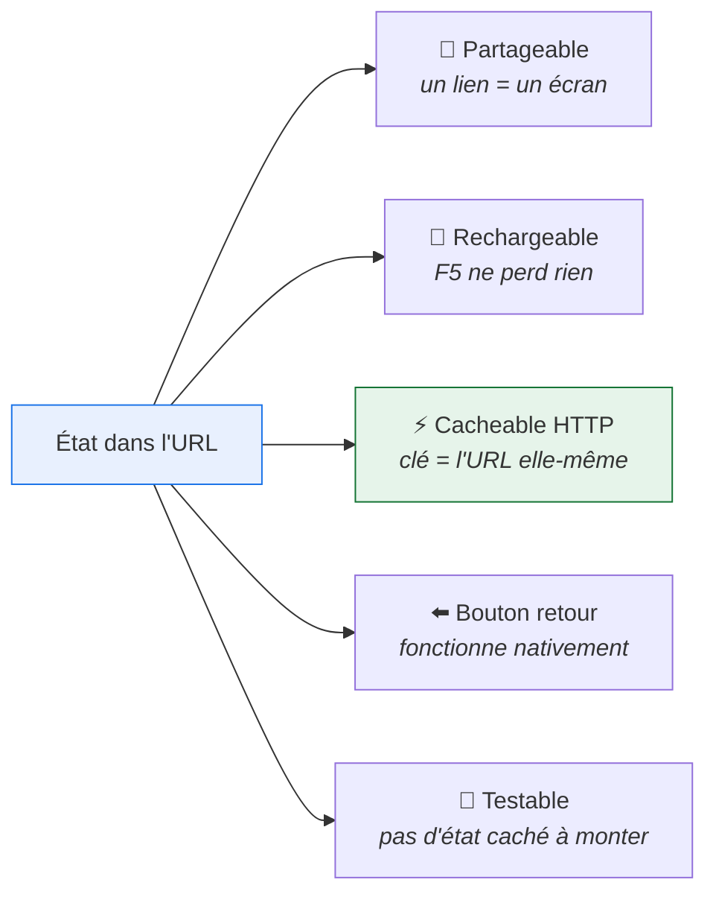
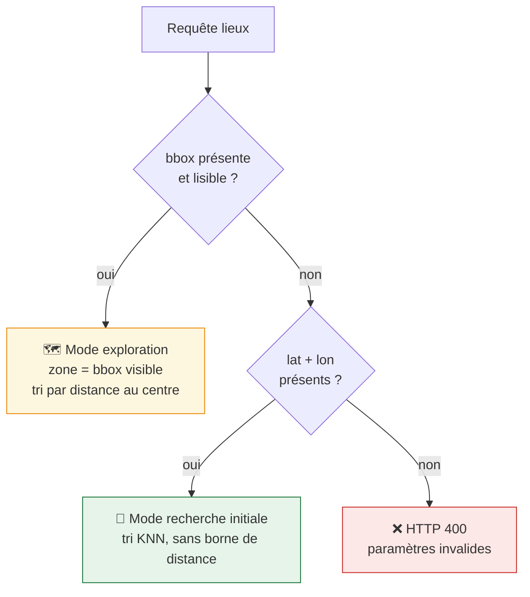

# 10. Contrat d'URL

> L'état de l'assistant vit **entièrement dans l'URL**. C'est ce qui rend chaque
> écran partageable, rechargeable et cacheable en HTTP. Ce document définit le
> contrat que toutes les PR doivent respecter.

## Pourquoi l'URL plutôt qu'un store client



C'est aussi ce qui permet au cache HTTP de fonctionner **sans fabriquer de
clé** : l'URL _est_ la clé ([05-données et cache](05-donnees-et-cache.md)).

## Les routes

| Route                          | Nom Django                       | Paramètres de chemin | Query string                                                             |
| ------------------------------ | -------------------------------- | -------------------- | ------------------------------------------------------------------------ |
| `/assistant/`                  | `assistant:home`                 | —                    | —                                                                        |
| `/assistant/objet/<slug>/`     | `assistant:produit`              | `slug`               | `adresse`, `lat`, `lon`                                                  |
| `/assistant/solutions/`        | `assistant:solutions`            | —                    | `geste`, `lat`, `lon`, `adresse`, `bbox`                                 |
| `/assistant/lieu/<uuid>/`      | `assistant:lieu`                 | `uuid`               | —                                                                        |
| `/assistant/lieux.geojson`     | `assistant:lieux-geojson`        | —                    | `geste`, `objet`, `lat`, `lon`, `bbox`                                   |
| `/assistant/recherche/objet`   | `assistant:recherche-objet`      | —                    | `q` (JSON, voir [ADR 0007](adr/0007-endpoint-json-pour-la-recherche.md)) |
| `/assistant/recherche/adresse` | `assistant:autocomplete-adresse` | —                    | `q`                                                                      |

## Les paramètres

| Paramètre     | Type   | Obligatoire             | Valeurs                                                                                     | Origine                                                      |
| ------------- | ------ | ----------------------- | ------------------------------------------------------------------------------------------- | ------------------------------------------------------------ |
| `slug`        | chemin | ✅                      | slug Wagtail                                                                                | `ProduitPage.slug`                                           |
| `uuid`        | chemin | ✅                      | uuid court                                                                                  | `DisplayedActeur.uuid`                                       |
| `geste`       | query  | ✅ (solutions, geojson) | `reparer`, `donner_echanger_rapporter`, `emprunter_preter_louer`, `vendre_acheter`, `trier` | **`GroupeAction.code`** — voir [02](02-architecture.md)      |
| `lat` / `lon` | query  | ✅ si pas de `bbox`     | décimal WGS84                                                                               | choix dans l'autocomplete BAN                                |
| `adresse`     | query  | ⚪️ affichage            | texte libre                                                                                 | libellé BAN, **réaffiché seulement**                         |
| `objet`       | query  | ⚪️ recommandé           | slug de `ProduitPage`                                                                       | restreint aux sous-catégories de la fiche ; `404` si inconnu |
| `bbox`        | query  | ⚪️ exploration          | JSON Leaflet                                                                                | déplacement de la carte                                      |
| `q`           | query  | ✅ (autocomplete)       | texte libre                                                                                 | saisie usager                                                |

> ⚠️ **`objet` est facultatif mais quasi toujours souhaitable.** Sans lui,
> `?geste=reparer` renvoie des réparateurs de n'importe quoi. Avec lui, le
> geste et l'objet sont cherchés sur la _même_ proposition : un réparateur de
> vélos doublé d'un donneur de meubles n'est pas un réparateur de meubles.
> Voir [ADR 0006](adr/0006-strategie-adaptative-geste-objet.md).

> ⚠️ **`geste` prend un code de `GroupeAction`, pas d'`Action`.** Un `?geste=deposer`
> ne correspond à rien : le code attendu est `trier`.

## Règles de priorité

Deux paramètres peuvent décrire la zone de recherche. L'ordre est **strict** :



| Situation                                          | Comportement                                                     |
| -------------------------------------------------- | ---------------------------------------------------------------- |
| `bbox` seule                                       | exploration, tri depuis le centre de la bbox                     |
| `lat`+`lon` seuls                                  | recherche initiale, tri par proximité                            |
| `bbox` **et** `lat`+`lon`                          | **`bbox` gagne** — l'usager a bougé la carte depuis sa recherche |
| ni l'un ni l'autre                                 | `400`                                                            |
| `bbox` illisible (`sanitize_frontend_bbox` → `[]`) | `400`, **pas** de repli silencieux sur `lat`/`lon`               |

Le dernier point est délibéré : un repli masquerait un bug client et
afficherait une zone que l'usager ne regarde pas.

## `adresse` n'est jamais utilisée pour chercher

`adresse` est **purement décorative** : elle réaffiche le libellé dans le
header. La recherche se fait **toujours** sur `lat`/`lon` ou `bbox`.

```python
# ✅ correct
lieux = qs.autour_de(params["lon"], params["lat"])

# ❌ ne jamais faire : géocoder côté serveur à chaque requête
lieux = qs.autour_de(*geocoder(request.GET["adresse"]))
```

Raisons : le géocodage est déjà fait par l'autocomplete, refaire un appel BAN
par requête ajouterait 3 s de latence et une dépendance externe sur le chemin
critique ([09-états dégradés](09-etats-degrades.md)).

## Le type d'adresse, porté séparément

La punaise rouge dépend du **type BAN**, pas de l'adresse elle-même
(#3356 §4). Il transite par un attribut de données, **pas** par l'URL :

| Type BAN                | Punaise     |
| ----------------------- | ----------- |
| `housenumber`, `street` | ✅ affichée |
| `municipality`          | ❌ absente  |

Le mettre dans l'URL serait tentant mais inutile : il est dérivable au moment
du choix dans l'autocomplete et n'a pas besoin de survivre à un partage de lien
— un lien partagé montre les lieux, pas la position de celui qui l'a envoyé.

## Exemples complets

```text
# Accueil
/assistant/

# Fiche objet après recherche
/assistant/objet/telephone-mobile/?adresse=12+rue+de+la+Paix%2C+Paris&lat=48.8698&lon=2.3312

# Solutions pour un geste
/assistant/solutions/?geste=reparer&lat=48.8698&lon=2.3312&adresse=12+rue+de+la+Paix%2C+Paris

# Après déplacement de la carte (bbox prioritaire)
/assistant/solutions/?geste=reparer&bbox=%7B%22southWest%22%3A...%7D

# Données de la carte
/assistant/lieux.geojson?geste=reparer&lat=48.8698&lon=2.3312

# Détail d'un lieu (partageable tel quel)
/assistant/lieu/a1b2c3d4/
```

## Construire les URLs dans les gabarits

**Toujours** `` (natif depuis Django 5.1, le projet est en
6.1.1), jamais de concaténation :

```django
{# ✅ préserve les paramètres existants et encode correctement #}
<turbo-frame id="assistant-solutions"
             src=""
             loading="lazy" hidden></turbo-frame>

{# ❌ casse au premier accent ou espace dans l'adresse #}
src="?geste={{ geste }}&adresse={{ adresse }}"
```

## Validation côté serveur

**Une seule implémentation**, dans `assistant/views/geojson.py` : la méthode
`_params()` détaillée dans [05-données et cache](05-donnees-et-cache.md),
section « Validation aux frontières ».

Elle applique exactement les règles de priorité ci-dessus :

| Entrée                     | Sortie                                       |
| -------------------------- | -------------------------------------------- |
| `bbox` lisible             | `{"bbox": [...], "lat": None, "lon": None}`  |
| `lat`+`lon` numériques     | `{"bbox": None, "lat": float, "lon": float}` |
| `bbox` illisible           | `ValueError` → `400`                         |
| `lat`/`lon` non numériques | `ValueError` → `400`                         |
| `lat`/`lon` absents        | `KeyError` → `400`                           |
| `geste` absent             | `KeyError` → `400`                           |

> 🔁 **Ne pas dupliquer cette fonction.** Si une autre vue a besoin de lire la
> position, elle importe celle-ci. Deux implémentations divergeraient au
> premier changement de règle.

## Tests du contrat

```python
def test_bbox_takes_precedence_over_latlon(client):
    """L'usager a bougé la carte : la bbox décrit ce qu'il regarde."""
    ...


def test_returns_400_when_no_position_given(client):
    """Ni bbox ni lat/lon : on ne devine pas une zone."""
    ...


def test_unreadable_bbox_does_not_fall_back_to_latlon(client):
    """Un repli silencieux masquerait un bug client."""
    ...


def test_adresse_is_never_used_for_geocoding(client):
    """`adresse` est décorative : seuls lat/lon et bbox localisent."""
    ...
```

## Ce qui ne doit PAS entrer dans l'URL

| Donnée                              | Pourquoi                                                  |
| ----------------------------------- | --------------------------------------------------------- |
| Filtres (Bonus, ESS, Répar'Acteurs) | hors MVP (#3295) — les ajouter plus tard, en query string |
| Mode liste/carte                    | hors MVP                                                  |
| Type d'adresse BAN                  | dérivable, sans intérêt au partage                        |
| Identifiant de session              | l'assistant est anonyme                                   |
| Position GPS de l'usager            | géolocalisation hors MVP, et donnée sensible              |
