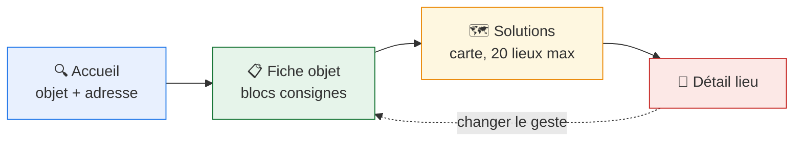

# 🧭 Assistant V2

> Plan d'implémentation de l'assistant au tri, au réemploi et à la réparation.
> Ticket de référence : [Découpage technique assistant v2](https://app.notion.com/p/3d86523d57d78057bb42f4ee0ff3a290) (#3431)

```{toctree}
:hidden:

00-synthese.md
01-vue-ensemble.md
02-architecture.md
03-turbo-frames.md
04-stimulus.md
05-donnees-et-cache.md
06-decoupage-pr.md
07-tests-et-qualite.md
08-demarrage.md
09-etats-degrades.md
10-contrat-url.md
adr/README.md
```

## En une minute

L'assistant V2 est une **reprise à zéro** de l'expérience de recherche : l'usager
saisit un objet et une adresse, voit les gestes possibles (réparer, donner,
déposer…), puis les lieux correspondants sur une carte.



## Les 5 choix structurants

| #   | Choix                                     | En une phrase                                                                  |
| --- | ----------------------------------------- | ------------------------------------------------------------------------------ |
| 1   | **Nouvelle app `assistant`, sans modèle** | Le contenu vit déjà dans `quefaire.ProduitPage` et `acteur.DisplayedActeur`.   |
| 2   | **Aucune reprise de la plomberie V1**     | On reprend l'accès aux données, on laisse les formulaires préfixés et le DSFR. |
| 3   | **L'état vit dans l'URL**                 | Chaque écran est partageable, rechargeable, et cacheable par HTTP.             |
| 4   | **Carte alimentée en GeoJSON**            | Le client possède l'état des marqueurs, seule façon de tenir la spec #3356.    |
| 5   | **Renommage préalable des apps**          | `qfdmd`→`quefaire`, `qfdmo`→`acteur`, en gelant les noms de tables.            |

Les trois décisions les plus contestables sont documentées en [ADR](adr/README.md).

## Par où commencer la lecture

L'ensemble fait ~70 min de lecture. **Personne n'a besoin de tout lire.**

| Vous êtes…                        | Lisez                                                                         | Temps     |
| --------------------------------- | ----------------------------------------------------------------------------- | --------- |
| 🎤 **en réunion de présentation** | [00-synthèse](00-synthese.md) — une page, tout le plan                        | **5 min** |
| 👩‍💻 développeur·euse qui démarre   | [00-synthèse](00-synthese.md) → [08-démarrage](08-demarrage.md)               | 8 min     |
| 🏗️ … puis qui code vraiment       | [02-architecture](02-architecture.md) + [06-découpage PR](06-decoupage-pr.md) | +19 min   |
| 🎨 frontend / Stimulus            | [04-stimulus](04-stimulus.md) + [03-turbo-frames](03-turbo-frames.md)         | 15 min    |
| 🗄️ backend / données              | [05-données et cache](05-donnees-et-cache.md)                                 | 11 min    |
| 🔗 contrat d'URL / API            | [10-contrat d'URL](10-contrat-url.md)                                         | 6 min     |
| 🔍 en revue d'architecture        | [ADR](adr/README.md) (3 × 3 min) puis [02](02-architecture.md)                | 16 min    |
| ♿ QA / accessibilité             | [07-tests et qualité](07-tests-et-qualite.md)                                 | 7 min     |
| 🚨 états vides et pannes          | [09-états dégradés](09-etats-degrades.md)                                     | 5 min     |

## Pièges vérifiés dans le code existant

Ces 15 points ont été **vérifiés en base et dans le code**, pas supposés. Ce
sont ceux où une implémentation « de bon sens » serait fausse.

### 🗄️ Données et modèles

| Piège                                                 | Réalité vérifiée                                                                                                                                                                                    | Détail                       |
| ----------------------------------------------------- | --------------------------------------------------------------------------------------------------------------------------------------------------------------------------------------------------- | ---------------------------- |
| « Les gestes sont des `Action` »                      | Ce sont des **`GroupeAction`** (5 en base). Un geste `deposer` n'existe pas : c'est `trier`.                                                                                                        | [02](02-architecture.md)     |
| « Les couleurs de pinpoint sont des tokens CSS »      | Elles sont **déjà en base** dans `GroupeAction.couleur`, et correspondent exactement aux 5 couleurs du Figma.                                                                                       | [02](02-architecture.md)     |
| « `DisplayedActeur.objects.physical()` »              | `AttributeError` : le manager ne proxifie pas le QuerySet. Il faut `.objects.all().physical()`.                                                                                                     | [05](05-donnees-et-cache.md) |
| « `[:20]` renvoie 20 lieux »                          | Le JOIN sur les propositions duplique : **9 363 acteurs** ont >1 proposition dans un même groupe.                                                                                                   | [05](05-donnees-et-cache.md) |
| « `in_bbox()` trie par distance »                     | Elle finit par `.order_by("?")` (aléatoire), à écraser explicitement.                                                                                                                               | [05](05-donnees-et-cache.md) |
| « `sanitize_frontend_bbox` lève sur entrée invalide » | Selon l'entrée : elle **logge et retourne `[]`** (`{}`), **lève `TypeError`** (`null`, `5`, `[]`) ou **laisse passer des chaînes** jusqu'à PostGIS. Les trois cas sont encapsulés dans `BboxField`. | [05](05-donnees-et-cache.md) |

### ⚡ Performance

| Piège                                | Réalité vérifiée                                                                                              | Détail                       |
| ------------------------------------ | ------------------------------------------------------------------------------------------------------------- | ---------------------------- |
| « La requête carte est rapide »      | **450 ms à Paris** (4 141 candidats chargés pour 20 résultats), 27 ms en zone rurale.                         | [05](05-donnees-et-cache.md) |
| « Le DSFR est le problème de poids » | Le CSS pèse **38 kb gzip**. Le vrai poids est **1 381 kb de JS**, dont MapLibre importé statiquement partout. | [04](04-stimulus.md)         |

### 🎨 Frontend

| Piège                                        | Réalité vérifiée                                                                                                           | Détail                              |
| -------------------------------------------- | -------------------------------------------------------------------------------------------------------------------------- | ----------------------------------- |
| « Une BAN en panne se voit »                 | Le proxy **retourne `[]` en cas de timeout** : indistinguable de « aucune adresse trouvée ». L'usager reformule en boucle. | [09](09-etats-degrades.md)          |
| « stimulus-use est disponible »              | **Déclaré dans `package.json` mais absent de `node_modules`** et jamais importé. `npm install` requis.                     | [04](04-stimulus.md)                |
| « On peut `await` une méthode débouncée »    | `debounce()` ne retourne rien : `await` résout sur `undefined`, `.catch()` lève.                                           | [04](04-stimulus.md)                |
| « `data-turbo-permanent` protège la carte »  | Inutile ici : le header est un frame **frère**, jamais remplacé. C'est le découpage qui protège.                           | [03](03-turbo-frames.md)            |
| « Ne pas charger le DSFR = s'en affranchir » | La config Tailwind (palette, espacements, typo) est **dérivée du DSFR**. Décision à part.                                  | [ADR 0001](adr/0001-pas-de-dsfr.md) |

### 🚚 Migration et outillage

| Piège                                           | Réalité vérifiée                                                                                                                                | Détail                                    |
| ----------------------------------------------- | ----------------------------------------------------------------------------------------------------------------------------------------------- | ----------------------------------------- |
| « Renommer l'app ne touche pas la base »        | Aucun `db_table` déclaré → renommer l'app renomme ~95 tables lues par dbt.                                                                      | [ADR 0002](adr/0002-geler-noms-tables.md) |
| « Seules `qfdmd`/`qfdmo` référencent ces apps » | **`data` (17 fichiers + 4 migrations)**, `core` (9) et `search` (4) aussi. Les migrations de `data` portent des `to="qfdmo.acteur"` à réécrire. | [06](06-decoupage-pr.md)                  |
| « Renommer l'app ne touche que le code »        | `django_migrations.app` stocke le label en **chaîne** : **314 lignes**. Non mis à jour, Django recrée 44 tables.                                | [06](06-decoupage-pr.md)                  |
| « Il faut créer un dispositif a11y »            | `@axe-core/playwright` et `e2e_tests/accessibility.spec.ts` **existent déjà**, et scannent les previews lookbook.                               | [07](07-tests-et-qualite.md)              |

## Sources

| Ticket                                                             | Sujet                                                | Statut      |
| ------------------------------------------------------------------ | ---------------------------------------------------- | ----------- |
| [#3431](https://app.notion.com/p/3d86523d57d78057bb42f4ee0ff3a290) | Découpage technique (parent)                         | Prêt à dev  |
| [#3295](https://app.notion.com/p/38e6523d57d780049d61e54dc439c1f3) | Découpage fonctionnel MVP — **la spec de référence** | Fait        |
| [#3356](https://app.notion.com/p/3a06523d57d780589476d537f8776008) | Comportement de la carte                             | En cours    |
| [#3434](https://app.notion.com/p/3d86523d57d780cda740c44ed0226417) | Routage / vues                                       | À spécifier |
| [#3433](https://app.notion.com/p/3d86523d57d780a19c3efeb5e4c4a221) | Lookbook et composants                               | Prêt à dev  |
| [#3432](https://app.notion.com/p/3d86523d57d78018a4c9c685280d0fae) | Endpoint GeoJSON                                     | À spécifier |
| [#3284](https://app.notion.com/p/38e6523d57d780b2a5f0efa51aa04ca1) | Composant CMS « consignes »                          | À spécifier |

Maquettes : [Figma](https://www.figma.com/design/8lTOjFETVvT3pAz5rebxhE/) ·
Prototype MVP : [lulufreedesign.github.io](https://lulufreedesign.github.io/assistant-au-tri-prototype-de-test/mvp/)

Inspirations techniques : [betagouv/aides-agri](https://github.com/betagouv/aides-agri)
et [betagouv/seves](https://github.com/betagouv/seves).
