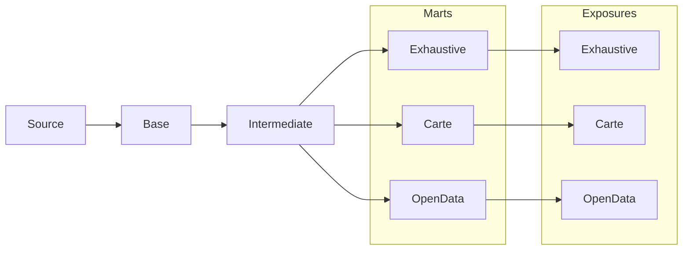

# Description des flux DBT

DBT est utilisé pour construire les "vues" (ce sont des tables en base de données SQL qui permets de définir des contraintes et des index) sur les acteurs.

## Finalités

On a 3 Finalités à calculer:

- Exhaustive : Vue exhaustive sur tous les acteurs en base de données
- Carte : Vue sur les acteurs à afficher sur la carte
- OpenData : Vue sur les acteurs à partager en open-data

## Pipeline DBT

Actuellement, les flux sont les suivants :

### Source

Déclaration des sources dans [`sources.yml`](../../../data-platform/dbt/models/source/source_acteur.yml)

Ce fichier décrit les tables sources qui seront utilisées par dbt.

### Base (Vues)

Vue sur les tables sources.
Permet de valider le format des données des sources en entrée du pipeline DBT.

### Intermediate (Vues)

Pré-calculs sur les vues de base. On applique les corrections

### Marts (Tables)

Filtre les acteurs pour les différentes finalités :

- Carte
- OpenData
- Exhaustive

### Exposures (Tables)

Expose les données pour les différentes finalités (cf. ci-dessus)
