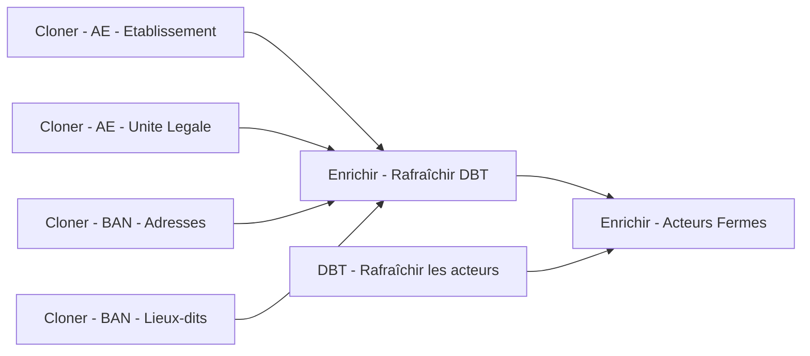

# Enrichissement de données

Le principe de l'enrichissement de données est d'hidrater et/ou corriger les données de «Longue vie aux objets» grâce à des sources partenaires ou exécutant des scripts de cohérence.

## Enrichissements via des sources partenaires

Les sources aujourd'hui utilisées sont :

- [Annuaire entreprise](https://annuaire-entreprises.data.gouv.fr/) : agrégateur de données sur les entreprises en France
- [La BAN : Banque d'adresse nationnale](https://adresse.data.gouv.fr/) : référencement et géolocalisation de toutes les adresses en France

### Comment ça marche

Plusieurs étapes :

1. Téléchargement de la base de données partenaire et copie sur notre propre base de données (DAG Airflow)
   - Cloner - AE - Etablissement
   - Cloner - AE - Unite Legale
   - Cloner - BAN - Adresses
   - Cloner - BAN - Lieux-dits
1. Préparation de la donnée (Airflow + DBT) :
   - DBT - Rafraîchir les acteurs affichés
   - 🔄 Enrichir - Rafraîchir les modèles DBT
1. Création des suggestions (Airflow + DBT) :
   - 🚪 Enrichir - Acteurs Fermés

## Script de cohérence

### Vérification des URLs

le DAG `🔗 Crawl - URLs - Suggestions` collecte les URLs des acteurs et parcourt ces URL pour vérifier qu'elles sont valident
