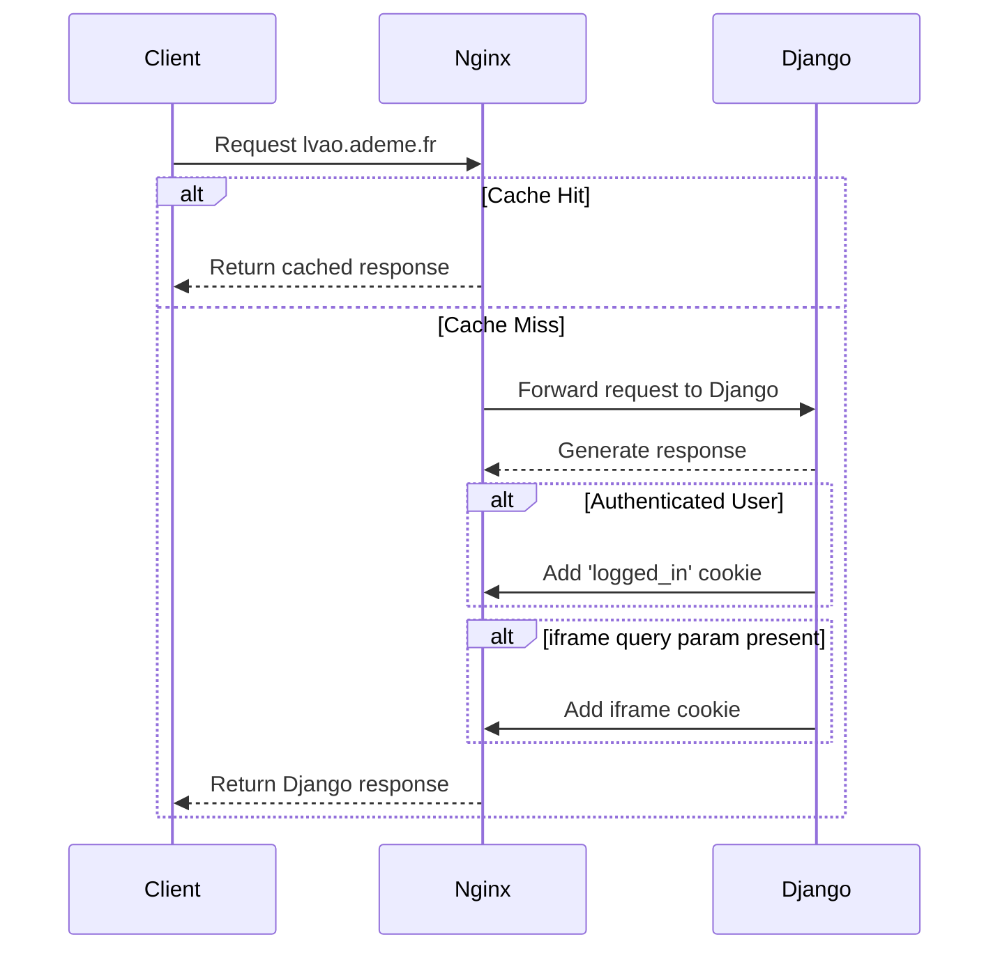

# 🚏 Routing, nginx et cache

Le projet est actuellement déployé sur **Scalingo**, Scalingo qui impose une limite de 50 requêtes/seconde sur un worker.
Nous avons décidé d'ajouter **Nginx** en janvier 2025 afin d'agir comme serveur de cache et anticiper sur l'atteinte de cette limite.

# nginx

Dans l'hypothèse d'un pic de charge,

- Le **cache** de certaines **vues Django** (déchet / produit, page d'accueil de l'assistant...)
- Le **cache** des **fichiers statiques** (CSS, JS...)

Des images valant mille mots, ci-dessous un schéma résumant le parcours d'une requête lorsqu'elle atteint `lvao.ademe.fr` ou `quefairedemesdechets.ademe.fr`

Les cookies définis expirent à la fin de la session, cela veut dire qu'ils seront re-générés si l'utilisateur ferme son navigateur.

# Whitenoise

Les fichiers statiques sont servis via Whitenoise, cela afin de gérer finement le cache de ceux-ci.
La [documentation officielle](https://whitenoise.readthedocs.io/en/latest/index.html#infrequently-asked-questions) répond aux principales questions que l'on peut se poser à ce sujet :

- Pourquoi pas charger les statiques depuis un S3 ?
- Comment servir les fichiers statiques derrière une reverse proxy ?

Dans notre cas, Whitenoise fonctionne de la manière suivante :

- À chaque déploiement, les fichiers statiques sont suffixés d'un hash de leur contenu
- La durée de mise en cache est infinie pour ces fichiers. Cela peut être fait sans risque car s'ils sont modifiés, le hash changera

# Middlewares

Le fonctionnement décrit ci-dessous concernant Nginx est défini dans un [middleware Django](https://docs.djangoproject.com/en/5.1/topics/http/middleware/) (`qfdmd/middleware.py`).
