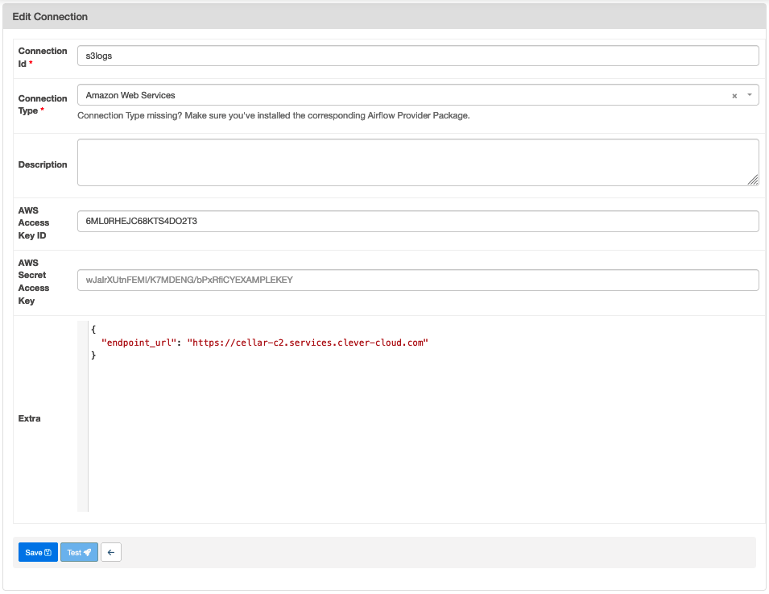

# Que faire de mes objets - Data Platform

Ce projet contient l'environnement d'execution d'Airflow

Les fichiers qui concerne la plateforme data :

- `pyproject.toml` définition des dépendances dans la section [tool.poetry.group.airflow.dependencies]
- `./dags` répertoire dans lequels sont stockés tous les dags executés sur le cluster Airflow
- `airflow-scheduler.Dockerfile` et `airflow-webserver.Dockerfile`, fichier de configuration docker executer dans tous les environnements
- `docker-compose.yml` orchestre les dockers en envronnemnt de développement
- `./dags_unit_tests` répertoire qui contient les tests des dags

## Environnements

On distingue 3 environements:

- `development` : airflow tourne localement en utilisant l'orchestrateur `docker compose` (cf. [docker-compose.yml](../../../docker-compose.yml))
- `preprod` et `prod` : airflow tourne sur CleverCloud

## Mise à jour du scheduler et du webserver sur CleverCloud

Airflow tourne sur CleverCloud sur un ensemble de serveur par environnement et utilise les services suivant:

- <ENVIRONMENT>-airflow-webserver (instance docker): interface d'airflow
- <ENVIRONMENT>-airflow-scheduler (instance docker): scheduler d'airflow, fait tourner les dags car on est configuré en LocalExecutor
- <ENVIRONMENT>-airflow-s3 : S3 pour stocker les logs et les dags
- <ENVIRONMENT>-airflow-postgres : base de données nécessaire au fonctionnelment d'airflow

Les répertoires s3 sont en cours de migration vers la plateforme Scaleway

## Déploiement et configuration

### CI/CD

la platefome Data est déployée en preprod à chaque mise à jour de la branche `main` sur Github (cf. [cd_preprod.yml](../../../.github/workflows/cd_preprod.yml))

Et en production à chaque depot de tag de version (cf. [cd_prod.yml](../../../.github/workflows/cd_prod.yml))

De la même manière que l'interface, cela permet de garder la cohérance entre l'application web et la plateforme data

### Configuration du cluster Airflow

#### Variable d'environnement du cluster Airflow

En plus des variables d'environnement nécessaire pour configurer Airflow, les variables d'environnemnt suivantes doivent-être configurées sur le docker `scheduler` de chaque environnement dans CleverCloud.

Un exemple à adapter selon l'environnement est disponible sur le fichier [.env.templates](../../../dags/.env.template)

#### Gestion des logs

Pour que les logs du scheduler soient stockés sur S3, les instances CleverCloud sont lancés avec les variables d'environnement:

```txt
AIRFLOW__LOGGING__REMOTE_LOGGING=true
AIRFLOW__LOGGING__REMOTE_BASE_LOG_FOLDER=s3://qfdmo-airflow-logs
AIRFLOW__LOGGING__REMOTE_LOG_CONN_ID=s3logs
AIRFLOW__LOGGING__ENCRYPT_S3_LOGS=false
```

`s3logs` est une connection configuré dans l'interface d'Airflow



Attention à ajouter le paramètre endpoint_url pour le stockage Cellar de CleverCloud
