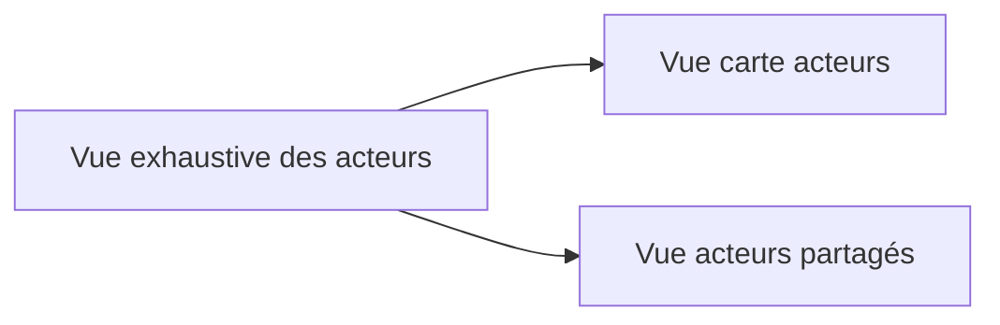
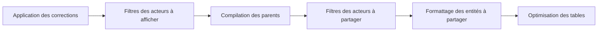
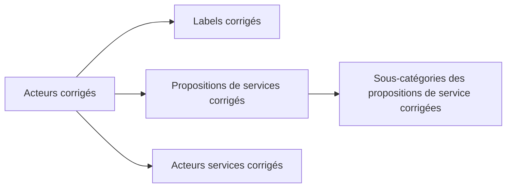

# Description des flux DBT

**Statut : ❓ À approuver**

DBT est utilisé pour construire les "vues" sur les acteurs. on a 3 vues à calculer :

Actuellement, les flux sont les suivants :

On nomme "Vue" le résultat d'un calcul de DBT, cependant, il est possible que ce soit des tables pour permettre l'indexation et garedr de bonnes performances de recherche.

## [Vue exhaustive des acteurs](../../../../dbt/models/exhaustive_acteurs/schema.yml)

Permet de visualiser tous les acteurs et leurs relations, y compris les acteurs qui ne sont pas actifs ou les acteurs dédupliqués.

## [Acteurs affichés sur la carte](../../../../dbt/models/carte_acteurs/schema.yml)

Calcule les acteurs à Afficher sur la carte.

## [Acteurs en Open-Data](../../../../dbt/models/carte_acteurs/schema.yml)

Calcule et formatte les acteurs à partager en open-data.

## Découpage par concepts

La cible est de découper le calcul des vues par concepts

### Application des corrections

Application de la logique de Coalesce pour les corrections e suivant les rêgles suivantes :

- Quand il n'existe pas de correction, l'acteur est la cible
- Quand il existe une correction
  - Pour les champs, si il le champs de la correction n'est pas vide, on l'applique, sinon, c'est celui de l'acteur source
  - Pour les relations (acteurs services, labels, propositions de services), les relations de la corrections sont appliquées

### Filtres des acteurs à afficher

2 filtrages sont appliqués :

- Acteurs à afficher sur la carte
- Acteurs à partager en open-data

### Compilation des parents

- Pour chaque, entités filtrées, on calculs les parents et masque les enfants

### Formattage des entités à partager

Essentiellement pour les acteurs à partager en open-data, on formate les entités pour qu'elles soient compatibles avec leformat partagable sur data.ademe.fr.

### Optimisation des tables

On optimise les tables pour qu'elles soient plus performantes et robustes.

- On indexe les colonnes utilisées dans les jointures et les recherche
- On ajoute les contraintes de clés étrangères
