# Enrichissement de données

Le principe de l'enrichissement de données est d'hidrater et/ou corriger les données de «Longue vie aux objets» grâce à des sources partenaires ou exécutant des scripts de cohérence.

## Enrichissements via des sources partenaires

Les sources aujourd'hui utilisées sont :

* [Annuaire entreprise](https://annuaire-entreprises.data.gouv.fr/) : agrégateur de données sur les entreprises en France
* [La BAN : Banque d'adresse nationnale](https://adresse.data.gouv.fr/) : référencement et géolocalisation de toutes les adresses en France

### Comment ça marche

Plusieurs étapes :

1. Téléchargement de la base de données partenaire et copie sur notre propre base de données (DAG Airflow)
    * Cloner - AE - Etablissement
    * Cloner - AE - Unite Legale
    * Cloner - BAN - Adresses
    * Cloner - BAN - Lieux-dits
1. Préparation de la donnée (Airflow + DBT) :
    * DBT - Rafraîchir les acteurs affichés
    * 🔄 Enrichir - Rafraîchir les modèles DBT
1. Création des suggestions (Airflow + DBT) :
    * 🚪 Enrichir - Acteurs Fermés

```mermaid
graph LR
    A[Cloner - AE - Etablissement]
    B[Cloner - AE - Unite Legale]
    C[Cloner - BAN - Adresses]
    D[Cloner - BAN - Lieux-dits]
    E[DBT - Rafraîchir les acteurs affichés]
    F[🔄 Enrichir - Rafraîchir les modèles DBT]
    G[🚪 Enrichir - Acteurs Fermés]
    A --> F
    B --> F
    C --> F
    D --> F
    F --> G
    E --> G
```

## Script de cohérence

### Vérification des URLs

le DAG `🔗 Crawl - URLs - Suggestions` collecte les URLs des acteurs et parcourt ces URL pour vérifier qu'elles sont valident
