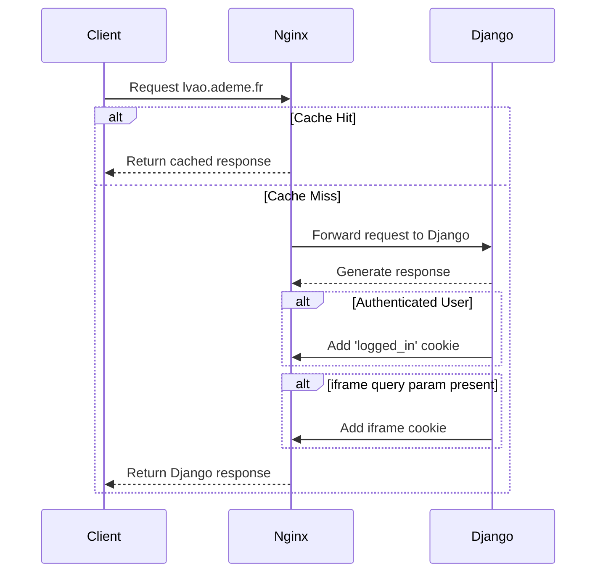

Le projet est actuellement déployé sur Scalingo.
Ils imposent une limite de 50 requêtes/seconde sur un worker.

Dans l'hypothèse d'un pic de charge, nous avons décidé d'ajouter Nginx en janvier 2025 afin d'agir comme serveur de cache et d'optimiser
- Le **cache** de certaines **vues Django**
- Le **cache** des **fichiers statiques**

Des images valant mille mots, ci-dessous un schéma résumant le parcours d'une requête lorsqu'elle atteint `lvao.ademe.fr` ou `quefairedemesdechets.ademe.fr

# nginx
# whitenoise
# cache
