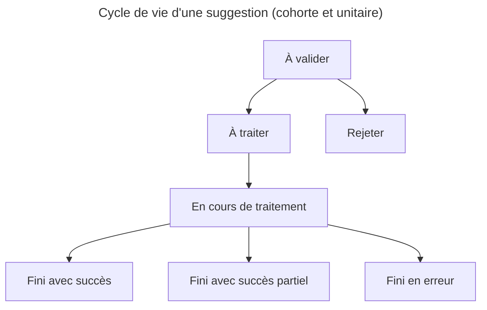

# Système de suggestion

**Statut : ❓ À approuver**

Cette proposition de modification de l'architecture pour faire évoluer le système de suggestion est un travail itératif. Il est donc nessaire de garder en tête la cibe et le moyen d'y aller.

## Existant et problématique

il existe les tables `dagrun` et `dagrunchange`:

- `dagrun` représente un ensemble de suggestions produit par l'execution d'un DAG airflow
- `dagrinchange` représente la suggestion de modification pour une ligne donnée

On a quelques problème de lisibilité des ces tables:

- les types des évenements sont imprécis et utilisé pour plusieurs propos, par exemple, `UPDATE_ACTOR` est utilisé pour des propositions de siretisation et de suppression de acteurs lors de l'ingestion de la source
- les types des évenements sont définis au niveau de chaque ligne, pour connaitre le type de
- si une ligne est problématique, aucune ligne n'est mise à jour
- on n'à pas de vu sur les DAG qui on réussi ou se sont terminés en erreur

## Proposition d'amélioration

### Base de données

- Renommage des tables : `dagrun` -> `suggestion_cohorte` , `dagrunchange` -> `suggestion_unitaire`
- Écrire les champs en français comme le reste des tables de l'application
- Revu des statuts de `suggestion_cohorte` : à traiter, en cours de traitement, fini avec succès, fini avec succès partiel, fini en erreur
- Ajout d'un type d'évenement à `suggestion_cohorte` : source, enrichissement
- Ajout d'un sous-type d'évenement à `suggestion_cohorte` : source - ajout acteur, source - suppression acteur, source - modification acteur, enrichissement - déménagement…
- Ajout de champ pour stocker le message de sortie (au moins en cas d'erreur)
- Paramettre de tolérance d'erreur
- 2 champs JSON, 1 context initial, 1 suggestion

### Interface

Si possible, utiliser l'interface d'administration de Django pour gérer les suggestions (cela devrait bien fonctionner au mons pour la partie `ingestion des sources`).

- Division des interfaces de validation :
  - `ingestion des sources` : nouvelles sources ou nouvelle version d'une source existante
  - `enrichissements` : fermetures, démenagements, enrichissement avec annuaire-entrprise, l'API BAN ou d'autres API
- Ajout de filtre sur le statut (à traiter est sélectionné par défaut)
- Ajout de la pagination
- permettre de cocher les suggestions et d'executer une action our l'ensemble

### Pipeline

- Le DAG de validation des cohortes doit intégrer la même architecture que les autres DAGs

# Cible

## Systeme de Suggestion

Les suggestions sont crées par l'exécution d'un pipeline ou d'un script. Les suggestions sont faites par paquet qu'on appelle **Cohorte**, les Cohortes comprennent un ensemble de suggestion de mofification

Les cohortes ont un type d'événement : `clustering`, `enrichissement`, `source` selon le type de l'action lancée à l'origine de la suggestion de modification

Les cohortes et les suggestions ont un statut de traitement qui représente leur cycle de vie : `à valider`, `rejeter`, `à traiter`, `en cours de traitement`, `fini avec succès`, `fini avec succès partiel` (uniquement pour les cohortes), `fini en erreur`

### Representation dans Django

- SuggestionCohorte représente les cohortes
- SuggestionUnitaire représente les propositions de modification

### Cycle de vie d'une suggestion

