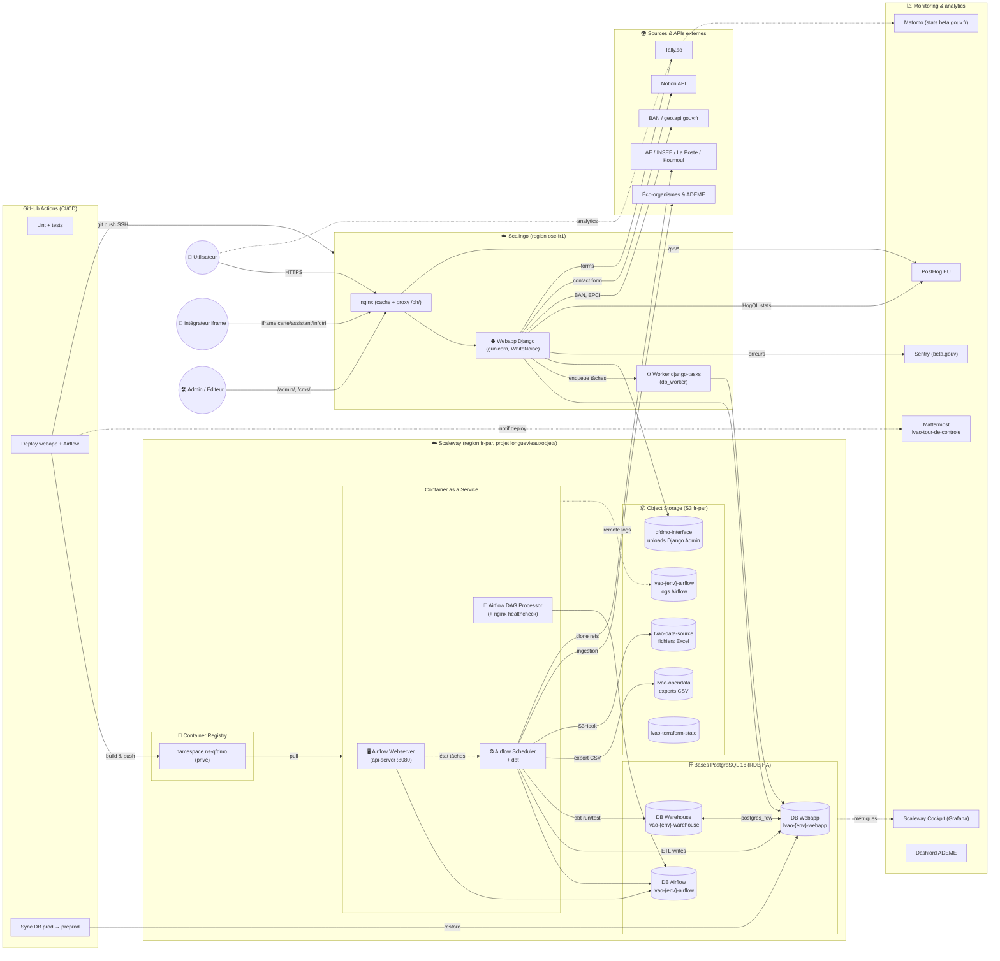

# Architecture applicative

Vue d'ensemble de la plateforme « Que Faire De Mes Objets et Déchets » (QFDMOD), des composants en présence et de leurs interactions.

> **Voir aussi** : [Flux de consolidation des données](data-flow.md), [Services externes](external-services.md), [Provisioning de l'infrastructure](../infrastructure/provisioning.md), [CI/CD](../infrastructure/ci-cd.md), [Monitoring](../infrastructure/monitoring.md), [Sécurité — vue d'ensemble](../security/README.md).

## Diagramme global



## Cartographie des composants

Pour le détail de chaque brique, suivre le lien correspondant.

### Hébergement applicatif

| Composant                                                    | Hébergeur                                  | Détail / référence                                                                                                               |
| ------------------------------------------------------------ | ------------------------------------------ | -------------------------------------------------------------------------------------------------------------------------------- |
| **Webapp Django** (Gunicorn + WhiteNoise + nginx local)      | Scalingo (`osc-fr1`)                       | [`infrastructure/provisioning.md`](../infrastructure/provisioning.md), [`webapp/README.md`](../webapp/README.md)                 |
| **Worker django-tasks** (`manage.py db_worker`)              | Scalingo (`osc-fr1`, container `worker`)   | [`webapp/django.md`](../webapp/django.md)                                                                                        |
| **Airflow** : webserver, scheduler (avec dbt), DAG processor | Scaleway Container as a Service (`fr-par`) | [`infrastructure/provisioning.md`](../infrastructure/provisioning.md), [`data-platform/airflow.md`](../data-platform/airflow.md) |
| **Container Registry** privé `ns-qfdmo`                      | Scaleway                                   | [`infrastructure/provisioning.md`](../infrastructure/provisioning.md)                                                            |

### Données

| Composant                                                                                                                    | Hébergeur                                             | Détail / référence                                                                                     |
| ---------------------------------------------------------------------------------------------------------------------------- | ----------------------------------------------------- | ------------------------------------------------------------------------------------------------------ |
| **DB Webapp** `lvao-{env}-webapp` (données métier, cache, médias Wagtail, PostGIS)                                           | Scaleway RDB PostgreSQL 16 HA                         | [`db/db_organisation.md`](../db/db_organisation.md), [`db/architecture.md`](../db/architecture.md)     |
| **DB Warehouse** `lvao-{env}-warehouse` (couches dbt)                                                                        | Scaleway RDB                                          | [`db/db_organisation.md`](../db/db_organisation.md), [`data-platform/dbt.md`](../data-platform/dbt.md) |
| **DB Airflow** `lvao-{env}-airflow` (métadonnées)                                                                            | Scaleway RDB                                          | [`data-platform/airflow.md`](../data-platform/airflow.md)                                              |
| Liaison **`postgres_fdw`** Webapp ↔ Warehouse                                                                                | Schémas virtuels `webapp_public` / `warehouse_public` | [`db/db_organisation.md`](../db/db_organisation.md)                                                    |
| **Object Storage** S3 (`qfdmo-interface`, `lvao-opendata`, `lvao-{env}-airflow`, `lvao-data-source`, `lvao-terraform-state`) | Scaleway S3 (`fr-par`)                                | [`infrastructure/provisioning.md`](../infrastructure/provisioning.md)                                  |

### Plateforme data

| Composant                                                               | Référence                                                                                   |
| ----------------------------------------------------------------------- | ------------------------------------------------------------------------------------------- |
| Orchestration **Airflow 3** (`LocalExecutor`, FAB auth, JWT)            | [`data-platform/airflow.md`](../data-platform/airflow.md)                                   |
| **Sources** d'ingestion (éco-organismes, ADEME, API CMA/Pharmacies, S3) | [`data-platform/sources.md`](../data-platform/sources.md)                                   |
| Transformation **dbt** (base/intermediate/marts/exposure)               | [`data-platform/dbt.md`](../data-platform/dbt.md)                                           |
| **Clustering / déduplication**                                          | [`data-platform/clustering-deduplication.md`](../data-platform/clustering-deduplication.md) |

### Webapp

| Composant                                                                                       | Référence                                               |
| ----------------------------------------------------------------------------------------------- | ------------------------------------------------------- |
| **Django** + apps métier (`qfdmo`, `qfdmd`, `search`, `data`, `infotri`, `stats`, `dsfr_hacks`) | [`webapp/django.md`](../webapp/django.md)               |
| **Tâches asynchrones** django-tasks (actions admin lourdes, file en base)                       | [`webapp/django.md`](../webapp/django.md)               |
| **API Django-Ninja** (`/api/qfdmo/*`, `/api/stats`)                                             | [`apis/README.md`](../apis/README.md)                   |
| **CMS Wagtail** (surcouche `sites-conformes`)                                                   | [`webapp/README.md`](../webapp/README.md)               |
| **Front** Stimulus + Turbo + Parcel + TypeScript                                                | [`webapp/javascript.md`](../webapp/javascript.md)       |
| **Design system** DSFR + Tailwind (prefix `qf-`)                                                | [`webapp/look-and-feel.md`](../webapp/look-and-feel.md) |
| **Templates** Django                                                                            | [`webapp/templates.md`](../webapp/templates.md)         |

### CI/CD & déploiement

| Composant                                                                               | Référence                                                             |
| --------------------------------------------------------------------------------------- | --------------------------------------------------------------------- |
| Workflows GitHub Actions (review, cd, deploy, sync_databases, dependabot, publish-docs) | [`infrastructure/ci-cd.md`](../infrastructure/ci-cd.md)               |
| Provisioning OpenTofu / Terragrunt                                                      | [`infrastructure/provisioning.md`](../infrastructure/provisioning.md) |

### Observabilité

| Composant                                                          | Référence                                                         |
| ------------------------------------------------------------------ | ----------------------------------------------------------------- |
| Sentry, PostHog, Matomo, Scaleway Cockpit, Mattermost, healthcheck | [`infrastructure/monitoring.md`](../infrastructure/monitoring.md) |
| CodeQL, GitGuardian, Dependabot, Dashlord                          | [`security/README.md`](../security/README.md)                     |

### Sécurité

| Sujet                                | Référence                                                     |
| ------------------------------------ | ------------------------------------------------------------- |
| Inventaire des actifs à protéger     | [`security/inventory.md`](../security/inventory.md)           |
| Prestataires & exigences de sécurité | [`security/providers.md`](../security/providers.md)           |
| Authentification & autorisations     | [`security/authentication.md`](../security/authentication.md) |
| Sécurité réseau                      | [`security/network.md`](../security/network.md)               |
| Gestion des secrets                  | [`security/secrets.md`](../security/secrets.md)               |
| Sauvegardes                          | [`security/backups.md`](../security/backups.md)               |
| Plan de continuité d'activité (PCA)  | [`security/pca.md`](../security/pca.md)                       |
| Plan de reprise d'activité (PRA)     | [`security/pra.md`](../security/pra.md)                       |
| Revues régulières                    | [`security/reviews.md`](../security/reviews.md)               |

```{toctree}
:maxdepth: 2
:hidden:

data-flow.md
external-services.md
```
