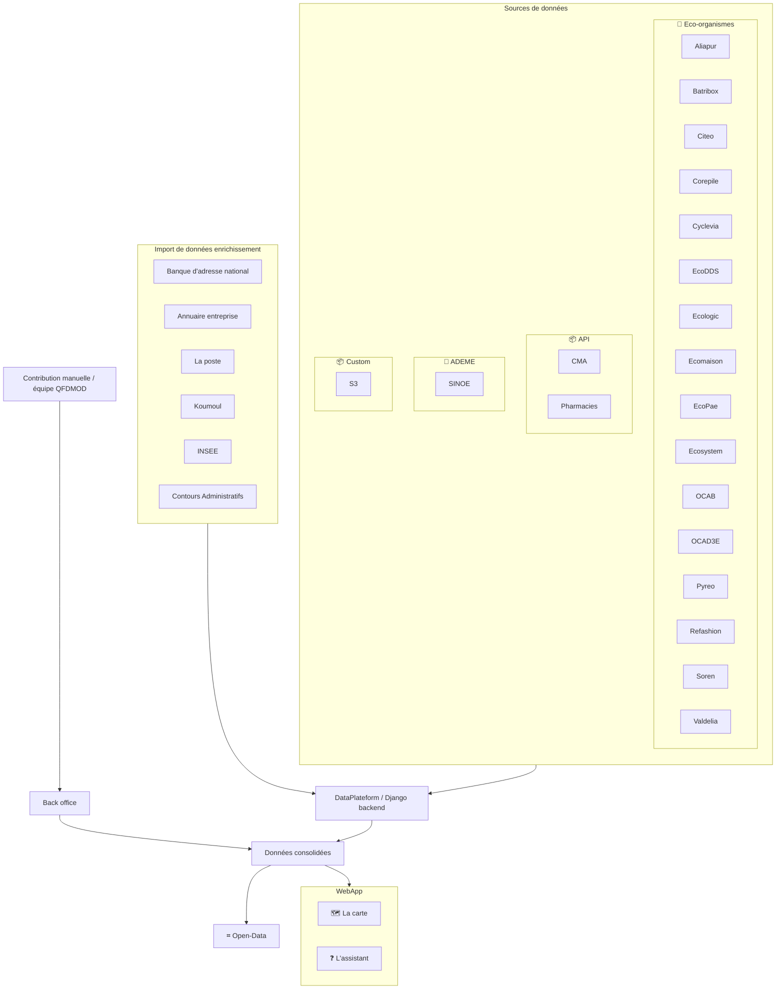

# Flux de consolidation des données

Vue d'ensemble du parcours des données depuis les sources externes jusqu'à leur exposition dans la webapp et l'open data.

> **Voir aussi** : [Sources d'ingestion (DAGs)](../data-platform/sources.md), [Airflow](../data-platform/airflow.md), [dbt](../data-platform/dbt.md), [Open Data](../opendata/README.md).

## Étapes du pipeline

| Étape                           | Description                                                                                                   | Référence                                                                                              |
| ------------------------------- | ------------------------------------------------------------------------------------------------------------- | ------------------------------------------------------------------------------------------------------ |
| **Source**                      | Ingestion des listes d'acteurs partagées par les éco-organismes, l'ADEME et les API métier (CMA, Pharmacies). | [`data-platform/sources.md`](../data-platform/sources.md)                                              |
| **Clone**                       | Clonage des référentiels d'enrichissement (BAN, AE, INSEE, La Poste, Koumoul, contours administratifs).       | [`data-platform/sources.md`](../data-platform/sources.md)                                              |
| **Enrichissement**              | Correction et complétion des acteurs (RGPD, fermés, villes, code postal).                                     | [`data-platform/airflow.md`](../data-platform/airflow.md)                                              |
| **Crawl & validation**          | Validation des URLs proposées.                                                                                | [`data-platform/airflow.md`](../data-platform/airflow.md)                                              |
| **Clustering**                  | Déduplication des acteurs partagés par plusieurs sources.                                                     | [`data-platform/clustering-deduplication.md`](../data-platform/clustering-deduplication.md)            |
| **Application des suggestions** | Application des suggestions validées par l'équipe via le back-office.                                         | [`data-platform/airflow.md`](../data-platform/airflow.md)                                              |
| **Compute acteurs**             | Matérialisation des tables d'acteurs affichés (`compute_acteurs` via dbt + `postgres_fdw`).                   | [`db/db_organisation.md`](../db/db_organisation.md), [`data-platform/dbt.md`](../data-platform/dbt.md) |
| **Stats**                       | Calcul des statistiques de qualité de données (`compute_stats`).                                              | [`data-platform/dbt.md`](../data-platform/dbt.md)                                                      |
| **Open Data**                   | Export hebdomadaire des acteurs vers le bucket S3 `lvao-opendata`.                                            | [`opendata/README.md`](../opendata/README.md)                                                          |
