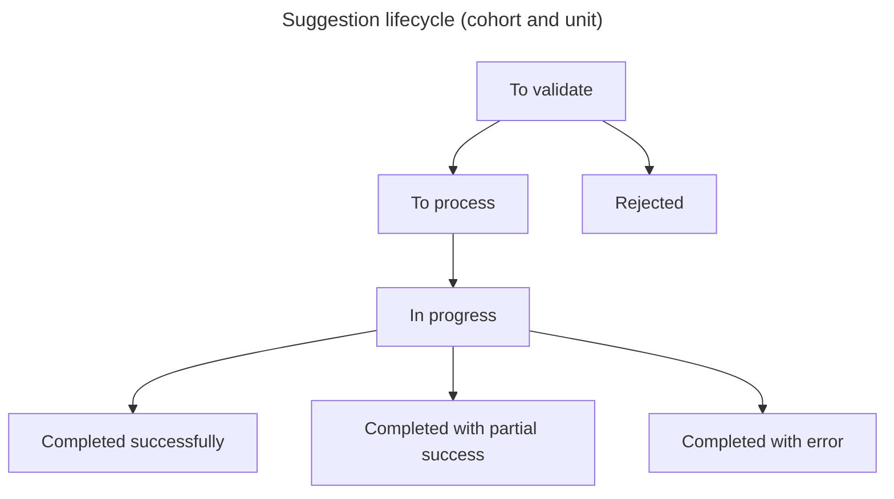

# Airflow

## File organization

This structure is mainly used when (re)organising files for source‑ingestion DAGs.

```text
/dags
|- config
|- shared                           -> files shared across several topics
   |- tasks                         -> tasks reused by several topics
      |- airflow_logic              -> Airflow‑specific logic shared by several topics
      |- business_logic             -> business logic shared by several topics
      |- database_logic             -> database‑related logic shared by several topics
|- <topic>                          -> files specific to a given topic (for example: source, compute_acteur…)
   |- dags                          -> DAGs related to this topic
   |- tasks                         -> tasks used by the DAGs for this topic
      |- airflow_logic              -> Airflow‑specific logic: task declarations and wrappers
      |- business_logic             -> business logic
      |- transform                  -> data‑transformation functions
         |- transform_df            -> DataFrame‑level transformation functions
         |- transform_column        -> column‑level transformation functions
|- utils                            -> DEPRECATED helper modules, to be migrated into the tree above
```

Tests follow the same structure as `data-platform/dags`, under `data-platform/dags/tests`.

## Follow the rules

for each dags, try to follow the steps and rules

Steps:

1. Check DAG configuration consistency
2. Normalize input data before compute
3. Compute data
4. Write desult to db

Rules:

- Fail fast : check format as soon as possible and fail if format isn't expected
- log sample of processed data at the begining and at the end of the task

## Suggestion system

Suggestions are created by running a pipeline or script. Suggestions are delivered in batches called **Cohort**; cohorts contain a set of modification suggestions.

Cohorts have an event type: `clustering`, `enrichment`, `source`, depending on the type of action that triggered the modification suggestion.

Cohorts and suggestions have a processing status that represents their lifecycle: `to validate`, `rejected`, `to process`, `in progress`, `completed successfully`, `completed with partial success` (cohorts only), `completed with error`.

### Representation in Django

- SuggestionCohorte represents cohorts, i.e. a set of suggestions of the same nature.
- Suggestion represents modification proposals.

### Suggestion lifecycle



## Identifier management

Use to manage the pivot between Partner identifier and our DB identifier.

This is used by `source` DAG type

### Key points

We call `source` the partners who share lists of circular economy actors.

### External identifier

The external identifier is the identifier provided by the partner who shares the actor. This identifier cannot be modified, so that we can identify updates to the actor by the partner and so that the data platform does not lose corrections and actor grouping (clustering).

### Unique identifier

The unique identifier is the identifier used by the platform to identify an actor. This identifier is the primary key of the actor table and is used as a foreign key by objects linked to the actor.

The unique identifier is composed as follows: `<SOURCE_CODE>*<EXTERNAL_IDENTIFIER><_d?>` (for digital actors).

- **SOURCE_CODE**: the code associated with the partner who shared the actor
- **EXTERNAL_IDENTIFIER**: the identifier provided by the source
- **\_d**: prefix when it is a digital actor, because partners can share the same actor twice if they have both physical and online activity

### Mapping

It may happen that the partner cannot ensure continuity of external identifiers. In that case, if the partner provides a mapping table of old and new identifiers, then it is possible to ensure continuity of unique identifiers by following the procedure defined [here](../../how-to/administration/update-ext-id.md).
