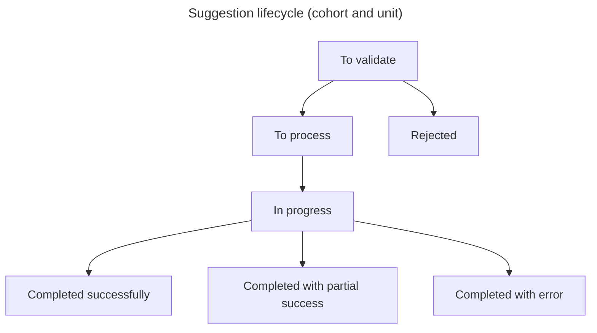

# Airflow

> **Voir aussi** : [Sources d'ingestion](sources.md), [dbt](dbt.md), [Architecture applicative](../architecture/README.md).

## Configuration runtime

- **Version** : `apache/airflow:slim-3.1.7-python3.12` (3 containers Scaleway : webserver `:8080`, scheduler avec dbt, dag-processor avec nginx healthcheck).
- **Executor** : `LocalExecutor` (single-node).
- **Auth manager** : **FAB** (`FabAuthManager`). Backends API : `basic_auth` + `session`. **JWT** pour les échanges internes (`AIRFLOW__API_AUTH__JWT_SECRET`).
- **Compte admin** : créé au premier démarrage du webserver via `_AIRFLOW_WWW_USER_USERNAME / _PASSWORD / _EMAIL`.
- **Intégration Django** : les DAGs importent les modèles Django via le package éditable `webapp-quefairedemesobjetsetdechets` et `utils.django.django_setup_full()` (settings `settings.airflow`).
- **Métadonnées** : base PostgreSQL `lvao-{env}-airflow`, nettoyée quotidiennement par le DAG `airflow_cleanup_db`.
- **Logs distants** : `AIRFLOW__LOGGING__REMOTE_LOGGING=true` vers le bucket S3 `lvao-{env}-airflow`.

## Vue d'ensemble des DAGs

| Activité                                                     | DAG(s)                                                                                                                | Schedule                                              |
| ------------------------------------------------------------ | --------------------------------------------------------------------------------------------------------------------- | ----------------------------------------------------- |
| Ingestion des données des sources                            | `eo-*`, `cma`, `pharmacies`, `source_sinoe`, `source-s3`                                                              | Manuel (`None`) — tag : `source`                      |
| Clonage de référentiels d'enrichissement                     | `clone_ban_*`, `clone_ae_*`, `clone_laposte_codes_postaux`, `clone_koumoul_epci`, `clone_insee_commune`, `clone_ca_*` | Hebdo / mensuel — voir [Clone](clone-referentiels.md) |
| Enrichissement des acteurs                                   | `enrich_acteurs_*` (RGPD, fermés, villes, code postal)                                                                | Manuel                                                |
| Crawl & validation des URLs                                  | `crawl_urls_suggestions`                                                                                              | Manuel                                                |
| Clustering / déduplication                                   | `cluster_acteur_suggestions`                                                                                          | Manuel                                                |
| Application des suggestions validées                         | `apply_suggestions`, `apply_suggestions_groupe`                                                                       | Toutes les 5 min                                      |
| Calcul des tables d'acteurs affichés + import dans la webapp | `compute_acteurs` (dbt + FDW)                                                                                         | Quotidien `0 0 * * *`                                 |
| Refresh des modèles dbt d'enrichissement                     | `enrich_dbt_models_refresh`                                                                                           | Quotidien `0 0 * * *`                                 |
| Calcul des statistiques                                      | `compute_stats` (`dbt run/test tag:stats`)                                                                            | Hebdo lundi 02:00                                     |
| Export opendata                                              | `export_opendata_dag` → S3 `lvao-opendata`                                                                            | Hebdo lundi 01:00                                     |
| Maintenance — purge metadata Airflow                         | `airflow_cleanup_db` (`airflow db clean --skip-archive`, rétention 7 j)                                               | Quotidien `0 0 * * *`                                 |
| Maintenance — purge logs DB Scaleway                         | `purge_log_db` (`scw rdb log purge`)                                                                                  | Toutes les heures à xx:03                             |

Les DAGs `compute_acteurs` matérialisent les tables d'acteurs via `IMPORT FOREIGN SCHEMA … LIMIT TO (…)` puis `INSERT INTO … SELECT` puis renommage atomique (swap `*_to_remove` → `DROP CASCADE`) pour minimiser le downtime. Voir [`db/db_organisation.md`](../db/db_organisation.md) pour le détail de la liaison `postgres_fdw`.

## File organization

This structure is mainly used when (re)organising files for source‑ingestion DAGs.

```text
/dags
|- config
|- shared                           -> files shared across several topics
   |- tasks                         -> tasks reused by several topics
      |- airflow_logic              -> Airflow‑specific logic shared by several topics
      |- business_logic             -> business logic shared by several topics
      |- database_logic             -> database‑related logic shared by several topics
|- <topic>                          -> files specific to a given topic (for example: source, compute_acteur…)
   |- dags                          -> DAGs related to this topic
   |- tasks                         -> tasks used by the DAGs for this topic
      |- airflow_logic              -> Airflow‑specific logic: task declarations and wrappers
      |- business_logic             -> business logic
      |- transform                  -> data‑transformation functions
         |- transform_df            -> DataFrame‑level transformation functions
         |- transform_column        -> column‑level transformation functions
|- utils                            -> DEPRECATED helper modules, to be migrated into the tree above
```

Tests follow the same structure as `data-platform/dags`, under `data-platform/dags/tests`.

Run them from the repo root (requires `uv sync --group dev --group notebook`):

```sh
make dags-test
```

Pytest uses `settings.test` (see `data-platform/pyproject.toml`).

## Follow the rules

for each dags, try to follow the steps and rules

Steps:

1. Check DAG configuration consistency
2. Normalize input data before compute
3. Compute data
4. Write desult to db

Rules:

- Fail fast : check format as soon as possible and fail if format isn't expected
- log sample of processed data at the begining and at the end of the task

## Suggestion system

Suggestions are created by running a pipeline or script. Suggestions are delivered in batches called **Cohort**; cohorts contain a set of modification suggestions.

Cohorts have an event type: `clustering`, `enrichment`, `source`, depending on the type of action that triggered the modification suggestion.

Cohorts and suggestions have a processing status that represents their lifecycle: `to validate`, `rejected`, `to process`, `in progress`, `completed successfully`, `completed with partial success` (cohorts only), `completed with error`.

### Representation in Django

- SuggestionCohorte represents cohorts, i.e. a set of suggestions of the same nature.
- Suggestion represents modification proposals.

### Applying suggestions from Django Admin

Some back-office actions on `SuggestionGroupe` (apply to parent, apply to acteur correction) can process thousands of rows. When **≥ 1 000** groups are selected, they run asynchronously via **django-tasks** (`webapp/data/tasks.py`) and a dedicated Scalingo **`worker`** process (`manage.py db_worker`). Below that threshold, execution is synchronous in the web process.

See [`webapp/django.md`](../webapp/django.md) for local setup and architecture details.

### Suggestion lifecycle


```mermaid
---
title: Suggestion lifecycle (cohort and unit)
---

flowchart TB

    AVALIDER[To validate] --> ATRAITER[To process] --> ENCOURS[In progress] --> SUCCES[Completed successfully]
    AVALIDER[To validate] --> REJETEE[Rejected]
    ENCOURS --> PARTIEL[Completed with partial success]
    ENCOURS --> ERREUR[Completed with error]
```

## Identifier management

Use to manage the pivot between Partner identifier and our DB identifier.

This is used by `source` DAG type

### Key points

We call `source` the partners who share lists of circular economy actors.

### External identifier

The external identifier is the identifier provided by the partner who shares the actor. This identifier cannot be modified, so that we can identify updates to the actor by the partner and so that the data platform does not lose corrections and actor grouping (clustering).

### Unique identifier

The unique identifier is the identifier used by the platform to identify an actor. This identifier is the primary key of the actor table and is used as a foreign key by objects linked to the actor.

The unique identifier is composed as follows: `<SOURCE_CODE>*<EXTERNAL_IDENTIFIER><_d?>` (for digital actors).

- **SOURCE_CODE**: the code associated with the partner who shared the actor
- **EXTERNAL_IDENTIFIER**: the identifier provided by the source
- **\_d**: prefix when it is a digital actor, because partners can share the same actor twice if they have both physical and online activity

### Mapping

It may happen that the partner cannot ensure continuity of external identifiers. In that case, if the partner provides a mapping table of old and new identifiers, then it is possible to ensure continuity of unique identifiers by following the procedure defined [here](../../how-to/administration/update-ext-id.md).

## XCom backend and object storage

Airflow 3 is configured to use the `XComObjectStorageBackend` from the `common.io` provider to handle large and complex XCom payloads (pandas DataFrames, numpy arrays…).

Configuration is done **only via environment variables**, not `airflow.cfg`:

- **Backend activation**
  - `AIRFLOW__CORE__XCOM_BACKEND=airflow.providers.common.io.xcom.backend.XComObjectStorageBackend`

- **Object storage configuration**
  - `AIRFLOW__COMMON_IO__XCOM_OBJECTSTORAGE_PATH=s3://<conn-id>@<bucket>/xcoms`
    - `<conn-id>`: Airflow connection ID for the object storage (S3/GCS/…)
    - `<bucket>`: bucket/container name
  - `AIRFLOW__COMMON_IO__XCOM_OBJECTSTORAGE_THRESHOLD=1048576`
    - Size threshold (in bytes). Above this size, XCom payloads are written to object storage instead of the metadata DB.
  - `AIRFLOW__COMMON_IO__XCOM_OBJECTSTORAGE_COMPRESSION=gzip`
    - Optional compression for large payloads.

With this setup, existing DAGs can continue to push/pull pandas DataFrames and numpy-backed data structures without manual pre-serialization for XCom. For domain objects (e.g. Django models like `ActeurType`, `Source`), use dedicated serialization helpers so that XCom only sees JSON-serialisable structures (see data-platform serialization utilities).

## XCom backend testing checklist

When validating changes to the XCom backend configuration (for example enabling `XComObjectStorageBackend` with environment variables), run at least the following checks in a non‑production Airflow environment:

- **Core clustering DAGs**
  - Trigger a full run of clustering DAGs using `cluster` tasks (normalisation, clustering, suggestions) and confirm tasks exchanging large pandas DataFrames via XCom complete without serialization errors.
- **Source ingestion DAGs**
  - Run at least one `source` DAG that pushes complex data (DataFrames containing numpy types, datetimes, and domain objects mapped via helpers) through XCom, and check that downstream tasks read them correctly.
- **Object storage offloading**
  - Push a deliberately large XCom value (larger than `AIRFLOW__COMMON_IO__XCOM_OBJECTSTORAGE_THRESHOLD`) and confirm that:
    - The XCom row stored in the metadata DB is only a reference.
    - The actual payload is written to the configured object storage path.
- **Domain objects**
  - For any business objects (e.g. `ActeurType`, `Source`) passed through XCom using the dedicated serialization helpers, verify that:
    - The pushed value is JSON‑serialisable.
    - The consumer task can reconstruct or use the value as expected.
