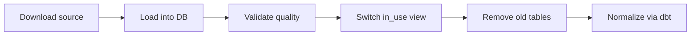

# Clone — Enrichment reference data

The `clone_*` DAGs import **public reference datasets** into the data warehouse. Unlike `source` DAGs, which ingest **actor lists** shared by partners, clone DAGs feed reference data used to **enrich, validate, or correct** actors already present on the platform.

> **See also**: [Sources and reference data](sources.md), [Airflow](airflow.md), [dbt](dbt.md), [Enrich SIRET/SIREN](enrich-siret-siren.md).

## Business context

The platform cross-references the actors it hosts with trusted external datasets:

| Reference data                 | Example business uses                                                                           |
| ------------------------------ | ----------------------------------------------------------------------------------------------- |
| **Annuaire Entreprises (AE)**  | Verify a SIREN/SIRET, detect a closed establishment, suggest a replacement via succession links |
| **BAN**                        | Correct a city or address, geocode                                                              |
| **La Poste / INSEE / Koumoul** | Match a postal code to a municipality, attach an actor to an EPCI                               |
| **Contours administratifs**    | Geographic reference data (municipalities, departments, regions, EPCIs)                         |

This data only changes when the official source publishes a new version. There is no reason to reprocess it on every enrichment run: it should be **refreshed at clone cadence**, not at suggestion cadence.

## General workflow

Every `clone_*` DAG follows the same business chain:

### 1. Import a new version

Data is downloaded from the official URL (data.gouv, INSEE, La Poste, etc.) and loaded into a **timestamped table** (`clone_<kind>_YYYYMMDDHHMMSS`). This table holds the raw version of the reference dataset.

### 2. Validation

SQL checks verify that the imported table is usable (consistent volume, required fields present, etc.). On failure, the table is dropped and the DAG stops: the previous version remains in service.

### 3. Switch the `*_in_use` view

Downstream consumers (dbt, enrichment DAGs) never read the timestamped table directly. They go through a **stable view** `clone_<kind>_in_use` that points to the latest validated version.

After a successful clone, the view is recreated to point to the new table. dbt models and enrichment DAGs therefore keep referencing a fixed name, with no service interruption.

### 4. Cleanup

Older timestamped tables for the same reference dataset are dropped to limit disk usage.

### 5. dbt normalization (depending on the dataset)

For some clones, a dbt step runs immediately after the switch. It turns raw data into ready-to-use intermediate models (cleaning, typing, indexes, preparatory joins). See the next section.

## dbt normalization: "clone first, enrich second"

**Principle**: dbt preparation of a reference dataset is triggered **when that dataset changes**, i.e. at the end of the relevant clone DAG. Enrichment DAGs only need to refresh their own `marts` models (`tag:…` selector without `+`), assuming `base` and `intermediate` layers are already up to date.

### Best practice: tag models with `normalisation`

Systematically add the `normalisation` tag to every dbt model that must be recalculated after a clone. Clone DAGs select these models with a combined selector: `tag:<domain>,tag:normalisation` (for example `tag:geo,tag:normalisation` or `tag:ban,tag:normalisation`).

### Reference data normalized at clone time

| Clone DAG                     | dbt models prepared (base + intermediate layers)              |
| ----------------------------- | ------------------------------------------------------------- |
| `clone_ae_unite_legale`       | Annuaire Entreprises `unite_legale` chain                     |
| `clone_ae_etablissement`      | `etablissement` chain (+ models tagged `normalisation`)       |
| `clone_ae_lien_succession`    | `lien_succession` chain (successors of closed establishments) |
| `clone_insee_commune`         | Geographic models (`tag:geo`)                                 |
| `clone_koumoul_epci`          | Geographic models (`tag:geo`), including `int_epci`           |
| `clone_laposte_codes_postaux` | Geographic models (`tag:geo`)                                 |

The three geographic clones (INSEE, Koumoul, La Poste) trigger the same `tag:geo` scope. This is intentional: the run is lightweight and keeps municipalities, postal codes, and EPCIs consistent whenever one of these datasets is updated.

### Clones without immediate normalization

Other clones only import raw data; dbt normalization happens elsewhere:

| Clone DAG                                    | dbt normalization                                                   |
| -------------------------------------------- | ------------------------------------------------------------------- |
| `clone_ban_adresses`, `clone_ban_lieux_dits` | Daily `enrich_dbt_models_refresh` DAG (`+tag:intermediate,tag:ban`) |
| `clone_ca_*` (contours administratifs)       | Raw geographic data, consumed directly or via other models          |

### Impact on enrichment DAGs

`enrich_acteurs_closed`, `enrich_acteurs_rgpd`, `enrich_acteurs_villes`, etc. no longer recalculate Annuaire Entreprises or geographic intermediate models. They only refresh their suggestion `marts` models, for example:

- `enrich_acteurs_closed` → `tag:marts,tag:enrich,tag:closed`
- `enrich_acteurs_rgpd` → `tag:marts,tag:enrich,tag:rgpd`
- `enrich_acteurs_villes` → `tag:marts,tag:enrich,tag:villes`

`enrich_siret_siren` keeps a `+tag:siren_siret` selector because its models combine both AE reference data **and** platform actors.

## DAG inventory

| DAG                                  | Source                   | Schedule            | dbt normalization at clone           |
| ------------------------------------ | ------------------------ | ------------------- | ------------------------------------ |
| `clone_ae_unite_legale`              | data.gouv (SIRENE stock) | 1st of month, 01:00 | Yes                                  |
| `clone_ae_etablissement`             | data.gouv (SIRENE stock) | 1st of month, 02:00 | Yes                                  |
| `clone_ae_lien_succession`           | data.gouv (SIRENE stock) | 1st of month, 03:00 | Yes                                  |
| `clone_ban_adresses`                 | adresse.data.gouv.fr     | 1st of month, 04:00 | No (via `enrich_dbt_models_refresh`) |
| `clone_ban_lieux_dits`               | adresse.data.gouv.fr     | 1st of month, 05:00 | No (via `enrich_dbt_models_refresh`) |
| `clone_insee_commune`                | INSEE (COG)              | Sunday, 00:00       | Yes (`tag:geo`)                      |
| `clone_ca_commune`                   | Contours administratifs  | Sunday, 01:00       | No                                   |
| `clone_ca_commune_associee_deleguee` | Contours administratifs  | Sunday, 01:00       | No                                   |
| `clone_ca_departement`               | Contours administratifs  | Sunday, 01:00       | No                                   |
| `clone_ca_epci`                      | Contours administratifs  | Sunday, 01:00       | No                                   |
| `clone_ca_region`                    | Contours administratifs  | Sunday, 01:00       | No                                   |
| `clone_koumoul_epci`                 | Koumoul                  | Sunday, 01:00       | Yes (`tag:geo`)                      |
| `clone_laposte_codes_postaux`        | La Poste (datanova)      | Sunday, 02:00       | Yes (`tag:geo`)                      |

> Source and usage details: [Sources and reference data](sources.md#cloned-enrichment-reference-data).
