# Clustering & Deduplication

- 🗺️ **Context**: we ingest data on circular economy actors from [multiple sources](https://data.ademe.fr/)
- 🔴 **Problem**: some actors are duplicated, polluting the user application
- 🟢 **Solution**: work to reduce duplicates and improve data consistency
- 🤔 **How**: see below

## ⚠️ Known limitations

- **We do not split children from an existing cluster**: our choice for now; we only want to add new children. To change this would require [CLUSTERING & DEDUP: re-cluster existing children](https://www.notion.so/CLUSTERING-DEDUP-re-clusteriser-les-enfants-existants-1956523d57d7801abe3bc132ec7e33b0?pvs=21). For now:
  - 🟢 **advantage**: no risk of damaging existing clusters
  - 🟠 **drawback**: no opportunity to re-cluster existing bad clusters

- **No child re-clustering = no child context**: consequence of the above; children do not have their data fetched or normalized, which can cause context issues, so we did https://github.com/incubateur-ademe/quefairedemesobjets/pull/1379 in the meantime

## 📜 Definition

- 📦 **Clustering:** the act of **grouping** actors by their **similarity**
- 1️⃣ **Deduplication**: turn a **cluster** into **a single actor** so there are **no more duplicates**
- 🎏 **Ideal final state of an actor**: we focus on actors with status=ACTIF (ACTIVE)

| State 🇫🇷       | Code 🇬🇧          | Definition                                       | Corresponds to a specific source                                                                                                                                     | Visible on the map               |
| -------------- | ---------------- | ------------------------------------------------ | -------------------------------------------------------------------------------------------------------------------------------------------------------------------- | -------------------------------- |
| parent(s)      | parent(s)        | actor that has 1 or more children attached to it | 🟠 NO we create an "artificial" parent so it lives independently from its children = more robust over time, no need to change the parent whenever children change | 🟢 YES                           |
| child/children | child / children | actor attached to 1 parent (1 is the maximum)    | 🟢 YES This is the source the actor comes from                                                                                                                    | 🟠 NO The parent is displayed |
| orphan(s)      | orphan(s)        | actor attached to 0 parents                      | 🟢 YES This is the source the actor comes from                                                                                                                    | 🟢 YES                           |

## ➡️ State transitions: scenarios

| change model                | State before | State after          | Scenario                                                         | Impact in revision                                                                                                                                      | Impact in displayed                |
| --------------------------- | ------------ | -------------------- | ---------------------------------------------------------------- | ------------------------------------------------------------------------------------------------------------------------------------------------------- | ---------------------------------- |
| `acteur_create_as_parent`   | Orphan       | Parent               | ➕ New parent for new cluster                                    | ➕ Parent to create ➕ Data enriched as best as possible                                                                                             | same as revision                   |
| `acteur_keep_as_parent`     | Parent       | Parent               | 1️⃣ Single existing parent → keep                                 | 🟰 Still parent of cluster ➕ Data enriched as best as possible                                                                                      | same as revision                   |
| `acteur_keep_as_parent`     | Parent       | Parent               | 🎖️ 2+ parents in cluster → the one with most children → keep     | 🟰 Still parent of cluster ➕ Data enriched as best as possible                                                                                      | same as revision                   |
| `acteur_delete_as_parent`   | Parent       | Will no longer exist | 🔴 2+ parents in cluster → not chosen → to delete                | 🛑 Should be automatically deleted after these children are updated (see [`PR1247`](https://github.com/incubateur-ademe/quefairedemesobjets/pull/1247)) | 🛑 Should disappear from displayed |
| `acteur_verify_in_revision` | Child        | Child                | 🟰 Already points to new parent → nothing to do                  | None                                                                                                                                                    | None                               |
| `acteur_update_parent_id`   | Child        | Child                | 🔀 Pointed to a parent that was not chosen → point to new parent | 🔀 Update parent_id to point to new parent                                                                                                              | None                               |
| `acteur_update_parent_id`   | Orphan       | Child                | 🔀 to point to a parent                                          | 🔀 Update parent_id to point to new parent                                                                                                              | 🛑 Should disappear from displayed |
| _(none)_                    | Orphan       | Orphan               | Still not part of any cluster (no change)                        | None                                                                                                                                                    | None                               |

## 🧪 Algorithm

### 🗓️ Past attempts

- **Consideration of https://github.com/dedupeio/dedupe**: but seeing that the [comparator](https://github.com/search?q=repo%3Adedupeio%2Fdedupe+comparator&type=code) evaluates 2 values at a time = **O(n²) complexity** at runtime, and with our volumes (~500K actors) = concern about going with a non-vectorized approach. We see [user feedback in that direction](https://github.com/dedupeio/dedupe/issues/940) (matching time exploding when going from a 1K to 5K sample).
- **Vectorized attempt**: tried basic vectorization (e.g. TF-IDF to naturally deprioritize noise/redundancy) but without compute infra (e.g. state startup = frugal) the idea was abandoned (risk of building models we could not operate via Airflow).

### 👉🏻 Current

- **Very primitive**: with normalization and TF-IDF but running at too small a scale to be really relevant. Lacks fuzzy tolerance.

### 💡 Improvements

- **Continue upstream normalization**: because it benefits not only clustering but also data quality on the map:
  - **old → new city conversion**: thanks to [BAN](https://github.com/incubateur-ademe/quefairedemesobjets/pull/1451)
  - **address normalization**: still with BAN
  - **name enrichment** at matching time for more embeddings via [AE](https://github.com/incubateur-ademe/quefairedemesobjets/pulls?q=Annuaire+entreprise)
- **Extend vectorized scope**: e.g. at department level, to offer a relevance vs. model size trade-off
- **Reconsider https://github.com/dedupeio/dedupe**: again on subsets (e.g. city) to benefit from the library (which offers useful things like distances) without suffering too much from O(n²)
- **Embeddings**: due to very diverse representations (e.g. waste collection centre vs. waste disposal sites)
- **Conversion mappings** for limited/known cases (e.g. street name abbreviations, e.g. ESP → ESPLANADE)
- **Phonetic algorithms** for typos
- **Language models**: potentially compact models (SLMs) that would outperform the above by asking the simple question ("please cluster these samples")

## 🚤 Performance

### 👉🏻 Current

- **Poor but sufficient for the business**: runs the algorithm on Airflow and does something else while waiting
- **Main reason**: loops and successive round-trips to choose parents and their data
- **Example**: clustering 150K actors took ~6 hours

### 💡 Improvements

- **Rewrite tasks** to use DBT models that prepare the data = eliminate loops / DB round-trips via Python.

## 🔀 Schema

```mermaid
graph TD
   subgraph selection["🔎 <b>selection</b>: statut=ACTIF"]
      direction LR
      parents
      orphans
      children
   end

   subgraph normalization["🧹 <b>normalization</b>"]
       norma["lower case, no accents etc..."]
   end

   subgraph clustering["📦 <b>clustering</b>"]
        similar["exact + fuzzy similarity"]
   end

   subgraph dedup["1️⃣ <b>deduplication</b>"]
        parents_choose["🥇 Choose new parents"]
        parents_data["🗄️ Choose parents' data (from non-normalized data)"]
        parents_choose-->parents_data
        parents_data-->children_feed["⬅️ Add existing children"]
        children_feed-->changes_mark["📋 Define changes"]
   end

   subgraph suggestions[" <b>suggestions</b>"]
      propose
    end

   parents-->|displayed| normalization
   orphans-->|displayed| normalization
   normalization --> clustering
   children-->|revision| children_feed
   clustering-->dedup
   changes_mark-->suggestions
```

