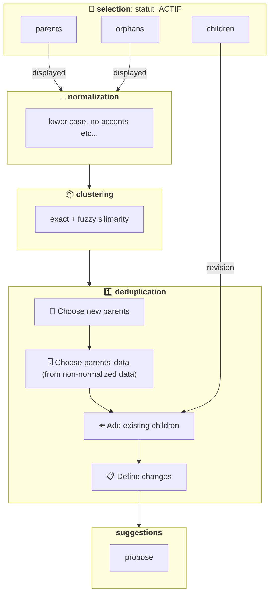

# Clustering & Déduplication

- 🗺️ **Contexte**: on ingère de la donnée d’acteurs de l’économie circulaire de [plusieurs sources](https://data.ademe.fr/)
- 🔴 **Problème**: certains acteurs sont en doublon, polluant l'application utilisteur
- 🟢 **Solution**: faire un travail pour réduire les doublons et améliorer la cohérence des données
- 🤔 **Comment**: voir ci-dessous

## ⚠️ Limitations connues

- **On ne séparent pas les enfants d’un cluster existant**: choix de notre part, pour l’instant on veut uniquement
  ajouter des nouveaux enfants. Pour changer il faudra [CLUSTERING & DEDUP: re-clusteriser les enfants existants](https://www.notion.so/CLUSTERING-DEDUP-re-clusteriser-les-enfants-existants-1956523d57d7801abe3bc132ec7e33b0?pvs=21). Pour l’instant:
  - 🟢 **avantage**: pas de risque d’endommager des clusters existants
  - 🟠 **inconvénient**: pas d’opportunité de re-clustering les mauvais cluster existants

- **Pas de re-clustering enfants = pas de contexte enfant**: conséquence du dessus, les enfants n’ont pas leur donnée récupérée ni
  normalisée, ce qui peut poser des problèmes de contexte, donc on à fait [PR1379](https://github.com/incubateur-ademe/quefairedemesobjets/pull/1379) en attendant

- **Pas de priorisation de multiple sources pour l'enrichissement**: on voudrait pouvoir définir **plusieurs sources selon un ordre spécifique**, mais pas possible actuellement, conséquence de ce [bug présent en v2](https://github.com/apache/airflow/discussions/46475) qui fait que 🔴 **l'ordre de sélection UI est écrasé/remplacé par l'ordre de définition du code**
  - [bug solutionné en v3](https://github.com/apache/airflow/discussions/46475#discussioncomment-12922818), d'où l'intérêt de le [migration v3](../../comment-faire/data/airflow-v3-migration.md)

## 📜 Définition

- 📦 **Clustering:** fait de **regrouper** des acteurs via leur **similarité**
- 1️⃣ **Déduplication**: convertir un **cluster** en **1 seul acteur** pour ne **plus avoir de doublons**
- 🎏 **Etat final idéal d’un acteur**: on se concentre sur les acteurs statut=ACTIF

<table><thead>
  <tr>
    <th>Etat 🇫🇷</th>
    <th>Code 🇬🇧</th>
    <th>Définition</th>
    <th>Correspond à une source en particulier</th>
    <th>Visible sur la carte</th>
  </tr></thead>
<tbody>
  <tr>
    <td>parent(s)</td>
    <td>parent(s)</td>
    <td>acteur qui a 1 ou plusieurs enfants rattachés à lui</td>
    <td>🟠 NON on créé un parent “artificiel” pour que celui-ci vive de manière détachée de ses enfants = plus robuste à travers le temps, pas besoin de changer le parent à chaque fois que les enfants changent </td>
    <td>🟢 OUI</td>
  </tr>
  <tr>
    <td>enfant(s)</td>
    <td>child / children</td>
    <td>acteur rattaché à 1 parent (1 est le maximum)</td>
    <td>🟢 OUI C’est de cette source que vient l’acteur </td>
    <td>🟠 NON C’est le parent qui est affiché </td>
  </tr>
  <tr>
    <td>orphelin(s)</td>
    <td>orphan(s)</td>
    <td>acteur rattaché à 0 parent</td>
    <td>🟢 OUI C’est de cette source que vient l’acteur </td>
    <td>🟢 OUI</td>
  </tr>
</tbody></table>

## ➡️ Transitions d’états: scénarios

<table><thead>
  <tr>
    <th>modèle de changement</th>
    <th>Etat avant</th>
    <th>Etat après</th>
    <th>Scénario</th>
    <th>Conséquences dans revision</th>
    <th>Conséquences dans displayed</th>
  </tr></thead>
<tbody>
  <tr>
    <td><a href="data/models/changes/acteur_create_as_parent.py">acteur_create_as_parent</a></td>
    <td>Orphelin</td>
    <td>Parent</td>
    <td>➕ Nouveau parent pour nouveau cluster</td>
    <td>➕ Parent à créer ➕ Donnée enrichie au mieux </td>
    <td>pareil que révision</td>
  </tr>
  <tr>
    <td><a href="data/models/changes/acteur_keep_as_parent.py">acteur_keep_as_parent</a></td>
    <td>Parent</td>
    <td>Parent</td>
    <td>1️⃣ 1 seul parent existant -&gt; à garder</td>
    <td> 🟰 Toujours parent du cluster ➕ Donnée enrichie au mieux </td>
    <td>pareil que révision</td>
  </tr>
  <tr>
    <td><a href="data/models/changes/acteur_keep_as_parent.py">acteur_keep_as_parent</a></td>
    <td>Parent</td>
    <td>Parent</td>
    <td>🎖️ 2+ parents dans cluster -&gt; celui avec + d'enfants -&gt; à garder</td>
    <td> 🟰 Toujours parent du cluster ➕ Donnée enrichie au mieux </td>
    <td>pareil que révision</td>
  </tr>
  <tr>
    <td><a href="data/models/changes/acteur_delete_as_parent.py">acteur_delete_as_parent</a></td>
    <td>Parent</td>
    <td>N’existera plus</td>
    <td>🔴 2+ parents dans cluster -&gt; non choisi -&gt; à supprimer</td>
    <td>🛑 Devrait être automatiquement supprimé suite à la mise à jour de ces enfants (voir <a href="https://github.com/incubateur-ademe/quefairedemesobjets/pull/1247">PR1247</a>)</td>
    <td>🛑 Devrait disparaitre de displayed</td>
  </tr>
  <tr>
    <td><a href="data/models/changes/acteur_verify_in_revision.py">acteur_verify_in_revision</a></td>
    <td>Enfant</td>
    <td>Enfant</td>
    <td>🟰 Pointe déjà vers nouveau parent → rien à faire</td>
    <td>Aucune</td>
    <td>Aucune</td>
  </tr>
  <tr>
    <td><a href="data/models/changes/acteur_update_parent_id.py">acteur_update_parent_id</a></td>
    <td>Enfant</td>
    <td>Enfant</td>
    <td>🔀 Pointait vers un parent qui n’a pas été choisi → à pointer vers nouveau parent</td>
    <td> 🔀 Mettre à jour parent_id pour pointer vers nouveau parent</td>
    <td>Aucune</td>
  </tr>
  <tr>
    <td><a href="data/models/changes/acteur_update_parent_id.py">acteur_update_parent_id</a></td>
    <td>Orphelin</td>
    <td>Enfant</td>
    <td>🔀 à pointer vers un parent</td>
    <td> 🔀 Mettre à jour parent_id pour pointer vers nouveau parent</td>
    <td>🛑 Devrait disparaitre de displayed</td>
  </tr>
  <tr>
    <td></td>
    <td>Orphelin</td>
    <td>Orphelin</td>
    <td>Ne fais toujours pas parti d’un cluster (pas de changement)</td>
    <td>Aucune</td>
    <td>Aucune</td>
  </tr>
</tbody></table>

## 🧪 Algorithme

### 🗓️ Tentatives passées

 - **Considération de https://github.com/dedupeio/dedupe**: mais en voyant que le [comparateur](https://github.com/search?q=repo%3Adedupeio%2Fdedupe+comparator&type=code) évalue 2 valeurs à la fois = **complexité O(n2)** au moment du runtime, et sachant nos volumes (~500K acteurs) = peur de s'orentier vers du non-vectorisé. On voit des [retours utilisateurs qui vont dans ce sens](https://github.com/dedupeio/dedupe/issues/940) (temps de matching qui explose en passant d'un échantillon de 1K à 5K).
 - **Tentative vectorisée**: tenté de faire du vectorisé de base (ex: TF-IDF pour naturellement dépriorisé le bruit / la redondance) mais n'ayant pas d'infra de compute (ex: startup état = frugale) l'idée a été abandonnée (le risque de créer des modèles qu'on ne pouvait pas gérer via Airflow).

### 👉🏻 Actuellement

 - **Très primitif**: avec de la normalisation et du TF-IDF mais qui tourne à une échelle trop réduite pour être vraiment pertinent. Manque de tolérance fuzzy.

### 💡 Améliorations

 - **Continuer la normalisation en amont**: car celle-ci fait bénéficier non seulement le clustering, mais la qualité des données sur la carte:
    - **conversion anciennes -> nouvelles villes**: grâce à la [BAN](https://github.com/incubateur-ademe/quefairedemesobjets/pull/1451)
    - **normalisation des adresses**: toujours avec la BAN
    - **enrichissement des noms** au moment du matching pour plus d'embeddings via l'[AE](https://github.com/incubateur-ademe/quefairedemesobjets/pulls?q=Annuaire+entreprise)
 - **Etendre le scope vectorisé**: par exemple à l'échelle d'un département, pour offrir un compromis pertinence vs. taille du modèle
 - **Reconsidérer https://github.com/dedupeio/dedupe**: encore une fois sur des sous-ensembles (e.g. ville) pour bénéficier de la librairie (qui offre des choses intéressantes genre distances) sans souffrir trop du O(n2)
 - **Embeddings**: à cause des représentations vraiment diverses (ex: centre de collècte des déchets vs. décheteries)
 - **Mappings de conversion** pour les cas limités/connus (ex: abbrévation des noms de voies, ex: ESP -> ESPLANADE)
 - **Algo phonétiques** pour les typos
 - **Modèles de langues**: potentiellement les modèles compact (SLMs) qui offrirait des performances supérieur à tout ce qu'on peut faire au dessus en posant la question simple ("merci de clusteriser ces échantillons")

## 🚤 Performance

### 👉🏻 Actuellement

 - **Mauvaises mais suffisantes pour métier**: qui fait tourner l'algo sur Airflow et fait autre chose en attendant
 - **Raison principale**: les boucles et aller-retour successifs pour choisir les parents et leur données
 - **Exemple** d'un clustering de 150K acteurs qui prenait ~6 heures

### 💡 Améliorations

 - **Réécrire les tâches** en passant par des modèles DBT qui s'occupe de préparer la data = finit les boucles / aller-retour DB via python.

## 🔀 Schéma

