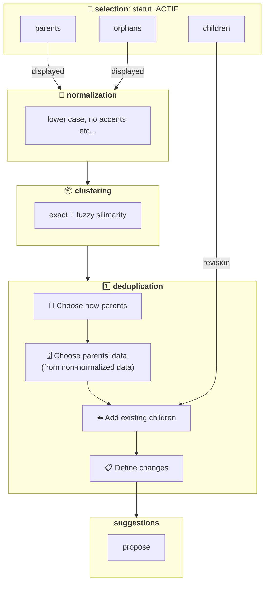

# Clustering & Déduplication

- 🗺️ **Contexte**: on ingère de la donnée d’acteurs de l’économie circulaire de [plusieurs sources](https://data.ademe.fr/)
- 🔴 **Problème**: certains acteurs sont en doublon, polluant l'application utilisteur
- 🟢 **Solution**: faire un travail pour réduire les doublons et améliorer la cohérence des données
- 🤔 **Comment**: voir ci-dessous

## ⚠️ Limitations connues

- **On ne séparent pas les enfants d’un cluster existant**: choix de notre part, pour l’instant on veut uniquement
  ajouter des nouveaux enfants. Pour changer il faudra [CLUSTERING & DEDUP: re-clusteriser les enfants existants](https://www.notion.so/CLUSTERING-DEDUP-re-clusteriser-les-enfants-existants-1956523d57d7801abe3bc132ec7e33b0?pvs=21). Pour l’instant:
  - 🟢 **avantage**: pas de risque d’endommager des clusters existants
  - 🟠 **inconvénient**: pas d’opportunité de re-clustering les mauvais cluster existants
 
- **Pas de re-clustering enfants = pas de contexte enfant**: conséquence du dessus, les enfants n’ont pas leur donnée récupérée ni
  normalisée, ce qui peut poser des problèmes de contexte, donc on à fait https://github.com/incubateur-ademe/quefairedemesobjets/pull/1379 en attendant

## 📜 Définition

- 📦 **Clustering:** fait de **regrouper** des ****acteurs via leur **similarité**
- 1️⃣ **Déduplication**: convertir un **cluster** en **1 seul acteur** pour ne **plus avoir de doublons**
- 🎏 **Etat final idéal d’un acteur**: on se concentre sur les acteurs statut=ACTIF

<table class="tg"><thead>
  <tr>
    <th class="tg-c3ow">Etat 🇫🇷</th>
    <th class="tg-c3ow">Code 🇬🇧</th>
    <th class="tg-c3ow">Définition</th>
    <th class="tg-c3ow">Correspond à une source en particulier</th>
    <th class="tg-c3ow">Visible sur la carte</th>
  </tr></thead>
<tbody>
  <tr>
    <td class="tg-0pky">parent(s)</td>
    <td class="tg-0pky">parent(s)</td>
    <td class="tg-0pky">acteur qui a 1 ou plusieurs enfants rattachés à lui</td>
    <td class="tg-0pky">🟠 NON on créé un parent “artificiel” pour que celui-ci vive de manière détachée de ses enfants = plus robuste à travers le temps, pas besoin de changer le parent à chaque fois que les enfants changent </td>
    <td class="tg-0pky">🟢 OUI</td>
  </tr>
  <tr>
    <td class="tg-0pky">enfant(s)</td>
    <td class="tg-0pky">child / children</td>
    <td class="tg-0pky">acteur rattaché à 1 parent (1 est le maximum)</td>
    <td class="tg-0pky">🟢 OUI C’est de cette source que vient l’acteur </td>
    <td class="tg-0pky">🟠 NON C’est le parent qui est affiché </td>
  </tr>
  <tr>
    <td class="tg-0pky">orphelin(s)</td>
    <td class="tg-0pky">orphan(s)</td>
    <td class="tg-0pky">acteur rattaché à 0 parent</td>
    <td class="tg-0pky">🟢 OUI C’est de cette source que vient l’acteur </td>
    <td class="tg-0pky">🟢 OUI</td>
  </tr>
</tbody></table>

## ➡️ Transitions d’états: scénarios

<table class="tg"><thead>
  <tr>
    <th class="tg-amwm">modèle de changement</th>
    <th class="tg-amwm">Etat avant</th>
    <th class="tg-amwm">Etat après</th>
    <th class="tg-amwm">Scénario</th>
    <th class="tg-amwm">Conséquences dans revision</th>
    <th class="tg-amwm">Conséquences dans displayed</th>
  </tr></thead>
<tbody>
  <tr>
    <td class="tg-cly1"><a href="/incubateur-ademe/quefairedemesobjets/blob/main/data/models/changes/acteur_create_as_parent.py">acteur_create_as_parent</a></td>
    <td class="tg-aiub">Orphelin</td>
    <td class="tg-aiub">Parent</td>
    <td class="tg-cly1">➕ Nouveau parent pour nouveau cluster</td>
    <td class="tg-cly1">➕ Parent à créer ➕ Donnée enrichie au mieux </td>
    <td class="tg-8zwo">pareil que révision</td>
  </tr>
  <tr>
    <td class="tg-cly1"><a href="/incubateur-ademe/quefairedemesobjets/blob/main/data/models/changes/acteur_keep_as_parent.py">acteur_keep_as_parent</a></td>
    <td class="tg-aiub">Parent</td>
    <td class="tg-aiub">Parent</td>
    <td class="tg-cly1">1️⃣ 1 seul parent existant -&gt; à garder</td>
    <td class="tg-cly1"> 🟰 Toujours parent du cluster ➕ Donnée enrichie au mieux </td>
    <td class="tg-8zwo">pareil que révision</td>
  </tr>
  <tr>
    <td class="tg-cly1"><a href="/incubateur-ademe/quefairedemesobjets/blob/main/data/models/changes/acteur_keep_as_parent.py">acteur_keep_as_parent</a></td>
    <td class="tg-aiub">Parent</td>
    <td class="tg-aiub">Parent</td>
    <td class="tg-cly1">🎖️ 2+ parents dans cluster -&gt; celui avec + d'enfants -&gt; à garder</td>
    <td class="tg-cly1"> 🟰 Toujours parent du cluster ➕ Donnée enrichie au mieux </td>
    <td class="tg-8zwo">pareil que révision</td>
  </tr>
  <tr>
    <td class="tg-cly1"><a href="/incubateur-ademe/quefairedemesobjets/blob/main/data/models/changes/acteur_delete_as_parent.py">acteur_delete_as_parent</a></td>
    <td class="tg-aiub">Parent</td>
    <td class="tg-cly1">N’existera plus</td>
    <td class="tg-cly1">🔴 2+ parents dans cluster -&gt; non choisi -&gt; à supprimer</td>
    <td class="tg-cly1">🛑 Devrait être automatiquement supprimé suite à la mise à jour de ces enfants (voir <a href="https://github.com/incubateur-ademe/quefairedemesobjets/pull/1247">PR1247</a>)</td>
    <td class="tg-cly1">🛑 Devrait disparaitre de displayed</td>
  </tr>
  <tr>
    <td class="tg-cly1"><a href="/incubateur-ademe/quefairedemesobjets/blob/main/data/models/changes/acteur_verify_in_revision.py">acteur_verify_in_revision</a></td>
    <td class="tg-aiub">Enfant</td>
    <td class="tg-aiub">Enfant</td>
    <td class="tg-cly1">🟰 Pointe déjà vers nouveau parent → rien à faire</td>
    <td class="tg-zz43">Aucune</td>
    <td class="tg-zz43">Aucune</td>
  </tr>
  <tr>
    <td class="tg-cly1"><a href="/incubateur-ademe/quefairedemesobjets/blob/main/data/models/changes/acteur_update_parent_id.py">acteur_update_parent_id</a></td>
    <td class="tg-aiub">Enfant</td>
    <td class="tg-aiub">Enfant</td>
    <td class="tg-cly1">🔀 Pointait vers un parent qui n’a pas été choisi → à pointer vers nouveau parent</td>
    <td class="tg-cly1"> 🔀 Mettre à jour parent_id pour pointer vers nouveau parent</td>
    <td class="tg-zz43">Aucune</td>
  </tr>
  <tr>
    <td class="tg-cly1"><a href="/incubateur-ademe/quefairedemesobjets/blob/main/data/models/changes/acteur_update_parent_id.py">acteur_update_parent_id</a></td>
    <td class="tg-aiub">Orphelin</td>
    <td class="tg-aiub">Enfant</td>
    <td class="tg-cly1">🔀 à pointer vers un parent</td>
    <td class="tg-cly1"> 🔀 Mettre à jour parent_id pour pointer vers nouveau parent</td>
    <td class="tg-cly1">🛑 Devrait disparaitre de displayed</td>
  </tr>
  <tr>
    <td class="tg-cly1"></td>
    <td class="tg-aiub">Orphelin</td>
    <td class="tg-aiub">Orphelin</td>
    <td class="tg-cly1">Ne fais toujours pas parti d’un cluster (pas de changement)</td>
    <td class="tg-zz43">Aucune</td>
    <td class="tg-zz43">Aucune</td>
  </tr>
</tbody></table>

## 🔀 Schéma

