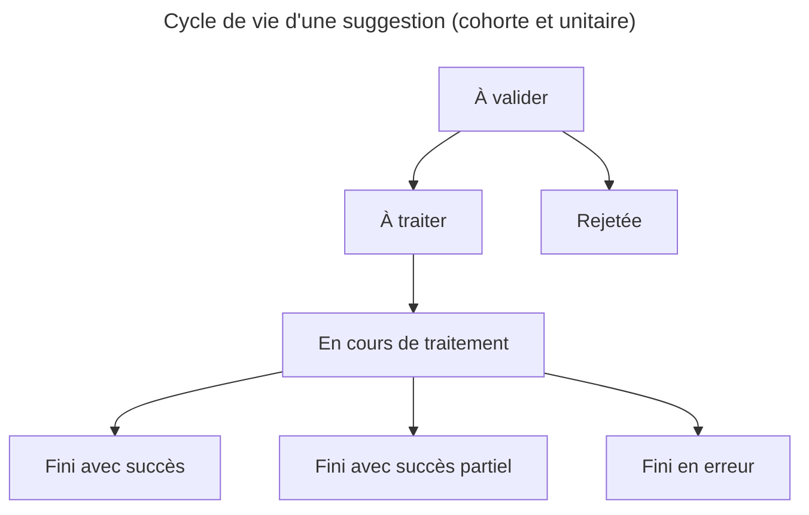

# Système de suggestion

**Statut : ❓ À approuver**

Cette proposition de modification de l'architecture pour faire évoluer le système de suggestion est un travail itératif. Il est donc nessaire de garder en tête la cibe et le moyen d'y aller.

## Systeme de Suggestion

Les suggestions sont créées par l'exécution d'un pipeline ou d'un script. Les suggestions sont faites par paquet qu'on appelle **Cohorte**, les Cohortes comprennent un ensemble de suggestions de modification

Les cohortes ont un type d'événement : `clustering`, `enrichissement`, `source` selon le type de l'action lancée à l'origine de la suggestion de modification

Les cohortes et les suggestions ont un statut de traitement qui représente leur cycle de vie : `à valider`, `rejeter`, `à traiter`, `en cours de traitement`, `fini avec succès`, `fini avec succès partiel` (uniquement pour les cohortes), `fini en erreur`

### Représentation dans Django

- SuggestionCohorte représente les cohortes, c'est à dire un ensemble de suggestions de la même nature
- Suggestion représente les propositions de modification

### Cycle de vie d'une suggestion

