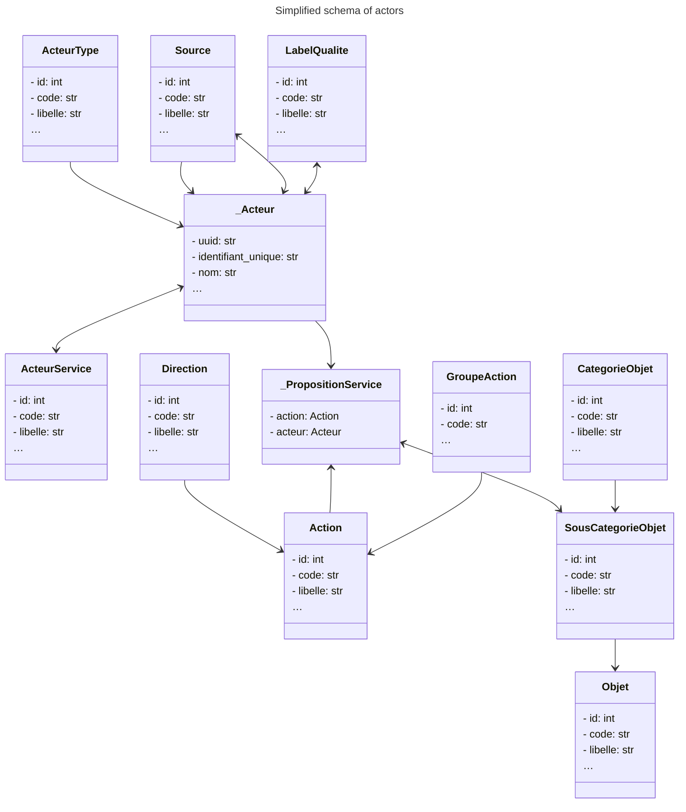
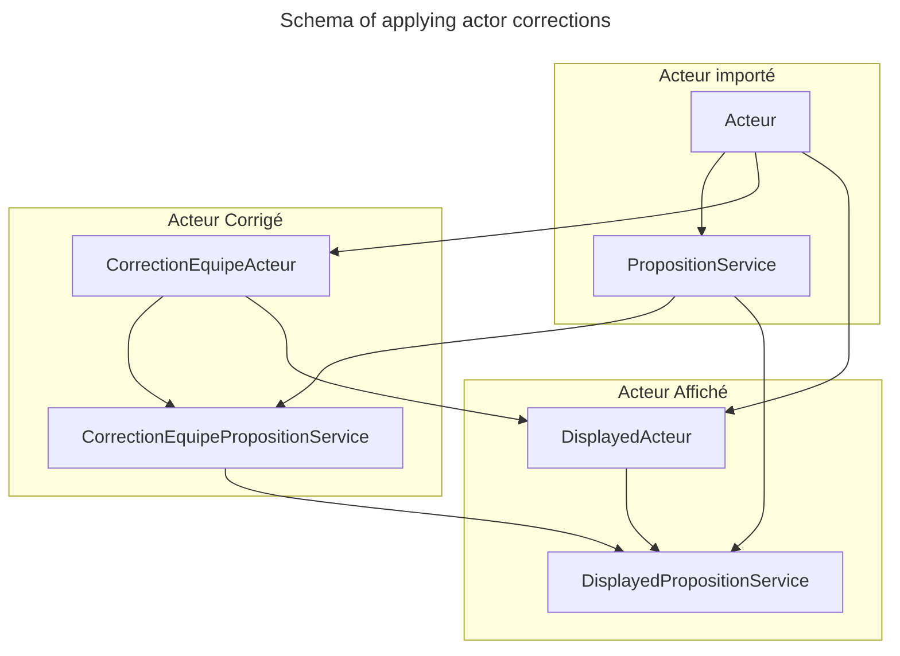

# «La Carte» database architecture

## Data model

Each reuse and recycling actor exposes service propositions associated with an action and a list of object categories.

### Administration objects in the database

Some database objects are administration objects that are not meant to be updated regularly. Below are the populations of these objects as of 18 September 2023.

**Direction** (`qfdmo_actiondirection`):

Look for an objects or Try to get rid of an object

**Action** (`qfdmo_action`):

What action do you want to perform, for example: réparer un objet, acheter de seconde main…

**Groupe d'Action** (`qfdmo_groupeaction`):

Way of grouping actions when the direction is not specified.

**Catégorie / Sous-catégorie / Objet** (`qfdmo_categorieobjet`, `qfdmo_souscategorieobjet`)

Classification of objects.

**Type de service** (`qfdmo_acteurservice`)

Type of services provided by the actor, for example: Achat/revente entre particuliers, Location par un professionnel, Pièces détachées…

**Type d'acteur** (`qfdmo_acteurtype`)

For example: commerce, association, acteur digital…

**Source** (`qfdmo_source`)

Partners who contributed to the collection of this actor.

## Simplified database schema

## Architecture of Actors and their service propositions

Actors are configured according to three layers:

- An import layer (Acteurs Importés) which represents the actors as they were shared by our partners, with some normalization (see tables `qfdmo_acteur` and `qfdmo_propositionservice`).
- A revision layer (Acteurs Revisions) which allows us to correct the data of imported actors and to group them when the same actor has been shared by several partners. The correction logic is a coalesce:
  - field by field, if the correction is not null and not empty, then the value to display is the correction
  - for related objects (proposition de service, services), the value of the correction will be displayed
  - for actor groupings, the value of the parent actor fields is displayed for each field, and related objects are collected across all children (actors grouped under the same entity)
- A display layer (Acteurs Affichés) which computes the actors to display based on imported actors and their revision.

