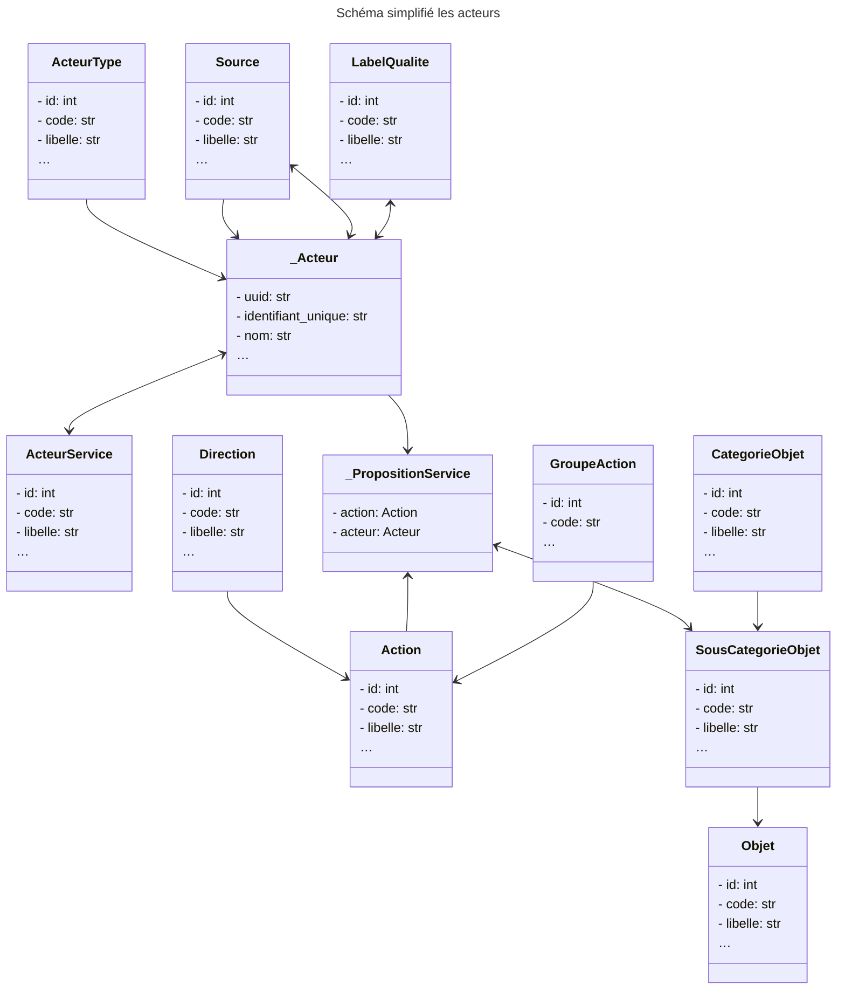
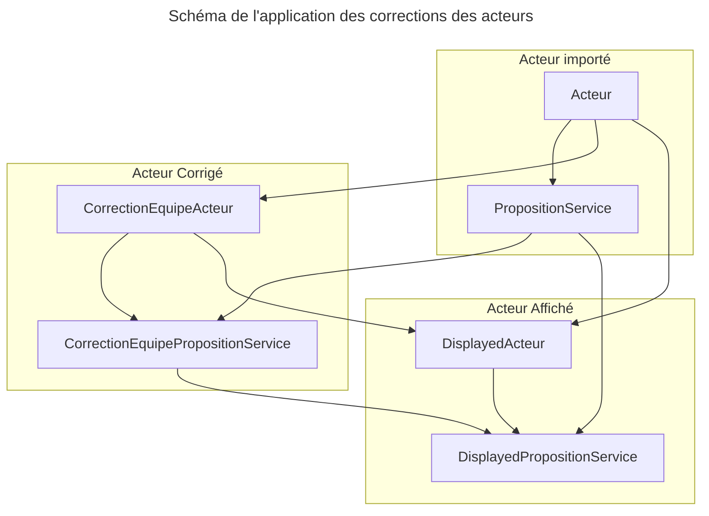

# Architecture de la base de données de La Carte

## Modèle de données

Chaque acteur du ré-emploi et recyclage expose des propositions de service associées à un geste et une liste de catégories d'objet.

### Objets d'administration en base de données

Certains objets de la base de données sont des objets d'administration qui n'ont pas vocation aest mis à jour régulièrement. Ci-dessous les populations de ces objets en date du 18 septembre 2023.

**Direction de l'action** (qfdmo_actiondirection):

Détenir ou chercher un objet (spécifique à l'utilisation de «Épargnons nos ressources»

**Action** (qfdmo_action):

Quelle action souhaitez vous faire, Exemple : réparer un objet, acheter de seconde main…

**Groupe d'Action** (qfdmo_groupeaction):

Manière de regrouper les actions lorsque la direction n'est pas précisée

**Catégorie / Sous-catégorie / Objet** (qfdmo_categorieobjet, qfdmo_souscategorieobjet)

Classification des objets

**Type de service** (qfdmo_acteurservice)

Type des services rendu par l'acteur, Exemple : Achat/revente entre particuliers, Location par un professionnel, Pièces détachées…

**Type d'acteur** (qfdmo_acteurtype)

Exemple : commerce, association, acteur digital…

**Source** (qfdmo_source)

Partenaires ayant contribué à la collecte de cette acteur

## Schema simplifié de base de données

## Architecture des Acteurs et de leurs propositions de service

Les acteurs sont configurés selon 3 couches:

- Une couche d'import (Acteurs Importés) qui représente les acteurs tels qu'ils ont été partagés par nos partenaires moyennant une normalisation (cf. table qfdmo_acteur et qfdmo_propositionservice)
- Une couche de révision (Acteurs Revisions) qui nous permet de corriger les données des acteurs importés et de les regrouper un même acteur a été partagé par plusieurs partenaires. La logique de correction est un coalesce:
    - champ par champ, si la correction est non null et non vide, alors on la valeur à afficher est celle de la correction
    - pour les objets liés (proposition de service, services), c'est la valeur de la correction qui sera affiché
    - pour les regroupement d'acteur, la valeur des champs de l'acteur parent est affichés pour chaque champs, les objets liés sont collectés sur tous les enfants (acteurs regroupés sous la même entité)
- Une couche d'affichage (Acteurs Affichés) qui calcule les acteurs à afficher selon les acteurs importés et leur révision

