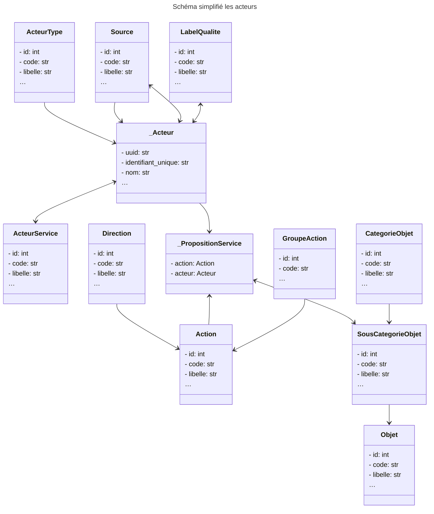
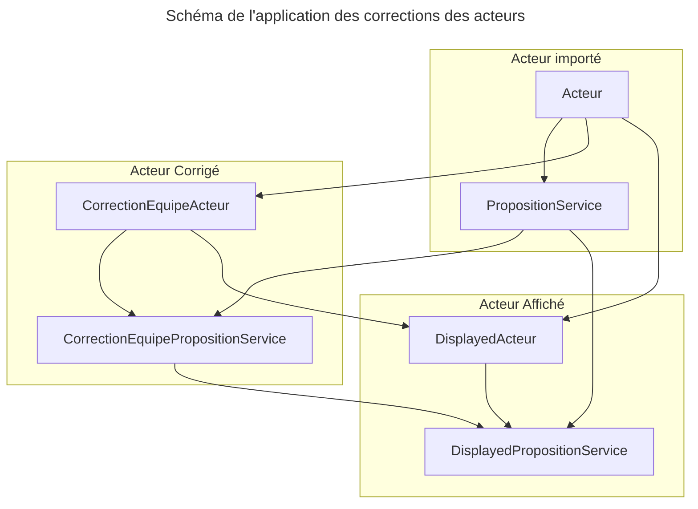

# Architecture de la base de données de La Carte

## Schema simplifié de base de données

```mermaid
---
title: Schéma simplifié les acteurs
---

classDiagram
    class ActeurService {
        - id: int
        - code: str
        - libelle: str
        …
    }

    class ActeurType {
        - id: int
        - code: str
        - libelle: str
        …
    }

    class Source {
        - id: int
        - code: str
        - libelle: str
        …
    }

    class LabelQualite {
        - id: int
        - code: str
        - libelle: str
        …
    }

    class _Acteur {
        - uuid: str
        - identifiant_unique: str
        - nom: str
        …
    }

    class _PropositionService {
        - action: Action
        - acteur: Acteur
    }

    class Action {
        - id: int
        - code: str
        - libelle: str
        …
    }

    class Direction {
        - id: int
        - code: str
        - libelle: str
        …
    }

    class GroupeAction {
        - id: int
        - code: str
        …
    }

    class CategorieObjet {
        - id: int
        - code: str
        - libelle: str
        …
    }

    class SousCategorieObjet {
        - id: int
        - code: str
        - libelle: str
        …
    }

    class Objet {
        - id: int
        - code: str
        - libelle: str
        …
    }

    Direction --> Action
    _Acteur --> _PropositionService
    _Acteur <--> ActeurService
    ActeurType --> _Acteur
    Source --> _Acteur
    Source <--> _Acteur
    LabelQualite <--> _Acteur
    _PropositionService <-- Action
    _PropositionService <--> SousCategorieObjet
    CategorieObjet --> SousCategorieObjet
    SousCategorieObjet --> Objet
    GroupeAction --> Action
```

```mermaid
---
title: Schéma de l'application des corrections des acteurs
---

flowchart TB
    subgraph Acteur importé
        direction LR
        Acteur --> PropositionService
    end
    subgraph Acteur Corrigé
        direction LR
        CorrectionEquipeActeur --> CorrectionEquipePropositionService
    end
    subgraph Acteur Affiché
        direction LR
        DisplayedActeur --> DisplayedPropositionService
    end

    Acteur --> CorrectionEquipeActeur --> DisplayedActeur
    Acteur --> DisplayedActeur
    PropositionService --> CorrectionEquipePropositionService --> DisplayedPropositionService
    PropositionService --> DisplayedPropositionService
```

