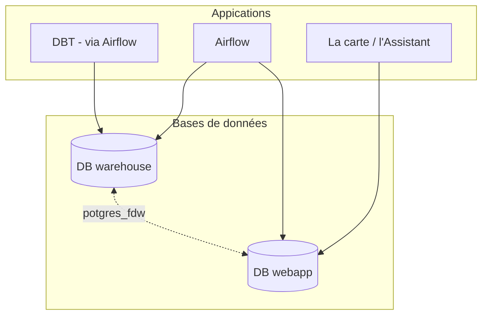

# Organisation des bases de données

## Utilisation de deux bases de données

L'application utilise deux bases de données :

- webapp : pour administrer et afficher les objets utils aux applications « La Carte » et « L'Assistant »
- warehouse : utilisé pour tous le travail de calcul et consolidation de la données

L'objectif est de séparer les bases de données pour que le travail sur la donnée n'impacte pas les performance de la webapp.
De même, nous avons besoin de beaucoup plus de place pour le travailler sur la données et de plus de rapidité pour la webapp.

## Lien entre bases de données

Le calcul avec DBT est effectué sur la base de données `warehouse`, cependant, il est nécessaire d'accéder aux données de de `webapp`

De même, il est nécessaire de mettre à disposition les données calculées sur la partie `warehouse` pour les afficher à la `webapp`

Pour gérer ces liens entre bases de données, l'application utilise l'extension `postgres_fdw` qui crée une représentation de la base distante dans un schema dédié

- la base de données `webapp` est disponible en lecture sur le schema `webapp_public` sur la base de données `warehouse`
- la base de données `warehouse` est disponible en lecture sur le schema `warehouse_public` sur la base de données `webapp`

Ces schemas sont rafraichis à chaque mise en prod (après les migrations)

commande utile : [Création des liens entre bases de données](../../comment-faire/development/useful_command.md#creation-des-liens-entre-bases-de-donnees)
