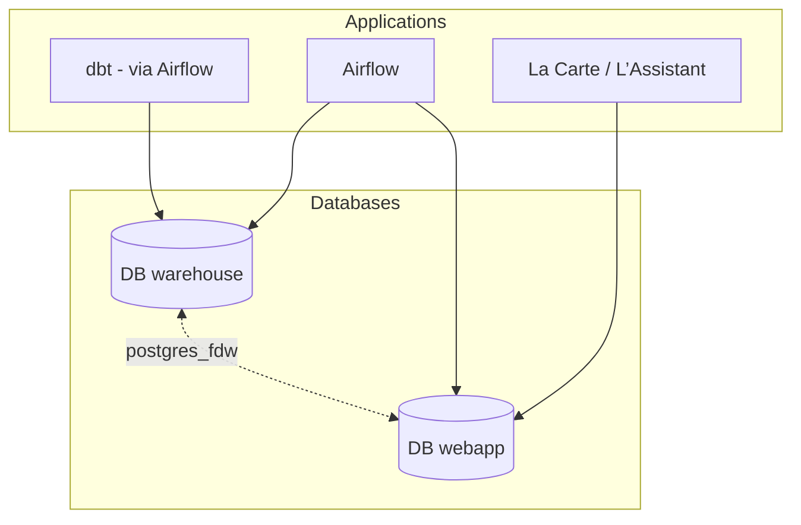

# Database organisation

## Using two databases instance

The application uses two PostgreSQL databases:

- `webapp`: stores and serves the data used to administer and display objects for the “La Carte” and “L’Assistant” applications
- `warehouse`: used for all data processing, calculations, and consolidation work

The goal is to separate the databases so that data processing does not impact the performance of the web application.
We also need much more storage capacity for data processing, and higher responsiveness for the web application.

## Links between databases

dbt computations are performed on the `warehouse` database. However, they need to read data from the `webapp` database.

Conversely, data computed in `warehouse` must be made available to `webapp` so that it can be displayed in the application.

To manage these cross-database links, the application uses the `postgres_fdw` extension, which exposes a remote database in a dedicated schema.

- the `webapp` database is available read-only via the `webapp_public` schema on the `warehouse` database
- the `warehouse` database is available read-only via the `warehouse_public` schema on the `webapp` database

These schemas are refreshed on each production deployment (after applying migrations).

Useful command: [Create links between databases](../../how-to/development/useful_command.md#creation-des-liens-entre-bases-de-donnees)

## `webapp_sample` database

`webapp_sample` is a database stored in `webapp` instance in preprod and locally (not in prod)

It is used to compute a sample of data (Auray and Montbeliard), this sample is computed weekly via a Airflow DAG is used to run tests
