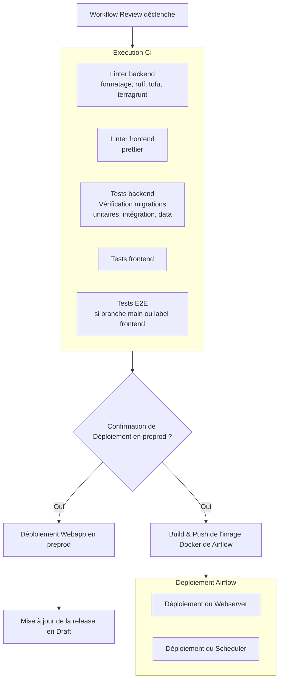
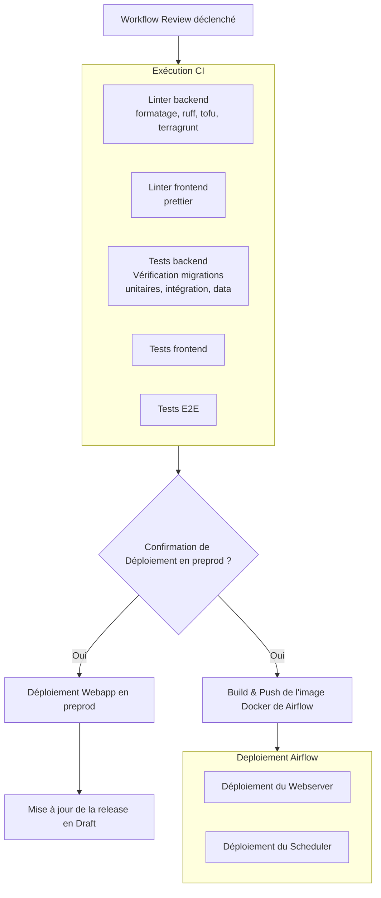
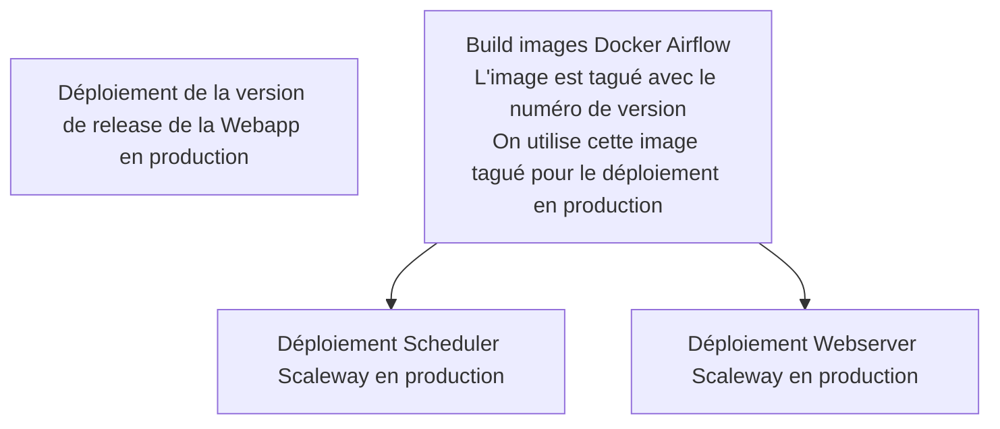

# Documentation CI/CD

Cette documentation décrit les différents workflows de CI/CD du projet et ce qui se passe dans chaque cas d'usage.

## Création ou mise à jour d'une Pull Request

Lorsqu'une Pull Request est créée ou mise à jour (événements `opened` ou `synchronize`), le workflow **Review** ([review.yml](https://github.com/incubateur-ademe/quefairedemesobjets/blob/main/.github/workflows/review.yml)) est déclenché.

Les tests et les linters sont exécutés et il est possible de déployer la branche de la PR en environnement de `preprod`.

### Flux du workflow Review

## Merge d'une PR sur main

Lorsqu'une Pull Request est mergée sur la branche `main`, le workflow **CD** ([cd.yml](https://github.com/incubateur-ademe/quefairedemesobjets/blob/main/.github/workflows/cd.yml)) est déclenché.

le Workkflow est très semblable au workflow de review : Les tests et les linters sont exécutés et il est possible de déployer la branche `main` en environnement de `preprod`.

### Flux du workflow CD

## Publication d'une release

Lorsqu'une release est publiée sur GitHub (événement `published`), le workflow **Deploy** ([deploy.yml](https://github.com/incubateur-ademe/quefairedemesobjets/blob/main/.github/workflows/deploy.yml)) est déclenché pour déployer en production.

La version de code tag est déployé en environnement de `prod`

### Flux du workflow Deploy

## Workflows planifiés

### Synchronisation des bases de données

Le workflow `sync_databases.yml` synchronise les données de production vers la préproduction.

**Planification** : Tous les dimanches à minuit (cron: `0 0 * * SUN`)

**Actions effectuées** :

- Restauration de la base de données de production vers la préproduction
- Exécution des migrations dans un conteneur one-off
- Réinitialisation de la table des suggestions
- Création du serveur de base de données distant entre webapp et warehouse
- Synchronisation des buckets S3 (copie de prod vers preprod)

### Dependabot

Le fichier `dependabot.yml` configure les mises à jour automatiques des dépendances.

**Planification** : Tous les mardis à 06:00 UTC

**Ecosystèmes surveillés** :

- **uv** : Dépendances Python (hebdomadaire)
- **npm** : Dépendances JavaScript (hebdomadaire, avec groupement par catégories : parcel, jest, eslint)
- **GitHub Actions** : Actions utilisées dans les workflows (hebdomadaire)
- **Terraform** : Modules Terraform dans `/infrastructure` (hebdomadaire)

### Publication de la documentation

Le workflow `publish-docs.yml` publie automatiquement la documentation sur GitHub Pages.

**Déclenchement** : À chaque push sur la branche `main`

la documentation est disponible ici : https://incubateur-ademe.github.io/quefairedemesobjets/README.html

## Environnements

Le projet utilise plusieurs environnements github pour stocker les variables d'environnement spécifiques à chacun : **preprod** et **prod**

## Notifications

Les déploiements en production déclenchent des notifications Mattermost dans le canal `lvao-tour-de-controle` :

- Notification de début de déploiement
- Notification de succès avec URL
- Notification d'échec avec lien vers les logs
- Notification si le site est down après déploiement
