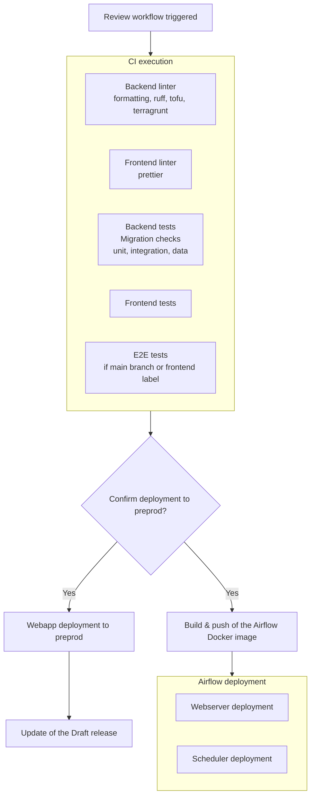
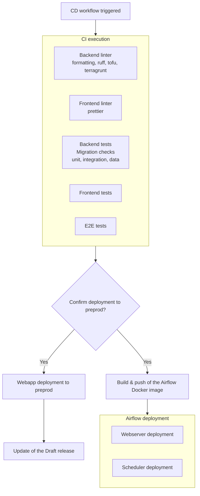
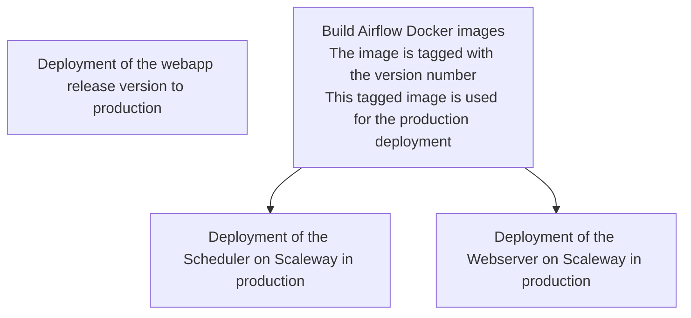

# CI/CD Documentation

This documentation describes the different CI/CD workflows of the project and what happens in each use case.

## Creating or updating a Pull Request

When a Pull Request is created or updated (events `opened` or `synchronize`), the **Review** workflow ([review.yml](https://github.com/incubateur-ademe/quefairedemesobjets/blob/main/.github/workflows/review.yml)) is triggered.

Tests and linters are run and it is possible to deploy the PR branch to the `preprod` environment.

### Review workflow flow

## Merging a PR into main

When a Pull Request is merged into the `main` branch, the **CD** workflow ([cd.yml](https://github.com/incubateur-ademe/quefairedemesobjets/blob/main/.github/workflows/cd.yml)) is triggered.

The workflow is very similar to the review workflow: tests and linters are run and it is possible to deploy the `main` branch to the `preprod` environment.

### CD workflow flow

## Publishing a release

When a release is published on GitHub (event `published`), the **Deploy** workflow ([deploy.yml](https://github.com/incubateur-ademe/quefairedemesobjets/blob/main/.github/workflows/deploy.yml)) is triggered to deploy to production.

The tagged version of the code is deployed to the `prod` environment.

### Deploy workflow flow

## Scheduled workflows

### Database synchronization

The `sync_databases.yml` workflow synchronizes production data to preproduction.

**Schedule**: Every Sunday at midnight (cron: `0 0 * * SUN`)

**Actions performed**:

- Restore the production database to preproduction
- Run migrations in a one-off container
- Reset the suggestions table
- Create the remote database server between webapp and warehouse
- Synchronize S3 buckets (copy from prod to preprod)

### Dependabot

The `dependabot.yml` file configures automatic dependency updates.

**Schedule**: Every Tuesday at 06:00 UTC

**Ecosystems monitored**:

- **uv**: Python dependencies (weekly)
- **npm**: JavaScript dependencies (weekly, grouped by categories: parcel, jest, eslint)
- **GitHub Actions**: Actions used in the workflows (weekly)
- **Terraform**: Terraform modules in `/infrastructure` (weekly)

### Documentation publication

The `publish-docs.yml` workflow automatically publishes the documentation to GitHub Pages.

**Trigger**: On every push to the `main` branch

The documentation is available here: https://incubateur-ademe.github.io/quefairedemesobjets/README.html

## Environments

The project uses several GitHub environments to store environment variables specific to each of them: **preprod** and **prod**.

## Notifications

Production deployments trigger Mattermost notifications in the `lvao-tour-de-controle` channel:

- Deployment start notification
- Success notification with URL
- Failure notification with a link to the logs
- Notification if the site is down after deployment
