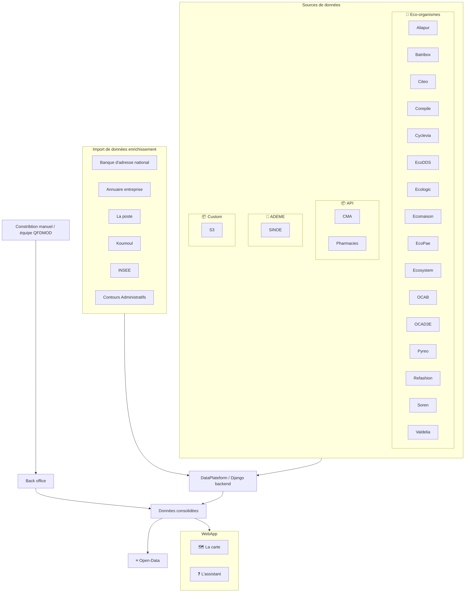
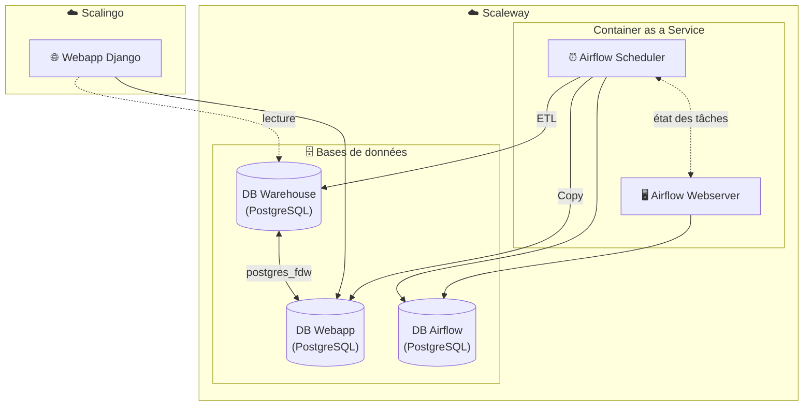

# Doc archi

## flux de consolidation de données

## Architecture de l'application

## Description des composants

### Scalingo

- **Webapp Django** : Application web principale exposée aux utilisateurs

### Scaleway

#### Container as a Service (CaaS)

- **Airflow Webserver** : Interface web pour monitorer et gérer les DAGs
- **Airflow Scheduler** : Orchestrateur qui planifie et exécute les tâches ETL

#### Bases de données

| Base de données | Usage                                                 |
| --------------- | ----------------------------------------------------- |
| DB Webapp       | Données applicatives (utilisateurs, acteurs, etc.)    |
| DB Warehouse    | Données transformées pour l'analyse et l'alimentation |
| DB Airflow      | Métadonnées Airflow (état des DAGs, logs, etc.)       |

## Activités du service QFDMOD

Via l'orchestrateur Airflow

- Ingestion des données des sources avec Airflow, tag : source
- Clone de tables d'enrichissement de données
- Enrichissement de données
- Calcul des statistuques
- Maintenance - Nettoyage logs / xcoms

Via la CI/CD (github)

- Tests automatiques
- Nettoyage des backups de DB
- Copies de la base de données WebApp de prod vers la preprod
- Création d'un echantillonage de la base de données pour créer des données de test
- Gestion des releases
-

Via le fournisseur de Cloud

- Backup des bases de données (tous les jours)

Via le backoffice

-
