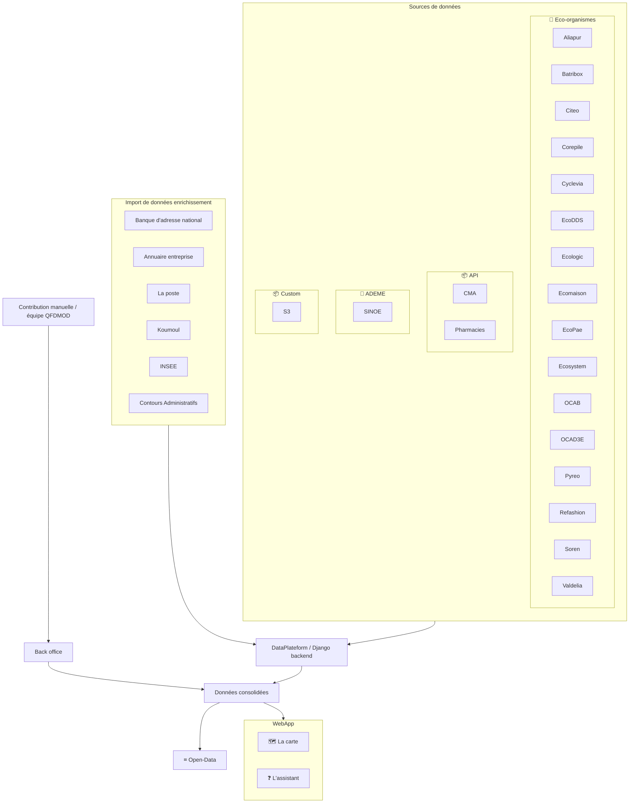
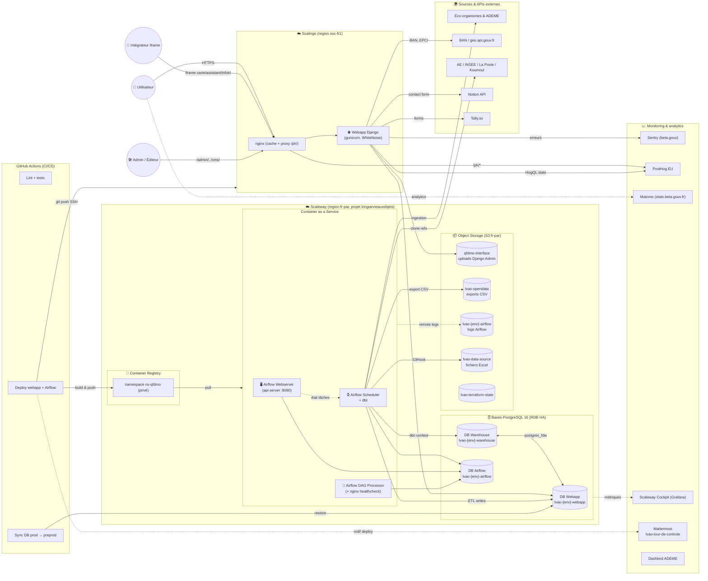

# Architecture applicative

Ce document décrit l'architecture globale de la plateforme « Que Faire De Mes Objets et Déchets » (QFDMOD), les composants en présence, leurs interactions, ainsi que les briques de sécurité associées (authentification, gestion des secrets, flux réseau, sauvegardes).

> **Voir aussi** : [Provisioning de l'infrastructure](../infrastructure/provisioning.md), [CI/CD](../infrastructure/ci-cd.md), [Monitoring](../infrastructure/monitoring.md), [Sécurité — vue d'ensemble](README.md).

## Flux de consolidation de données

```mermaid
flowchart
    direction RL
    subgraph source["Sources de données"]
        direction TB
        subgraph eco-organisme["🌱 Eco-organismes"]
            direction LR
            aliapur["Aliapur"]
            batribox["Batribox"]
            citeo["Citeo"]
            corepile["Corepile"]
            cyclevia["Cyclevia"]
            ecodds["EcoDDS"]
            ecologic["Ecologic"]
            ecomaison["Ecomaison"]
            ecopae["EcoPae"]
            ecosystem["Ecosystem"]
            ocab["OCAB"]
            ocad3e["OCAD3E"]
            pyreo["Pyreo"]
            refashion["Refashion"]
            soren["Soren"]
            valdelia["Valdelia"]
        end
        subgraph api["📦 API"]
            direction RL
            cma["CMA"]
            pharmacies["Pharmacies"]
        end
        subgraph ademe["💚 ADEME"]
            direction LR
            sinoe["SINOE"]
        end
        subgraph autre["📦 Custom"]
            direction LR
            s3["S3"]
        end
    end
    subgraph webapp["WebApp"]
        direction LR
        lacarte["🗺️ La carte"]
        assistant["❓ L'assistant"]
    end
    subgraph externe["Import de données enrichissement"]
        direction LR
        ban["Banque d'adresse national"]
        ae["Annuaire entreprise"]
        laposte["La poste"]
        koumoul["Koumoul"]
        insee["INSEE"]
        contours["Contours Administratifs"]
    end
    dataplateform["DataPlateform / Django backend"]
    contrib["Contribution manuelle / équipe QFDMOD"]
    backoffice["Back office"]
    data["Données consolidées"]
    opendata["⌗ Open-Data"]
    externe --> dataplateform
    contrib --> backoffice
    backoffice --> data
    dataplateform --> data
    source --> dataplateform
    data --> webapp
    data --> opendata
```

### Détail des sources ingérées

Toutes les sources ci-dessous sont exposées comme des DAGs Airflow individuels (déclenchement manuel, schedule `None`) sous `data-platform/dags/sources/dags/`.

| Catégorie     | DAG Airflow    | Source / endpoint                                         | Filière                                            |
| ------------- | -------------- | --------------------------------------------------------- | -------------------------------------------------- |
| Eco-organisme | `eo-aliapur`   | ALIAPUR (`data.pointsapport.ademe.fr`)                    | PNEU                                               |
| Eco-organisme | `eo-batribox`  | BATRIBOX (`data.ademe.fr`)                                | Piles & accus                                      |
| Eco-organisme | `eo-citeo`     | CITEO                                                     | Emballages & papiers                               |
| Eco-organisme | `eo-corepile`  | COREPILE                                                  | Piles & accus                                      |
| Eco-organisme | `eo-cyclevia`  | CYCLEVIA                                                  | Lubrifiants                                        |
| Eco-organisme | `eo-ecodds`    | ECODDS                                                    | Articles de bricolage & jardin, Produits chimiques |
| Eco-organisme | `eo-ecologic`  | ECOLOGIC                                                  | ABJ, ASL, EEE                                      |
| Eco-organisme | `eo-ecomaison` | ECOMAISON                                                 | ABJ, Éléments d'ameublement, Jouets, PMCB          |
| Eco-organisme | `eo-ecopae`    | ECOPAE                                                    | Produits chimiques                                 |
| Eco-organisme | `eo-ecosystem` | ECOSYSTEM                                                 | EEE                                                |
| Eco-organisme | `eo-pyreo`     | PYREO                                                     | Produits chimiques                                 |
| Eco-organisme | `eo-refashion` | REFASHION                                                 | Textiles, linges, chaussures                       |
| Eco-organisme | `eo-soren`     | SOREN                                                     | EEE                                                |
| Eco-organisme | `eo-valdelia`  | VALDELIA                                                  | PMCB                                               |
| Eco-organisme | `eo-ocab`      | OCAB                                                      | OCA / PMCB                                         |
| Eco-organisme | `eo-ocad3e`    | OCAD3E (label QualiRépar)                                 | EEE                                                |
| API           | `cma`          | CMA Réparacteurs (`apiopendata.artisanat.fr/reparacteur`) | Label `reparacteur`                                |
| API           | `pharmacies`   | Ordre National des Pharmaciens (`ordre.pharmacien.fr`)    | Médicaments                                        |
| ADEME         | `source_sinoe` | ADEME SINOE (`data.ademe.fr`)                             | Déchèteries                                        |
| Custom        | `source-s3`    | Bucket S3 `lvao-data-source`                              | Fichiers Excel ad-hoc                              |

### Référentiels d'enrichissement clonés

Données externes clonées en base via les DAGs `clone_*` puis exploitées en croisement par dbt.

| Référentiel               | Source                                          | Usage                                                                          |
| ------------------------- | ----------------------------------------------- | ------------------------------------------------------------------------------ |
| BAN                       | `adresse.data.gouv.fr`                          | Géocodage acteurs (`adresses-france.csv.gz`, `lieux-dits-beta-france.csv.gz`)  |
| Annuaire Entreprises (AE) | `object.files.data.gouv.fr`, `www.data.gouv.fr` | Validation SIREN/SIRET, détection établissements fermés                        |
| La Poste                  | `datanova.laposte.fr`                           | Codes postaux (`laposte-hexasmal`)                                             |
| Koumoul                   | `opendata.koumoul.com`                          | EPCI                                                                           |
| INSEE                     | `www.insee.fr`                                  | Communes (`v_commune_2025.csv`)                                                |
| Contours administratifs   | `etalab-datasets.geo.data.gouv.fr`              | GeoJSON commune / département / région / EPCI / communes associées & déléguées |

## Architecture de l'application

```mermaid
flowchart LR
    user(("👤 Utilisateur"))
    integrateur(("🧩 Intégrateur iframe"))
    admin(("🛠️ Admin / Éditeur"))

    subgraph github["GitHub Actions (CI/CD)"]
        direction TB
        ci["Lint + tests"]
        cd["Deploy webapp + Airflow"]
        sync["Sync DB prod → preprod"]
    end

    subgraph Scalingo["☁️ Scalingo (region osc-fr1)"]
        nginx_scalingo["nginx (cache + proxy /ph/)"]
        webapp["🌐 Webapp Django\n(gunicorn, WhiteNoise)"]
    end

    subgraph Scaleway["☁️ Scaleway (region fr-par, projet longuevieauxobjets)"]
        direction TB
        subgraph CaaS["Container as a Service"]
            airflow_webserver["🖥️ Airflow Webserver\n(api-server :8080)"]
            airflow_scheduler["⏰ Airflow Scheduler\n+ dbt"]
            airflow_dag_processor["📁 Airflow DAG Processor\n(+ nginx healthcheck)"]
        end

        subgraph Registry["🐳 Container Registry"]
            ns_qfdmo["namespace ns-qfdmo (privé)"]
        end

        subgraph Databases["🗄️ Bases PostgreSQL 16 (RDB HA)"]
            db_webapp[("DB Webapp\nlvao-{env}-webapp")]
            db_warehouse[("DB Warehouse\nlvao-{env}-warehouse")]
            db_airflow[("DB Airflow\nlvao-{env}-airflow")]
            db_warehouse <-->|"postgres_fdw"| db_webapp
        end

        subgraph S3["📦 Object Storage (S3 fr-par)"]
            s3_medias[("qfdmo-interface\nuploads Django Admin")]
            s3_opendata[("lvao-opendata\nexports CSV")]
            s3_logs[("lvao-{env}-airflow\nlogs Airflow")]
            s3_source[("lvao-data-source\nfichiers Excel")]
            s3_tfstate[("lvao-terraform-state")]
        end
    end

    subgraph monitoring["📈 Monitoring & analytics"]
        sentry["Sentry (beta.gouv)"]
        posthog["PostHog EU"]
        matomo["Matomo (stats.beta.gouv.fr)"]
        cockpit["Scaleway Cockpit (Grafana)"]
        mattermost["Mattermost\nlvao-tour-de-controle"]
        dashlord["Dashlord ADEME"]
    end

    subgraph sources_ext["🌍 Sources & APIs externes"]
        eco_organismes["Éco-organismes & ADEME"]
        ban_geo["BAN / geo.api.gouv.fr"]
        ae_insee["AE / INSEE / La Poste / Koumoul"]
        notion["Notion API"]
        tally["Tally.so"]
    end

    user -->|"HTTPS"| nginx_scalingo
    integrateur -->|"iframe carte/assistant/infotri"| nginx_scalingo
    admin -->|"/admin/, /cms/"| nginx_scalingo
    nginx_scalingo --> webapp
    nginx_scalingo -->|"/ph/*"| posthog

    webapp --> db_webapp
    webapp --> s3_medias
    webapp -->|"erreurs"| sentry
    webapp -->|"HogQL stats"| posthog
    webapp -->|"BAN, EPCI"| ban_geo
    webapp -->|"contact form"| notion
    webapp -->|"forms"| tally

    airflow_scheduler --> db_airflow
    airflow_scheduler -->|"ETL writes"| db_webapp
    airflow_scheduler -->|"dbt run/test"| db_warehouse
    airflow_scheduler -->|"export CSV"| s3_opendata
    airflow_scheduler -->|"S3Hook"| s3_source
    airflow_scheduler -->|"ingestion"| eco_organismes
    airflow_scheduler -->|"clone refs"| ae_insee
    airflow_webserver --> db_airflow
    airflow_dag_processor --> db_airflow
    airflow_webserver -.->|"état tâches"| airflow_scheduler
    CaaS -.->|"remote logs"| s3_logs

    cd -->|"git push SSH"| Scalingo
    cd -->|"build & push"| ns_qfdmo
    ns_qfdmo -->|"pull"| CaaS
    sync -->|"restore"| db_webapp

    user -.->|"analytics"| matomo
    Databases -.->|"métriques"| cockpit
    cd -.->|"notif deploy"| mattermost
```

## Description des composants

### Frontaux et hébergement applicatif

#### Scalingo (région `osc-fr1`)

| Composant            | Détail                                                                                                                                                                                                                                                    |
| -------------------- | --------------------------------------------------------------------------------------------------------------------------------------------------------------------------------------------------------------------------------------------------------- |
| **Webapp Django**    | Application web principale exposée aux utilisateurs (front public, back-office Django Admin, CMS Wagtail). Servie par **Gunicorn** sur socket Unix, fichiers statiques via **WhiteNoise** (`CompressedManifestStaticFilesStorage`).                       |
| **Buildpacks**       | `apt`, `node`, `python`, `nginx` (ordre défini dans `webapp/.buildpacks`).                                                                                                                                                                                |
| **Procfile**         | `web: bash bin/start` — lance Gunicorn + nginx local.                                                                                                                                                                                                     |
| **nginx Scalingo**   | Couche de cache devant Gunicorn (`servers.conf.erb`), proxy `/ph/*` vers PostHog (analytics first-party), bypass cache via cookie `logged_in` (posé par `RequestEnhancementMiddleware`), `Vary: Sec-Fetch-Dest` (distingue iframe vs navigation directe). |
| **Base de données**  | La webapp cible la DB Scaleway `lvao-{env}-webapp` via `DATABASE_URL` (pas d'add-on PostgreSQL Scalingo).                                                                                                                                                 |
| **Cache applicatif** | `django.core.cache.backends.db.DatabaseCache` (table `qf_django_cache`). **Pas de Redis** : tous les caches sont stockés en base.                                                                                                                         |
| **Médias**           | Délégués à Scaleway Object Storage (`django-storages` + `boto3`).                                                                                                                                                                                         |

#### Scaleway (région `fr-par`, projet `longuevieauxobjets`)

Toutes les ressources suivent la nomenclature `lvao-{env}-{nom}` où `env ∈ {prod, preprod, preview}`.

##### Container as a Service (CaaS)

Trois Serverless Containers distincts pour Airflow 3 (`apache/airflow:slim-3.1.7-python3.12`), construits via Dockerfiles dédiés :

| Container                    | Image                              | Rôle                                                                                                                                          |
| ---------------------------- | ---------------------------------- | --------------------------------------------------------------------------------------------------------------------------------------------- |
| `lvao-airflow-webserver`     | `airflow-webserver.Dockerfile`     | Interface UI/API Airflow (`airflow api-server`, port 8080). Création du compte admin au premier démarrage via `_AIRFLOW_WWW_USER_*`.          |
| `lvao-airflow-scheduler`     | `airflow-scheduler.Dockerfile`     | Orchestrateur (`LocalExecutor`). Embarque le runtime **dbt** (`dbt deps`), `gdal-bin`, le CLI Scaleway, `jq`, `unzip` pour les pipelines ETL. |
| `lvao-airflow-dag-processor` | `airflow-dag-processor.Dockerfile` | Parsing isolé des DAGs avec nginx en façade pour le healthcheck.                                                                              |

Auth manager Airflow : **FAB** (`FabAuthManager`). Backends API : `basic_auth` + `session`. JWT pour les échanges internes (`AIRFLOW__API_AUTH__JWT_SECRET`).

##### Container Registry

Namespace privé `ns-qfdmo` — héberge les images Docker des 3 containers Airflow (push par la CI, pull par les Serverless Containers).

##### Bases de données (RDB PostgreSQL 16 HA)

| Base de données | Nom Scaleway           | Usage                                                                                                                                                                                                                                               |
| --------------- | ---------------------- | --------------------------------------------------------------------------------------------------------------------------------------------------------------------------------------------------------------------------------------------------- |
| DB Webapp       | `lvao-{env}-webapp`    | Données applicatives : acteurs (`qfdmo_acteur`, `qfdmo_displayedacteur`, `qfdmo_revisionacteur`), propositions de service, configurations carte, utilisateurs Wagtail/Django, cache (`qf_django_cache`), médias Wagtail. Extension PostGIS activée. |
| DB Warehouse    | `lvao-{env}-warehouse` | Tables analytiques produites par **dbt** (`base/`, `intermediate/`, `marts/`, `exposure/`). Schéma `webapp_public` consommé en source via `postgres_fdw`.                                                                                           |
| DB Airflow      | `lvao-{env}-airflow`   | Métadonnées Airflow (état des DAGs, XComs, logs courts). Nettoyée quotidiennement par le DAG `airflow_cleanup_db`.                                                                                                                                  |

**Backups natifs Scaleway** : rétention 24 h + dump quotidien conservé 7 jours, copie cross-region. Connexions clientes en `sslmode=require`.

##### Object Storage (S3 `fr-par`)

| Bucket                 | Connexion Airflow | Usage                                                                                                                                                            |
| ---------------------- | ----------------- | ---------------------------------------------------------------------------------------------------------------------------------------------------------------- |
| `qfdmo-interface`      | —                 | Fichiers (images) uploadés depuis l'interface **Django Admin** de la webapp : `logos/`, `labels/`, `pictos/`, `config/groupeaction/icones/`, images Wagtail.     |
| `lvao-opendata`        | `s3data`          | Export CSV opendata des acteurs (`acteurs.csv` permanent + snapshot horodaté `YYYYMMDDHHMMSS.csv`, ACL `public-read`). Produit par le DAG `export_opendata_dag`. |
| `lvao-data-source`     | `s3data`          | Fichiers Excel ad-hoc consommés par le DAG `source-s3`.                                                                                                          |
| `lvao-{env}-airflow`   | `scalewaylogs`    | Remote logs Airflow (`AIRFLOW__LOGGING__REMOTE_LOGGING=true`).                                                                                                   |
| `lvao-terraform-state` | —                 | Backend OpenTofu/Terragrunt (versionné, chiffré).                                                                                                                |

##### Liaison `postgres_fdw`

`postgres_fdw` est utilisé dans les deux sens pour permettre aux pipelines dbt de lire les données métier et à la webapp de récupérer les tables d'acteurs calculées.

| Direction          | Schéma virtuel                   | Mise en place                                       |
| ------------------ | -------------------------------- | --------------------------------------------------- |
| Webapp → Warehouse | `webapp.public.warehouse_public` | `scripts/sql/create_remote_warehouse_in_webapp.sql` |
| Warehouse → Webapp | `warehouse.public.webapp_public` | `scripts/sql/create_remote_webapp_in_warehouse.sql` |

Le DAG `compute_acteurs` matérialise les tables d'acteurs via `IMPORT FOREIGN SCHEMA … LIMIT TO (…)` puis `INSERT INTO … SELECT` puis renommage atomique (swap `*_to_remove` → `DROP CASCADE`) pour minimiser le downtime.

### Stack technique

#### Webapp Django (`webapp/`)

| Couche          | Technologies                                                                                                                                                                                                                       |
| --------------- | ---------------------------------------------------------------------------------------------------------------------------------------------------------------------------------------------------------------------------------- |
| Framework       | **Django ≥ 6.0** (Python 3.12), `django.contrib.gis` (PostGIS), `django-extensions`, `django-cors-headers`.                                                                                                                        |
| API             | **Django-Ninja** (single `NinjaAPI` dans `core/api.py`, OpenAPI auto-généré). Pas de DRF, pas de GraphQL.                                                                                                                          |
| CMS             | **Wagtail 7.4.1** (app `qfdmd`), surcouche **`sites-conformes`** (« Sites Faciles » beta.gouv : `content_manager`, `menus`, `blog`, `events`, `forms`), `wagtail_localize`, `wagtailmenus`, `wagtailmarkdown`, `wagtail_honeypot`. |
| Apps métier     | `qfdmo` (acteurs, carte, formulaire), `qfdmd` (CMS), `search`, `data` (back-office suggestions), `infotri`, `stats`, `dsfr_hacks`.                                                                                                 |
| Admin           | **Django Admin** (`/admin/`, `djangoql` + `django-import-export`) et **Wagtail Admin** (`/cms/`).                                                                                                                                  |
| Front           | **Stimulus** + **Turbo** (Hotwired), build **Parcel** (`static/to_compile/` → `static/compiled/`), TypeScript, PostCSS.                                                                                                            |
| Design system   | **DSFR** (`@gouvfr/dsfr` + `django-dsfr`) + **Tailwind CSS 3** (prefix `qf-`). `DSFR_MARK_OPTIONAL_FIELDS = True` (RGAA 11.10).                                                                                                    |
| Cartographie    | **MapLibre GL** + fonds vectoriels **Carte Facile** (front utilisateur). OpenStreetMap dans le back-office.                                                                                                                        |
| Embeds          | `@iframe-resizer/{parent,child}` pour redimensionner les iframes carte / assistant / formulaire / infotri.                                                                                                                         |
| Stockage médias | **Scaleway S3** via `django-storages` (bucket `qfdmo-interface`) pour les fichiers uploadés depuis le Django Admin. Fallback `FileSystemStorage` en local.                                                                         |
| Statiques       | **WhiteNoise** (`CompressedManifestStaticFilesStorage`).                                                                                                                                                                           |
| Monitoring      | **Sentry** (`sentry-sdk`, `DjangoIntegration` + `LoggingIntegration`, `traces_sample_rate=0.01`), **PostHog** (analytics + feature flags), **Matomo**.                                                                             |
| Tests           | `pytest` + `pytest-django`, `factory-boy`, `wagtail-factories`, **Playwright** (e2e + `@axe-core/playwright`), **Jest** + Testing Library côté JS.                                                                                 |

#### Data-platform (`data-platform/`)

| Couche             | Technologies                                                                                                                                                                                  |
| ------------------ | --------------------------------------------------------------------------------------------------------------------------------------------------------------------------------------------- |
| Orchestration      | **Apache Airflow 3.1.7** (`LocalExecutor`, FAB auth, JWT inter-composants).                                                                                                                   |
| Providers          | `apache-airflow-providers-{amazon, fab, postgres, standard}`.                                                                                                                                 |
| Transformation     | **dbt-core** + **dbt-postgres** (`dbt-utils 1.3.0`, `dbt_expectations 0.10.4`). Couches `base/` → `intermediate/` → `marts/` → `exposure/`. 7 UDFs Postgres custom créées par `on-run-start`. |
| Data ops           | `pandas`, `pyarrow`, `shapely`, `scikit-learn`, `fuzzywuzzy`, `python-levenshtein`, `dedupe` (déduplication / clustering d'acteurs).                                                          |
| Intégration Django | Les DAGs importent les modèles Django (package éditable `webapp-quefairedemesobjetsetdechets`) via `utils.django.django_setup_full()` (settings `core.airflow_settings`).                     |
| Tests              | `pytest` (`make dags-test`), tests E2E avec Airflow + SQLite in-memory.                                                                                                                       |

## Services externes consommés par la webapp

| Service                   | Variables d'environnement                                                                                     | Usage                                                                                                                                               |
| ------------------------- | ------------------------------------------------------------------------------------------------------------- | --------------------------------------------------------------------------------------------------------------------------------------------------- |
| **Sentry** (beta.gouv)    | `SENTRY_DSN`                                                                                                  | Monitoring d'erreurs back + front.                                                                                                                  |
| **PostHog EU**            | `ASSISTANT_POSTHOG_KEY`, `POSTHOG_BASE_URL`, `POSTHOG_STATS_PROJECT_ID`, `POSTHOG_PERSONAL_API_KEY`           | Analytics, A/B testing (feature flag `produit-carte-default-view-mobile`), HogQL pour l'API `/api/stats`. Proxifié via nginx `/ph/*` (first-party). |
| **Matomo**                | `ASSISTANT_MATOMO_ID`, `LVAO_MATOMO_ID`                                                                       | Statistiques d'audience (`stats.beta.gouv.fr`).                                                                                                     |
| **BAN** (`data.geopf.fr`) | —                                                                                                             | Autocomplete adresses + reverse-geocode (proxy server-side, cache HTTP 1 h).                                                                        |
| **geo.api.gouv.fr**       | —                                                                                                             | EPCI codes & contours (cache 30 j / 1 an).                                                                                                          |
| **Notion API**            | `NOTION_TOKEN`, `NOTION_CONTACT_FORM_DATABASE_ID`                                                             | Réception du formulaire de contact (signal `post_save` sur `FormSubmission`).                                                                       |
| **Tally.so**              | `FEEDBACK_FORM`, `ADDRESS_SUGGESTION_FORM`, `UPDATE_SUGGESTION_FORM`, `CONTACT_FORM`, `ASSISTANT_SURVEY_FORM` | Formulaires hébergés (redirections).                                                                                                                |
| **Google Search Console** | —                                                                                                             | Vérification de propriété via fichier statique `google9dfbbc61adbe3888.html`.                                                                       |
| **Google Maps**           | —                                                                                                             | Liens « Itinéraire » construits côté serveur.                                                                                                       |
| **Scaleway S3**           | `AWS_ACCESS_KEY_ID`, `AWS_S3_ENDPOINT_URL`, `AWS_S3_REGION_NAME`, `AWS_STORAGE_BUCKET_NAME`                   | Stockage des fichiers uploadés depuis le Django Admin (bucket `qfdmo-interface`).                                                                   |
| **Cloudflare CDN**        | —                                                                                                             | Sert `iframeResizer.contentWindow.js` aux pages intégratrices.                                                                                      |

## Authentification & autorisations

| Surface                            | Mécanisme                      | Détail                                                                                                                                                      |
| ---------------------------------- | ------------------------------ | ----------------------------------------------------------------------------------------------------------------------------------------------------------- |
| **Site public**                    | Aucune                         | Accès anonyme à la carte, à l'assistant et à l'API REST `/api/`.                                                                                            |
| **API REST Django-Ninja**          | Aucune                         | Endpoints publics en lecture (`/api/qfdmo/*`, `/api/stats`).                                                                                                |
| **Django Admin** (`/admin/`)       | `django.contrib.auth` standard | `LOGIN_URL = "admin:login"`. Helper `core.utils.has_explicit_perm` pour bypasser le « superadmin a toutes les perms ». Pas d'OAuth / SSO / ProConnect.      |
| **Wagtail Admin** (`/cms/`)        | `django.contrib.auth`          | Permission custom `wagtailadmin.can_see_beta_search` créée par `qfdmd/management/commands/create_assistant_permissions.py`, contrôlée par `BetaMiddleware`. |
| **Back-office données** (`/data/`) | `LoginRequiredMixin`           | Workflow de validation des suggestions, vues Turbo-Stream.                                                                                                  |
| **Airflow** (`/`)                  | FAB (basic auth + session)     | Admin créé au bootstrap (`_AIRFLOW_WWW_USER_USERNAME/_PASSWORD/_EMAIL`, rôle `Admin`). JWT pour la communication inter-composants.                          |
| **Scaleway**                       | CLI + IAM                      | Provisioning OpenTofu/Terragrunt. Administration via le projet `longuevieauxobjets`.                                                                        |
| **Scalingo**                       | Clé SSH + token                | Déploiement via l'action GitHub `kolok/deploy-to-scalingo`.                                                                                                 |

## Activités du service QFDMOD

### Via l'orchestrateur Airflow

| Activité                                                     | DAG(s)                                                                                                                | Schedule                         |
| ------------------------------------------------------------ | --------------------------------------------------------------------------------------------------------------------- | -------------------------------- |
| Ingestion des données des sources                            | `eo-*`, `cma`, `pharmacies`, `source_sinoe`, `source-s3`                                                              | Manuel (`None`) — tag : `source` |
| Clonage de référentiels d'enrichissement                     | `clone_ban_*`, `clone_ae_*`, `clone_laposte_codes_postaux`, `clone_koumoul_epci`, `clone_insee_commune`, `clone_ca_*` | Hebdo dimanche 00:00–02:00       |
| Enrichissement des acteurs                                   | `enrich_acteurs_*` (RGPD, fermés, villes, code postal)                                                                | Manuel                           |
| Crawl & validation des URLs                                  | `crawl_urls_suggestions`                                                                                              | Manuel                           |
| Clustering / déduplication                                   | `cluster_acteur_suggestions`                                                                                          | Manuel                           |
| Application des suggestions validées                         | `apply_suggestions`, `apply_suggestions_groupe`                                                                       | Toutes les 5 min                 |
| Calcul des tables d'acteurs affichés + import dans la webapp | `compute_acteurs` (dbt + FDW)                                                                                         | Quotidien `0 0 * * *`            |
| Refresh des modèles dbt d'enrichissement                     | `enrich_dbt_models_refresh`                                                                                           | Quotidien `0 0 * * *`            |
| Calcul des statistiques                                      | `compute_stats` (`dbt run/test tag:stats`)                                                                            | Hebdo lundi 02:00                |
| Export opendata                                              | `export_opendata_dag` → S3 `lvao-opendata`                                                                            | Hebdo lundi 01:00                |
| Maintenance — purge metadata Airflow                         | `airflow_cleanup_db` (`airflow db clean --skip-archive`, rétention 7 j)                                               | Quotidien `0 0 * * *`            |
| Maintenance — purge logs DB Scaleway                         | `purge_log_db` (`scw rdb log purge`)                                                                                  | Toutes les heures à xx:03        |

### Via la CI/CD (GitHub Actions)

| Workflow                                                                                      | Déclencheur                           | Action                                                                                                               |
| --------------------------------------------------------------------------------------------- | ------------------------------------- | -------------------------------------------------------------------------------------------------------------------- |
| `ci.yml`, `review.yml`                                                                        | PR `opened`/`synchronize`             | Linters (ruff, black, prettier, tofu, terragrunt), tests unitaires & intégration, déploiement optionnel sur preprod. |
| `e2e.yml`                                                                                     | PR / main                             | Tests Playwright 4 shards + régression visuelle + a11y (`@axe-core/playwright`).                                     |
| `cd.yml`                                                                                      | Merge sur `main`                      | Tests complets + déploiement preprod (webapp + 3 containers Airflow).                                                |
| `deploy.yml`                                                                                  | Release GitHub publiée                | Déploiement en prod (webapp Scalingo + push + redéploiement Airflow tagué).                                          |
| `_deploy-webapp.yml`                                                                          | Réutilisable                          | Déploiement Scalingo via `kolok/deploy-to-scalingo`.                                                                 |
| `_deploy-airflow.yml`, `_airflow-build-and-push-docker.yml`, `_scaleway-container-deploy.yml` | Réutilisables                         | Build & push des 3 images Airflow dans `ns-qfdmo`, déploiement des Serverless Containers.                            |
| `sync_databases.yml`                                                                          | Hebdo dimanche minuit (`0 0 * * SUN`) | Restore prod → preprod (DB + S3) + migrations + reset suggestions + recréation `postgres_fdw`.                       |
| `dependabot.yml`                                                                              | Hebdo mardi 06:00 UTC                 | MAJ deps uv / npm / GitHub Actions / Terraform.                                                                      |
| `publish-docs.yml`                                                                            | Push sur `main`                       | Build Sphinx → GitHub Pages.                                                                                         |
| Purge tags registry                                                                           | Hebdo                                 | Nettoyage des anciennes images dans `ns-qfdmo`.                                                                      |

Voir [CI/CD Documentation](../infrastructure/ci-cd.md) pour les diagrammes détaillés.

### Via le fournisseur de Cloud

- **Backups quotidiens** des 3 bases PostgreSQL Scaleway (rétention 24 h + 7 j, copie cross-region).
- **Snapshots manuels** via `scripts/infrastructure/backup-db.sh`.

### Via le back-office

| Surface                       | Action                                                                                                                                                                                            |
| ----------------------------- | ------------------------------------------------------------------------------------------------------------------------------------------------------------------------------------------------- |
| Django Admin (`/admin/`)      | Édition directe des acteurs, sources, types, services, labels qualité, configurations carte, EPCI, sous-catégories d'objets. Import/export Excel (`django-import-export`).                        |
| Wagtail Admin (`/cms/`)       | Édition des pages produits (`ProduitPage`), page d'accueil, blog, événements, formulaires, snippets legacy `Produit`/`Synonyme`/`Lien`, settings (`EmbedSettings`, `FormPageValidationSettings`). |
| Back-office `data` (`/data/`) | Validation / rejet des suggestions de modifications (`Suggestion`, `SuggestionCohorte`, `SuggestionGroupe`, `SuggestionUnitaire`, `SuggestionLog`) avec vues Turbo-Stream.                        |
| `/cms/recherche/`             | Curation des termes de recherche (`SearchTerm`, `SearchTag`) et synonymes.                                                                                                                        |

## Monitoring & observabilité

| Outil                                 | Périmètre                         | Détail                                                                                                                                                                                                                           |
| ------------------------------------- | --------------------------------- | -------------------------------------------------------------------------------------------------------------------------------------------------------------------------------------------------------------------------------- |
| **Sentry**                            | Erreurs back-end + front-end      | `sentry-sdk` (`DjangoIntegration`, `LoggingIntegration`, `traces_sample_rate=0.01`) + `@sentry/browser`. [Projet beta.gouv](https://sentry.incubateur.net/organizations/betagouv/projects/que-faire-de-mes-objets/?project=115). |
| **PostHog EU**                        | Analytics produit + feature flags | A/B testing (`produit-carte-default-view-mobile`), HogQL pour `/api/stats`. Proxy `/ph/*` côté nginx Scalingo (first-party).                                                                                                     |
| **Matomo**                            | Statistiques d'audience           | `stats.beta.gouv.fr` via template tag ``.                                                                                                                                                                            |
| **Scaleway Cockpit (Grafana)**        | Métriques infra                   | Dashboard RDB PostgreSQL ([lien](https://6bef58ea-39e7-4fa5-8a55-dc3999fc62df.dashboard.cockpit.fr-par.scw.cloud/d/scw-rdb-postgresql-overview/rdb-postgresql-overview)), métriques containers.                                  |
| **Mattermost**                        | Notifications                     | Canal `lvao-tour-de-controle` — début de déploiement, succès (avec URL), échec (avec lien logs), site down post-deploy.                                                                                                          |
| **Dashlord ADEME**                    | Sécurité applicative              | Surveillance globale des sites incubés ([dashlord.incubateur.ademe.fr](https://dashlord.incubateur.ademe.fr/)).                                                                                                                  |
| **Healthcheck post-deploy**           | Disponibilité                     | `HEALTHCHECK_URLS` vérifié après chaque déploiement webapp.                                                                                                                                                                      |
| **CodeQL / GitGuardian / Dependabot** | Sécurité du code                  | Voir [README sécurité](README.md).                                                                                                                                                                                               |

## Sécurité réseau

- **Aucun VPC** : les bases de données et containers Scaleway sont exposés publiquement, l'accès est restreint par `sslmode=require` et l'authentification credentials.
- **Registry privé** (`ns-qfdmo`) avec pull authentifié par les Serverless Containers.
- **CORS** géré par `django-cors-headers` côté webapp (origins configurés par environnement).
- **Embeds iframe** : détection par header `Sec-Fetch-Dest: iframe`, header `Vary: Sec-Fetch-Dest` pour différencier les caches. Backlinks contrôlés via `EmbedSettings` (Wagtail).
- **TLS** : terminé par Scalingo (Let's Encrypt) côté webapp, par Scaleway côté Airflow. En local, mkcert + nginx (`nginx-local-only/`).

## Gestion des secrets

| Couche                  | Stockage                                                                                  | Utilisation                                                                                                   |
| ----------------------- | ----------------------------------------------------------------------------------------- | ------------------------------------------------------------------------------------------------------------- |
| Webapp (Scalingo)       | Variables d'environnement Scalingo                                                        | `DATABASE_URL`, `SENTRY_DSN`, `AWS_*`, `NOTION_TOKEN`, clés PostHog, etc.                                     |
| Airflow (Scaleway)      | `secret_environment_variables` de `scaleway_container.airflow_*` (Terragrunt)             | DSN bases, `AIRFLOW__API_AUTH__JWT_SECRET`, identifiants S3, credentials webserver.                           |
| CI/CD                   | GitHub Environments `preprod` / `prod` (rule sur `main`)                                  | Tokens Scaleway / Scalingo / Mattermost / S3, IDs containers, `DJANGO_SCALINGO_APP_NAME`, `HEALTHCHECK_URLS`. |
| OpenTofu                | `infrastructure/environments/<env>/terraform.tfvars` (non versionnés, `sensitive = true`) | `db_password`, `project_id`, `organization_id`.                                                               |
| Détection en pré-commit | `detect-secrets`                                                                          | Empêche les commits accidentels de secrets.                                                                   |

## Sauvegardes & PRA

| Élément                                    | Stratégie                                                                                         |
| ------------------------------------------ | ------------------------------------------------------------------------------------------------- |
| DB Webapp / Warehouse / Airflow (Scaleway) | Backups natifs RDB — rétention point-in-time 24 h + dumps quotidiens 7 j, **copie cross-region**. |
| Bucket `qfdmo-interface`                   | Versioning S3 Scaleway.                                                                           |
| Bucket `lvao-opendata`                     | Snapshots horodatés compilés par le DAG `export_opendata_dag` en plus du `acteurs.csv` courant.   |
| État Terraform                             | Bucket `lvao-terraform-state` (versionné, chiffré).                                               |
| Sync prod → preprod                        | Hebdo dimanche minuit via `sync_databases.yml` (DB + S3).                                         |
| Backups manuels                            | `scripts/infrastructure/backup-db.sh`.                                                            |

## Environnement de développement local

`docker-compose.yml` expose deux profiles :

| Profile   | Services                                                                                                                                                       |
| --------- | -------------------------------------------------------------------------------------------------------------------------------------------------------------- |
| `lvao`    | `lvao-webapp-db` (PostGIS, port 6543), `lvao-warehouse-db` (8765), nginx local SSL (`nginx-local-only/` + mkcert, domaine `quefairedemesdechets.ademe.local`). |
| `airflow` | `airflow-db` (7654), `airflow-webserver` (8080), `airflow-scheduler` (12 G RAM), `airflow-dag-processor` (8082).                                               |

Webapp lancée localement via `make runserver` (`honcho`), tests par `make unit-test` / `make integration-test` / `make e2e-test`. Les DAGs sont testés depuis `data-platform/` via `make dags-test`. Pas de mailcatcher ni de Redis en local (cache DB).
