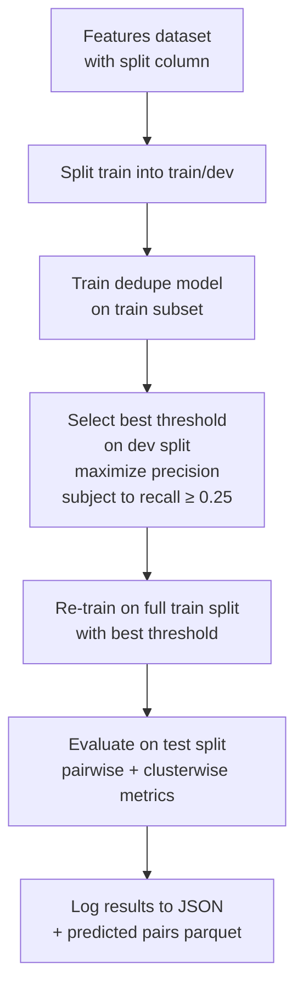
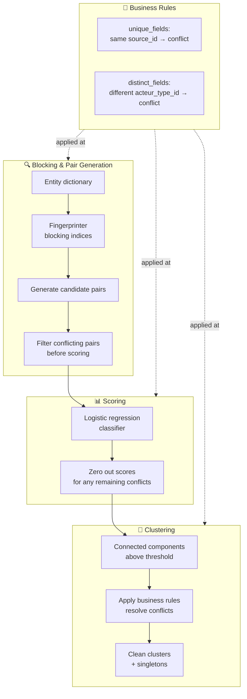

# ML Deduplication

Machine-learning based entity deduplication pipeline for actor records, built on top of the [`dedupe`](https://github.com/dedupeio/dedupe) library.

## Overview

This project provides a complete training and evaluation workflow to learn which pairs of entities (e.g., organizations / actors) refer to the same real-world object and cluster them accordingly. It follows an end-to-end pipeline:

- **Feature extraction** — build structured, comparable representations from raw records
- **Supervised learning** — train record linkage models on labeled match/distinct pairs
- **Hyperparameter tuning** — search over feature sets and model configurations with automatic threshold selection
- **Evaluation** — report both pair-wise (precision / recall / F1) and cluster-wise quality metrics against ground-truth clusters

```mermaid
flowchart LR
    subgraph DatasetCreation["📊 Dataset Creation"]
        A["Manual labeling CSVs"]
        B["Database queries"]
        C["Labeled pairs parquet\n(identifiant_unique_i, identifiant_unique_j, label, cluster_id)"]
        A --> C
        B --> C
    end

    subgraph FeaturesEngineering["⚙️ Features Engineering"]
        D["Labeled pairs parquet"]
        E["SQL enrichment\n(entity attributes for both sides)"]
        F["Preprocessing + train/test split"]
        G["Features dataset parquet"]
        D --> E --> F --> G
    end

    subgraph Training["🧠 Training Pipeline"]
        H["Features dataset parquet"]
        I["Train on train split"]
        J["Select best threshold on dev split"]
        K["Re-train on full train split"]
        L["Evaluate on test split"]
        M["Logs: metrics JSON + predicted pairs parquet"]
        H --> I --> J --> K --> L --> M
    end

    C --> D
    G --> H
```



## Project structure

```text
ml_deduplication/
├── main.py                     # Entry point (placeholder)
├── datasets/                   # Raw / prepared Parquet data
│   └── features_dataset_*.parquet
├── logs/                       # Training results (JSON) & artifacts
└── ml_deduplication/           # Package source
    ├── dataset/
    │   ├── dataset_creation.py     # Create labeled entity pairs dataset
    │   ├── features_engineering.py # Extract features + train/test split
    │   └── utils.py
    ├── evaluation/
    │   ├── metrics/
    │   │   ├── pairwise.py         # Precision / recall / F1
    │   │   └── cluster.py          # Cluster-level quality metrics
    │   └── learning_curve.py
    └── training/
        ├── model.py                # BusinessRulesDedupe wrapper
        ├── business_rules.py       # Standalone business rules application
        ├── features.py             # Feature definitions and dedupe configs
        ├── model_selection.py      # Parameter grid + threshold selection
        ├── training_pipeline.py    # Full training pipeline
        └── utils.py
```

## Setup

Requires Python ≥ 3.13 and [`uv`](https://docs.astral.sh/uv/).

```bash
cd ml_deduplication
uv sync               # create .venv + install deps (polars, dedupe, …)
cp .env.example .env  # adapt local paths / credentials if any
```

## Usage

### 1. Dataset creation

Create a balanced dataset of labeled entity pairs from manual annotations and database queries:

```bash
# Basic usage (reads paths from environment variables)
python -m ml_deduplication.dataset.dataset_creation

# With explicit arguments
python -m ml_deduplication.dataset.dataset_creation \
    --datasets-path /path/to/csv/files \
    --database-uri "your_database_uri" \
    --dataset-output-path ./datasets/ml_dataset_custom.parquet \
    --num-examples-per-class 1000
```

**Data sources combined:**

- **Manual ML labeling** — historical annotations from `Clusterisation *.csv` files
- **Manual labeling suggestions** — false positives, true negatives, and true positives from CSV suggestion files
- **Database parent changes** — negative pairs derived from records that changed parent relationships
- **Random sampling** — both positive and negative pairs sampled from the database

**Output:** `ml_dataset_<date>.parquet` with columns `identifiant_unique_i`, `identifiant_unique_j`, `label`, `cluster_id`

**Environment variables:** `ML_DATASETS_PATH`, `DATABASE_CONNECTION_URI` if not passed as parameters

### 2. Feature extraction

Enrich the labeled pairs dataset with full entity attributes and perform train/test splitting:

```bash
# Basic usage
python -m ml_deduplication.dataset.features_engineering \
    --ml-dataset-filepath ./datasets/ml_dataset_20250101.parquet \
    --database-uri "your_database_uri"

# With custom output and test size
python -m ml_deduplication.dataset.features_engineering \
    --ml-dataset-filepath ./datasets/ml_dataset_20250101.parquet \
    --database-uri "your_database_uri" \
    --dataset-output-path ./datasets/features_dataset_custom.parquet \
    --test-size 0.2 \
    --log-level DEBUG
```

**Processing steps:**

1. Write labeled pairs to a temporary database table
2. Run SQL queries to join entity attributes for both sides of each pair
3. Preprocess: handle missing values, normalize empty strings, clip coordinates
4. Split into `train` (80% for example) / `test` (20% for example) at the cluster level (no data leakage)

**Output:** `features_dataset_<date>.parquet` with all entity features + `split` column

**Environment variables:** `ML_DATASET_FILEPATH`, `DATABASE_CONNECTION_URI`

### Training

Train the deduplication model on the features dataset:

```bash
# Simple training with default hyperparameters
python -m ml_deduplication.training.training_pipeline datasets/features_dataset_20250101.parquet

# Hyperparameter tuning across feature configs and index predicates
python -m ml_deduplication.training.training_pipeline datasets/features_dataset_20250101.parquet --mode tuning

# Custom log directory
python -m ml_deduplication.training.training_pipeline datasets/features_dataset_20250101.parquet --log-dir ./my_custom_logs

# Both flags combined
python -m ml_deduplication.training.training_pipeline datasets/features_dataset_20250101.parquet --mode tuning --log-dir ./outputs
```

**Training process (for each hyperparameter configuration):**



**Training pipeline details:**

1. **Train/dev split** — the `train` portion is further split to select the optimal classification threshold
2. **Threshold selection** — test thresholds from 0.10 to 0.95 (step 0.05); pick the one maximizing precision among those meeting minimum recall (0.25)
3. **Full re-training** — retrain on the complete `train` split using the selected threshold
4. **Evaluation** — run predictions on the `test` split and compute both pairwise and clusterwise metrics

**Hyperparameter grid** (in `training/model_selection.py`):

- `index_predicates`: `True` (with blocking indices) vs `False` (exhaustive comparison)
- `dedupe_variables_config`: `MANDATORY`, `RESTRICTED`, or `FULL` feature sets
- `features_names`: which columns from the dataset to use

**Outputs:**

- `training_results_<mode>_<timestamp>.json` — metrics and configuration summary
- `training_<mode>_<timestamp>_test_pred_pairs.parquet` — predicted pairs on test set

## Key components

| Module                                      | What it does                                                                                                                   |
| ------------------------------------------- | ------------------------------------------------------------------------------------------------------------------------------ |
| `training/model.py` – `BusinessRulesDedupe` | Thin wrapper around `dedupe.Dedupe`; exposes `prepare_training()`, `train()` and `partition(data, threshold)`                  |
| `training/training_pipeline.py`             | Orchestrates a full pipeline: train on labeled pairs → pick best threshold (dev) → re-train → evaluate (test)                  |
| `training/model_selection.py`               | Builds the hyperparameter grid (feature combinations + index predicates) and searches for the optimal classification threshold |
| `evaluation/metrics/pairwise.py`            | Computes precision / recall / F1 at the pair level from ground-truth vs. predicted clusters                                    |
| `evaluation/metrics/cluster/`               | Cluster-level report: completeness, homogeneity, purity and size distributions                                                 |

## How `BusinessRulesDedupe` works

`BusinessRulesDedupe` extends `dedupe.Dedupe` with domain-specific constraints that prevent impossible matchings. It operates at three levels:



### Conflict detection

Two entities **conflict** if:

- **Unique field conflict**: they share the same non-null value on a `unique_fields` column (e.g., `source_id`) — they cannot be duplicates because they represent distinct source records
- **Distinct field conflict**: they have different non-null values on a `distinct_fields` column (e.g., `acteur_type_id`) — they cannot be duplicates because they are different entity types

### Three-level enforcement

1. **Blocking level** — conflicting pairs are filtered out before scoring, saving compute and preventing transitive clustering through bridge records
2. **Scoring level** — any remaining conflicting pairs get their scores zeroed out
3. **Clustering level** — after initial clustering, each cluster is checked for internal conflicts; the most conflicting entity (lowest confidence score) is iteratively removed until the cluster is conflict-free. Removed entities become singletons

### Configuration

```python
BusinessRulesDedupe(
    variable_definition=dedupe_variables_config,
    unique_fields=("source_id",),          # Same value → conflict
    distinct_fields=("acteur_type_id",),   # Different value → conflict
    index_predicates=True,                 # Use blocking indices
)
```

## Evaluation metrics

- **Pair-wise** — treats every entity pair as a binary classification; reports precision, recall, F1. Used to select the best threshold on dev data (`min_recall=0.25`).
- **Cluster-wise** — assesses whole clusters (completeness, homogeneity) and size distributions vs. ground truth.

## Configuration & hyperparameters

The search grid lives in `training/model_selection.py`. It varies:

1. **Feature sets** — which columns are compared (names, addresses, SIRET, …).
2. **Dedupe field config** — per-field comparison rules (`exact`, `levenshtein` distance, etc.).
3. **Index predicates** — whether to build blocking indices for speed vs. exhaustiveness.

Run `uv run python main.py --help` (if implemented) or inspect `generate_parameter_grid()` to see current options.

## Datasets & logging

- Feature datasets live in `datasets/`. Expected columns include the entity identifier, ground-truth cluster id and a `split` column (`train` / `test`).
- Each tuning run appends a JSON summary under `logs/training_results_<date>.json`.

## Notes

- Training is **CPU-bound** (blocking + pairwise distance computation); large grids may take minutes to hours.
- The dedupe library's active-learning UI is intentionally bypassed — all training uses labelled pairs, which keeps the pipeline reproducible and CI-friendly.
- The train/test split is performed at the **cluster level** (not at the pair level) to prevent data leakage: all pairs involving entities from the same ground-truth cluster end up in the same split.
