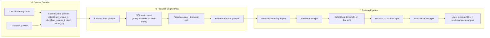

# ML Deduplication

Machine-learning based entity deduplication pipeline for actor records. It
learns which pairs of entities (e.g. organizations / actors) refer to the same
real-world object and clusters them accordingly.

## Model paths

This project contains **three** model implementations, each with its own
training and inference entry points. The **XGBoost path is the current
production path** (it is what the Docker inference image and the Makefile
serve). The other two are alternatives / reference implementations.

| Model                                                        | Status             | Training entry point                         | Inference entry point             |
| ------------------------------------------------------------ | ------------------ | -------------------------------------------- | --------------------------------- |
| [**XGBoost**](./ml_deduplication/modeling/xgboost/README.md) | **Production**     | `training.xgboost.training_pipeline_xgboost` | `inference.xgboost.run_inference` |
| [**Dedupe**](./ml_deduplication/modeling/dedupe/README.md)   | Legacy / reference | `training.dedupe.training_pipeline_dedupe`   | `inference.run_inference`         |
| [**Splink**](./ml_deduplication/modeling/splink/README.md)   | Experimental       | `training.splink.training_pipeline_splink`   | `inference.run_inference_splink`  |

Each README in the linked subdirectories documents its pipeline, training and
inference usage, and dependencies.

## Overview

The project provides a complete training and evaluation workflow to learn which
pairs of entities refer to the same real-world object and cluster them
accordingly. It follows an end-to-end pipeline:

- **Feature extraction** — build structured, comparable representations from raw records
- **Supervised learning** — train record linkage models on labeled match/distinct pairs
- **Hyperparameter tuning** — search over feature sets and model configurations with automatic threshold selection
- **Evaluation** — report both pair-wise (precision / recall / F1) and cluster-wise quality metrics against ground-truth clusters


```mermaid
flowchart LR
    subgraph DatasetCreation["📊 Dataset Creation"]
        A["Manual labeling CSVs"]
        B["Database queries"]
        C["Labeled pairs parquet\n(identifiant_unique_i, identifiant_unique_j, label, cluster_id)"]
        A --> C
        B --> C
    end

    subgraph FeaturesEngineering["⚙️ Features Engineering"]
        D["Labeled pairs parquet"]
        E["SQL enrichment\n(entity attributes for both sides)"]
        F["Preprocessing + train/test split"]
        G["Features dataset parquet"]
        D --> E --> F --> G
    end

    subgraph Training["🧠 Training Pipeline"]
        H["Features dataset parquet"]
        I["Train on train split"]
        J["Select best threshold on dev split"]
        K["Re-train on full train split"]
        L["Evaluate on test split"]
        M["Logs: metrics JSON + predicted pairs parquet"]
        H --> I --> J --> K --> L --> M
    end

    C --> D
    G --> H
```

## Project structure

```text
ml_deduplication/
├── datasets/                   # Raw / prepared Parquet data
│   └── features_dataset_*.parquet
├── logs/                       # Training results (JSON) & artifacts
├── outputs/                    # Inference results (parquet)
└── ml_deduplication/           # Package source
    ├── dataset/                # Labeled-pairs dataset creation
    │   ├── dataset_creation.py     # Create labeled entity pairs dataset
    │   ├── features_creation.py    # Extract features + train/test split
    │   ├── pairs.py / clusters.py / utils.py
    ├── evaluation/
    │   ├── metrics/
    │   │   ├── pairwise.py         # Precision / recall / F1
    │   │   └── cluster.py          # Cluster-level quality metrics
    │   └── learning_curve.py
    ├── inference/               # Inference entry points
    │   ├── xgboost/run_inference.py      # Production xgboost inference
    │   ├── run_inference.py              # Dedupe inference
    │   └── run_inference_splink.py       # Splink inference
    ├── modeling/                # Model implementations (per-model READMEs)
    │   ├── xgboost/  # Production model (README)
    │   ├── dedupe/   # Experimental model (README)
    │   └── splink/   # Experimental model (README)
    └── training/                # Training pipelines (per model)
        ├── xgboost/
        ├── dedupe/
        ├── splink/
        └── utils.py / settings.py
```

## Setup

Requires Python ≥ 3.13 and [`uv`](https://docs.astral.sh/uv/).

```bash
cd ml_deduplication
uv sync                     # create .venv + install base deps (inference-only)
uv sync --group training    # + training/EDA deps (dedupe, splink, optuna, …)
cp .env.example .env  # adapt local paths / credentials if any
```

The project is split into dependency groups:

- **base** (`[project].dependencies`) — minimal set needed to run **inference**
  (`ml_deduplication.inference.xgboost.run_inference`).
- **`training` group** — heavier training / EDA packages (`dedupe`, `splink`,
  `optuna`, `plotly`, …). Opt-in via `uv sync --group training` (or
  `uv sync --all-groups` to install every group).
- **`dev` / `notebooks` groups** — dev tooling and notebook environment.

The Docker inference image installs only the base group (`uv sync --frozen
--no-dev`), keeping it lean.

## Usage

### 1. Dataset creation

Create a balanced dataset of labeled entity pairs from manual annotations and database queries:

```bash
# Basic usage (reads paths from environment variables)
python -m ml_deduplication.dataset.dataset_creation

# With explicit arguments
python -m ml_deduplication.dataset.dataset_creation \
    --datasets-path /path/to/csv/files \
    --database-uri "your_database_uri" \
    --dataset-output-path ./datasets/ml_dataset_custom.parquet \
    --num-examples-per-class 1000
```

**Data sources combined:**

- **Manual ML labeling** — historical annotations from `Clusterisation *.csv` files
- **Manual labeling suggestions** — false positives, true negatives, and true positives from CSV suggestion files
- **Database parent changes** — negative pairs derived from records that changed parent relationships
- **Random sampling** — both positive and negative pairs sampled from the database

**Output:** `ml_dataset_<date>.parquet` with columns `identifiant_unique_i`, `identifiant_unique_j`, `label`, `cluster_id`

**Environment variables:** `ML_DATASETS_PATH`, `DATABASE_CONNECTION_URI` if not passed as parameters

### 2. Feature extraction

Enrich the labeled pairs dataset with full entity attributes and perform train/test splitting:

```bash
# Basic usage
python -m ml_deduplication.dataset.features_creation \
    --ml-dataset-filepath ./datasets/ml_dataset_20250101.parquet \
    --database-uri "your_database_uri"

# With custom output and test size
python -m ml_deduplication.dataset.features_creation \
    --ml-dataset-filepath ./datasets/ml_dataset_20250101.parquet \
    --database-uri "your_database_uri" \
    --dataset-output-path ./datasets/features_dataset_custom.parquet \
    --test-size 0.2 \
    --log-level DEBUG
```

**Processing steps:**

1. Write labeled pairs to a temporary database table
2. Run SQL queries to join entity attributes for both sides of each pair
3. Preprocess: handle missing values, normalize empty strings, clip coordinates
4. Split into `train` (80% for example) / `test` (20% for example) at the cluster level (no data leakage)

**Output:** `features_dataset_<date>.parquet` with all entity features + `split` column

**Environment variables:** `ML_DATASET_FILEPATH`, `DATABASE_CONNECTION_URI`

### 3. Training & inference (per model)

Once the features dataset is ready, training and inference differ by model.
Follow the dedicated README for the path you use:

- [**XGBoost (production)**](./ml_deduplication/modeling/xgboost/README.md)
- [**Dedupe (legacy)**](./ml_deduplication/modeling/dedupe/README.md)
- [**Splink (experimental)**](./ml_deduplication/modeling/splink/README.md)

## Evaluation metrics

- **Pair-wise** — treats every entity pair as a binary classification; reports precision, recall, F1. Used to select the best threshold on dev data (`min_recall=0.25`).
- **Cluster-wise** — assesses whole clusters (completeness, homogeneity) and size distributions vs. ground truth.

## Docker / Makefile

The [Dockerfile](./Dockerfile) builds a lean inference image that:

- Bakes the XGBoost model artifacts into the image at `/model` via the
  `MODEL_DIR` build arg (default `models/xgboost`).
- Installs only the base dependency group (`uv sync --frozen --no-dev`).
- Runs as a non-root `dedup` user with a read-only `/app` and `/model`.

The [Makefile](./Makefile) provides `build`, `buildx`, and `run` targets. The
`build` target forwards `MODEL_DIR` as a build arg; `run` mounts only the
specific acteurs file and the output directory (no model mount needed, since
the model is baked into the image). See `make help` for details.

## Notes

- Training is **CPU-bound** (blocking + pairwise distance computation); large grids may take minutes to hours.
- The train/test split is performed at the **cluster level** (not at the pair level) to prevent data leakage: all pairs involving entities from the same ground-truth cluster end up in the same split.
